## Customer Work Flow (AR)

Example of **customer (AR)** process work flow aligned with SQL Account flow:

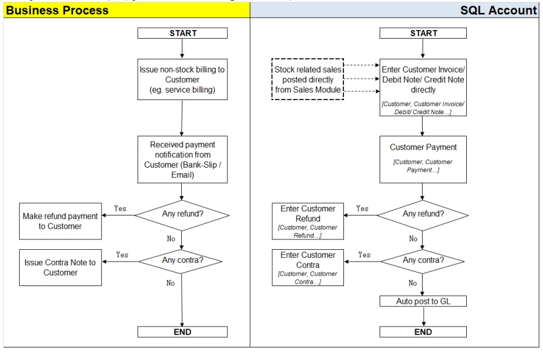

AR = Account Receivable

## Customer Invoice

### Customer Invoice vs Sales Invoice

The difference between Customer Invoice and Sales Invoice:

|**Customer Invoice**| **Sales Invoice**|
|---|---|
|shows only the accounts code and does not show Qty / Unit Price.| linked to the stock and account modules. Hence, we advise users who need to key in stock items to use Sales Invoice. Once the information in the Sales Invoice is updated, the information in the Customer Invoice will automatically be updated by the system.|

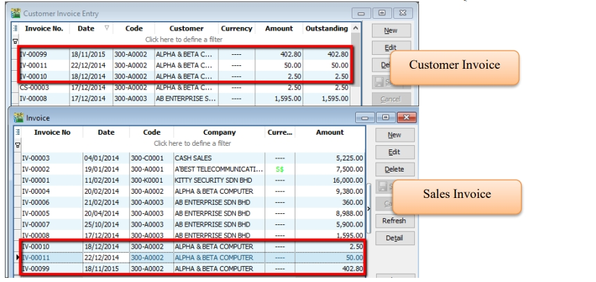

### Create a new Customer Invoice

   1. **Customer** | **Customer Invoice** | **New**

   2. Select **Customer Code** | insert transaction and amount.

   3. **Save**

        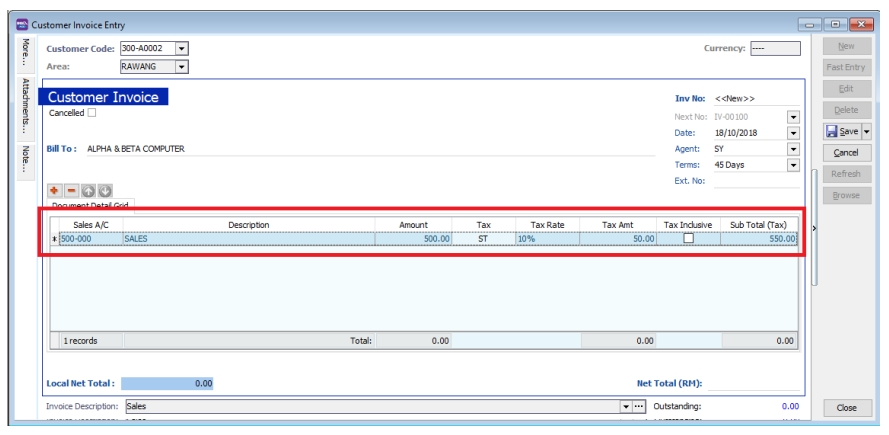

## Customer Payment

### Local Bank Payment

   :::info
   Watch tutorial video here: [Youtube](https://www.youtube.com/watch?v=IjHX5ys846I&feature=youtu.be)
   :::

   1. **Customer** | **Customer Payment** | **New**

   2. Select your **Customer**

   3. Select the **bank for your account and cheque no** if applicable

   4. Key in the **customer payment amount**

   5. **Tick the corresponding invoice/debit note to be knocked off**

        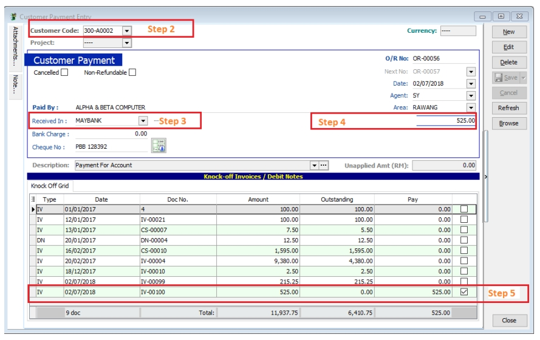

### Post Dated Cheque

   1. Search for the payment that you want to edit, click on **Edit**, right click on Customer Payment, you will see **Set Posting Date**

        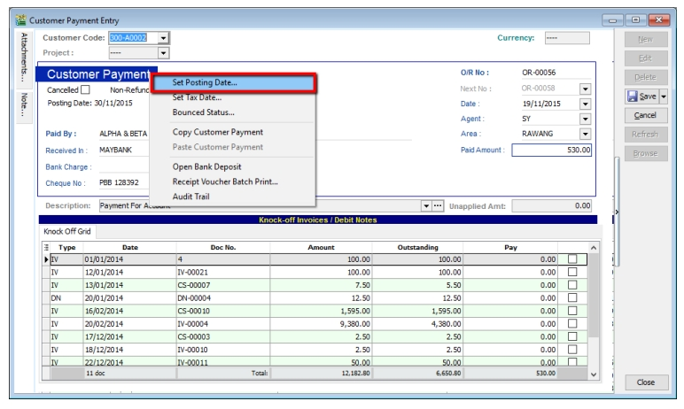

        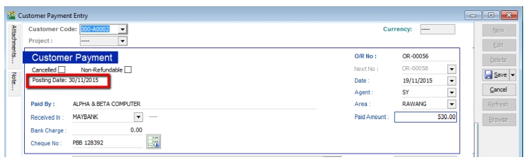

### Bounced Cheque

   1. Search for the payment that you want to edit, click on **Edit**, right click on Customer Payment, you will see **Bounced Status**

      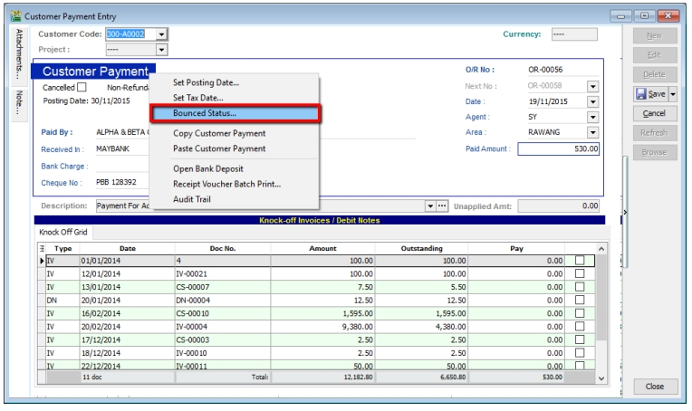

      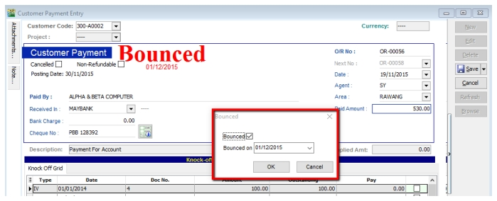

      After bounced, system will auto revert the payment out, you can view your ledger.

      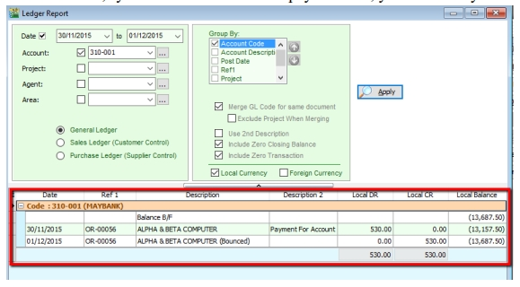

## Customer Credit Note

If the situation involves return stock from customer, please do Sales Credit Note and knock off it in Customer Credit Note as below step.

1. **Customer** | **Customer Credit Note**

2. **Edit** | Click **Yes**

3. **Knocked off accordingly**.

   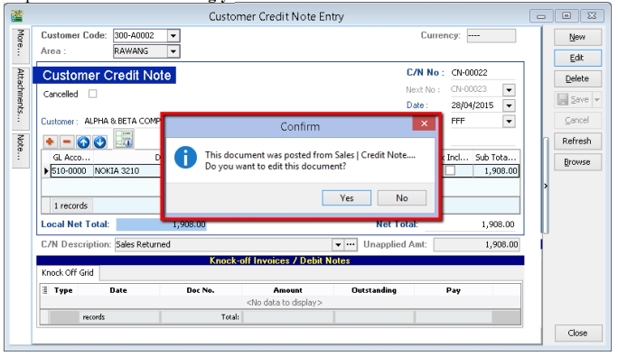

   If it does not involve with returned stock, e.g. discount given with

   1. **Customer** | **Customer Credit Note** | **New CN**

   2. **New** | Select **Customer** | Select **GL Account** | **Amount**

   3. **Knocked off accordingly**.

   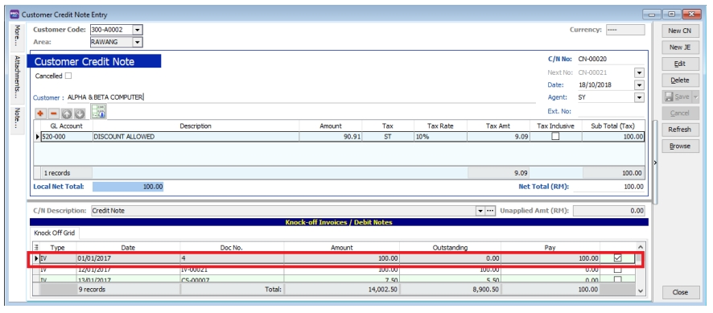

## Customer Refund

You can use this document to refund a customer. You can knock off with Customer Payment or Credit Note which have unapplied amounts.

1. **Customer** | **Customer Refund**.

2. Choose the **Customer** | Select your **Payment Method** | **Enter your Refund Amount**

3. **Knock off the payment or credit note and save**.

    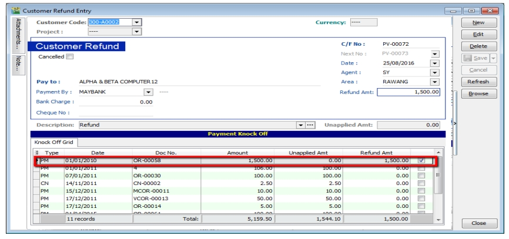

## Customer Contra

If you have a customer who is also a supplier, you may want to offset the outstanding customer and supplier invoices. This is known as a contra entry. You can offset the two invoices by using Customer Contra and Supplier Contra. This means that when you record the invoices as being paid, it will not affect your current bank account balance.

**Scenario:**

**If you have an outstanding sales invoice for RM200 and a purchase invoice for RM150 for the same customer or company, the actual amount owed to you is RM50 and the contra entry amount is RM150.**

### Make sure you have a valid `Contra Account`

1. Tools | Options

    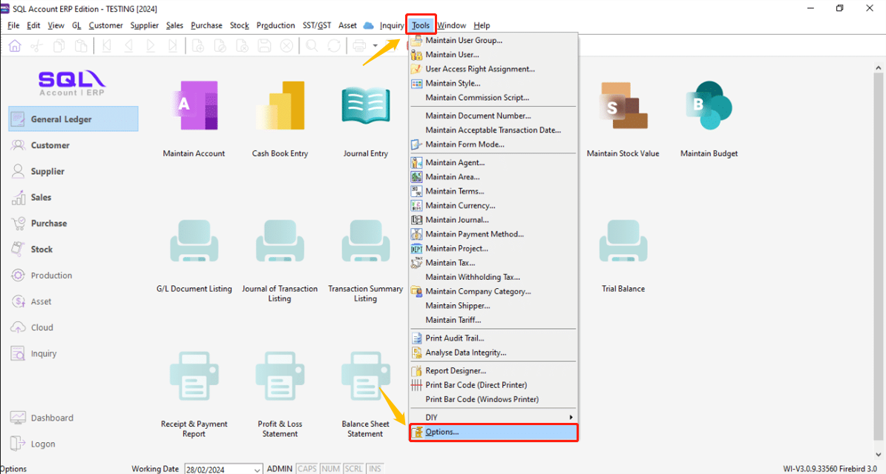

2. General Ledger | make sure you had chosen a valid Contra Account

    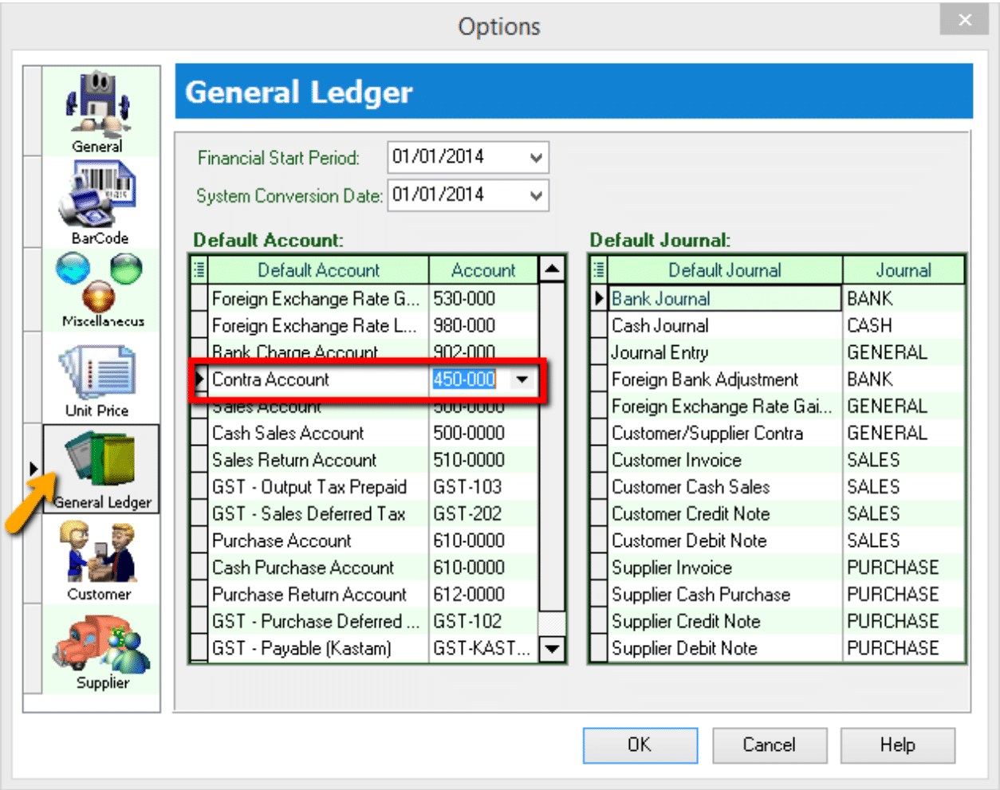

### Contra Entry

   1. Go Customer | Customer Contra

        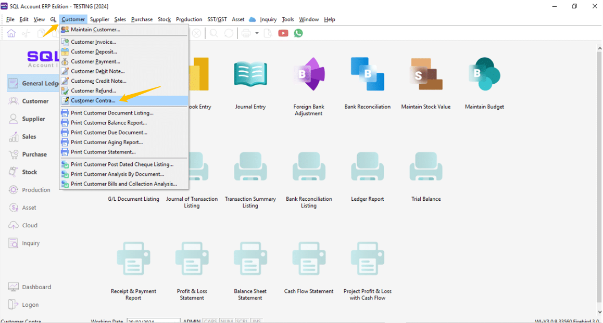

   2. Press on NEW

        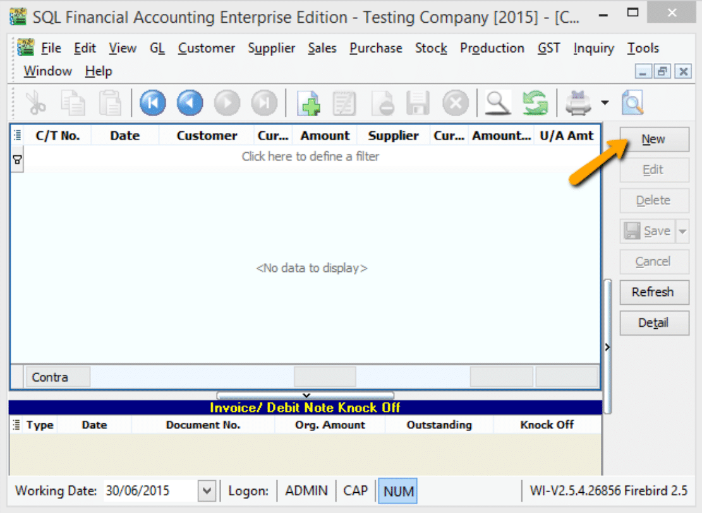

        2a. Select your Customer Code

        2b. Enter your Contra Amount

        2c. Knock off your Invoice

        2d. Press on SAVE Button

        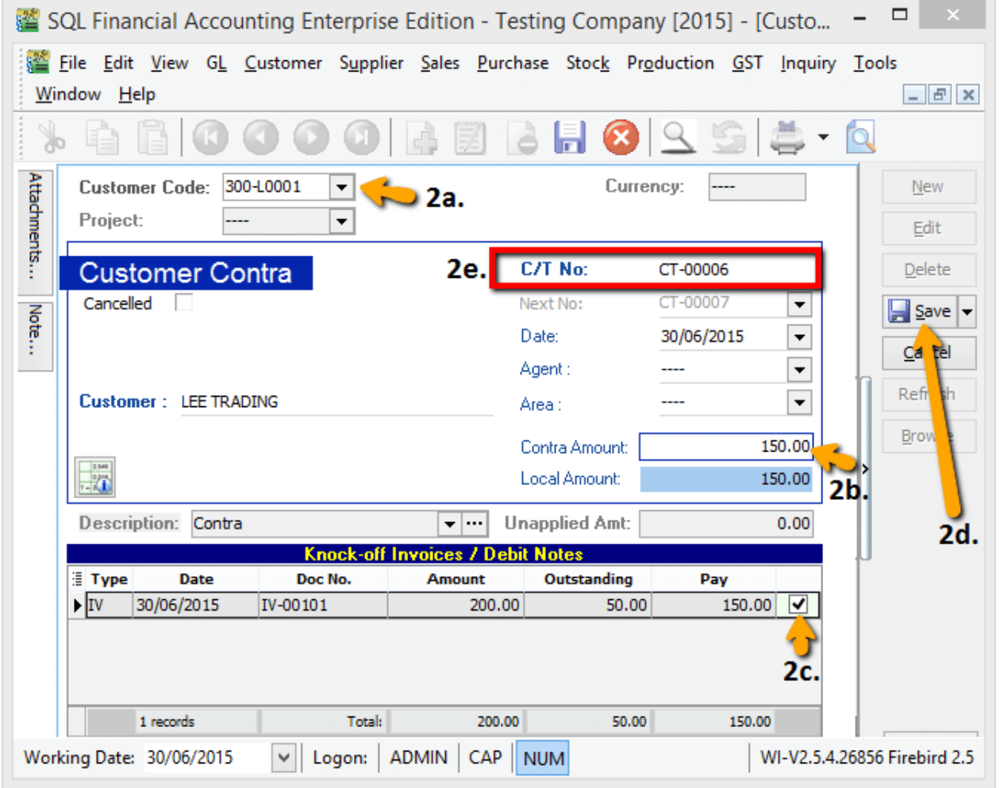

   3. System will auto generated a Contra Number, jot down the number and go **Supplier | Supplier Contra** to edit it.

        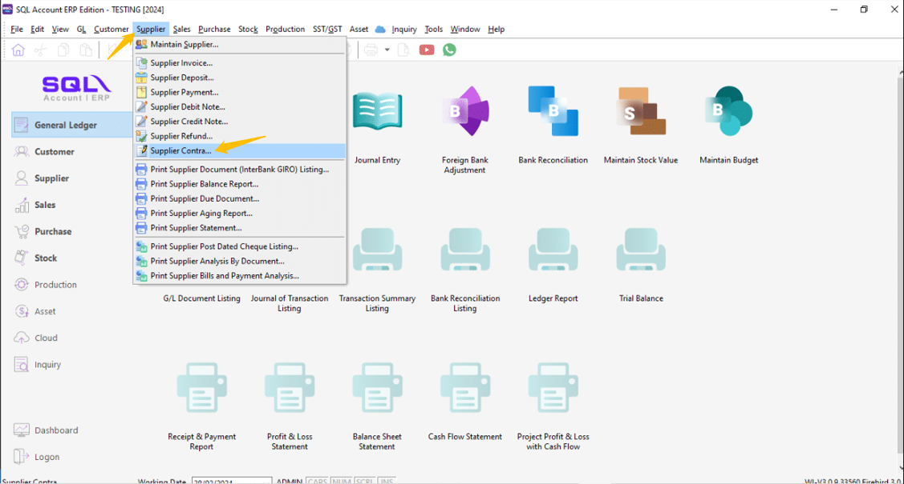

   4. Look for the Same Contra Number (refer step 2e), EDIT it.

        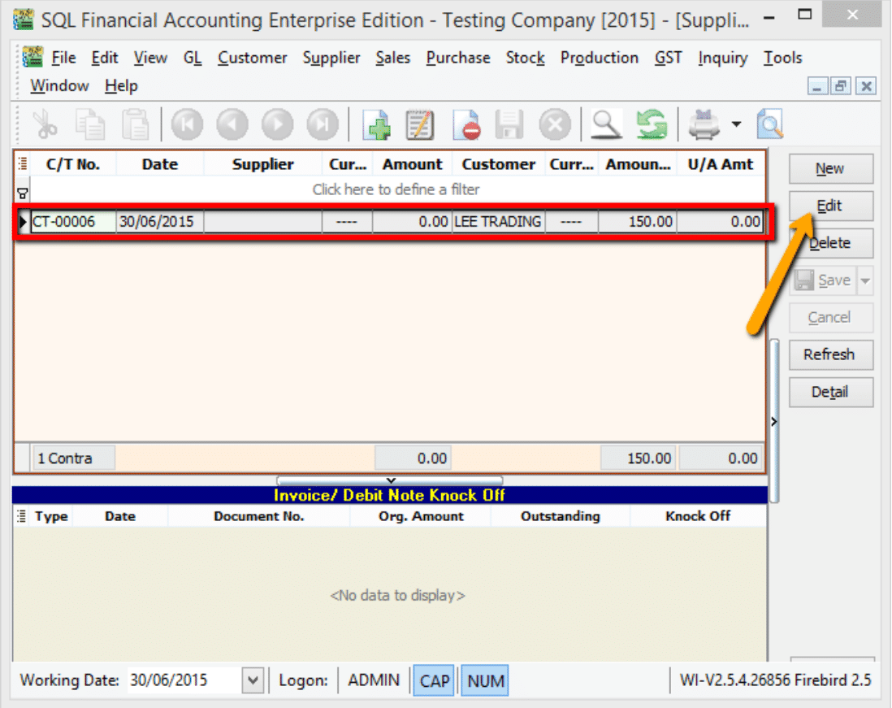

      4a. Select your Supplier

      4b. Enter Contra Amount (Must be same as Customer Contra Amount)

      4c. Knock off your Supplier Invoice

      4d. Press on SAVE Button

        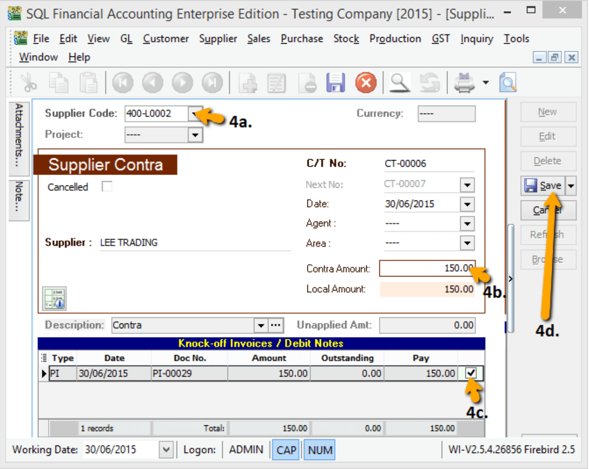

After you post the contra entry:

- The outstanding amount on the sales invoice is RM50.

- The purchase invoice is fully knock off.

- When you receive the RM50, you can record this against the sales invoice using your normal Customer Payment entry.

## Supplier Work Flow (AP)

Example of **supplier (AP)** process work flow aligned with SQL Account flow:

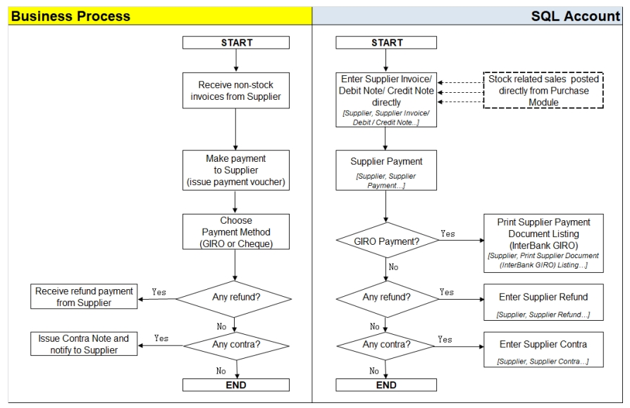

AP = Account Payable

**Supplier module** is the similar to **Customer Module**.

You can apply the same steps from [Customer Invoice](#customer-invoice) → [Customer Contra](#customer-contra) for Supplier Module (Invoice, Payment, Credit Note, Refund, Contra).

## Interbank GIRO (IBG)

Refer to [Additional Module](../additional-module/interbank-giro.md)
