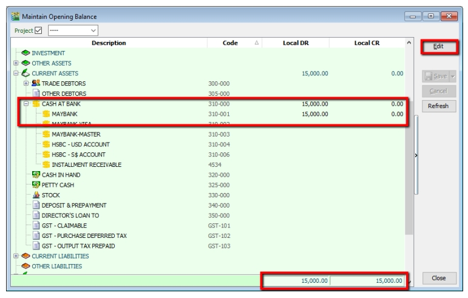
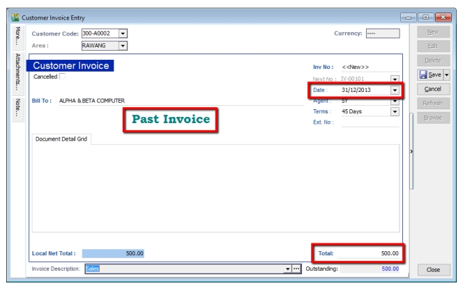
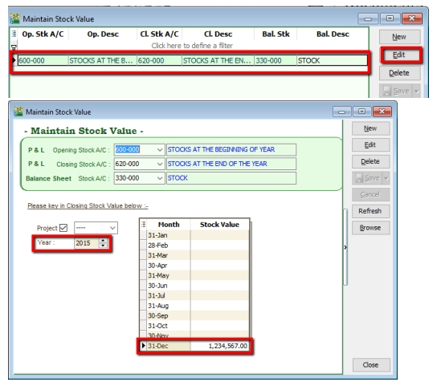
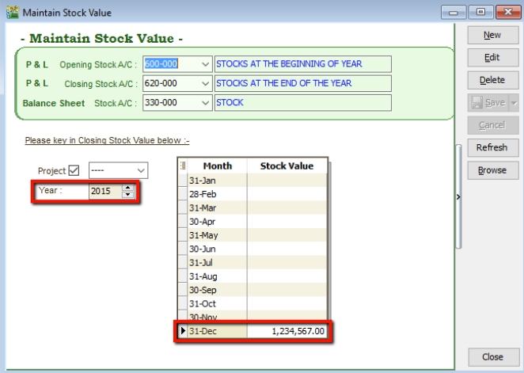
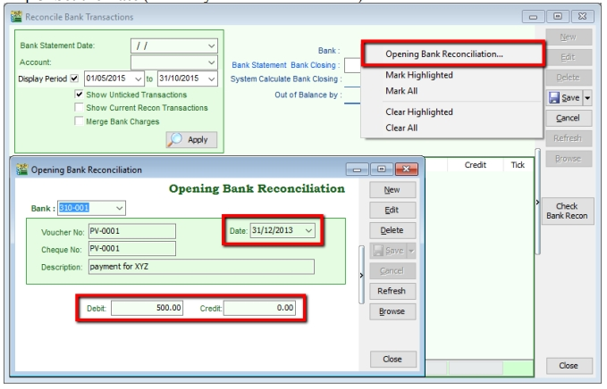
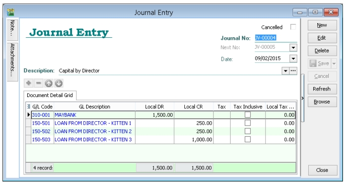
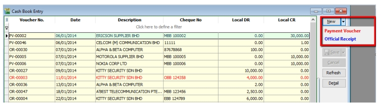
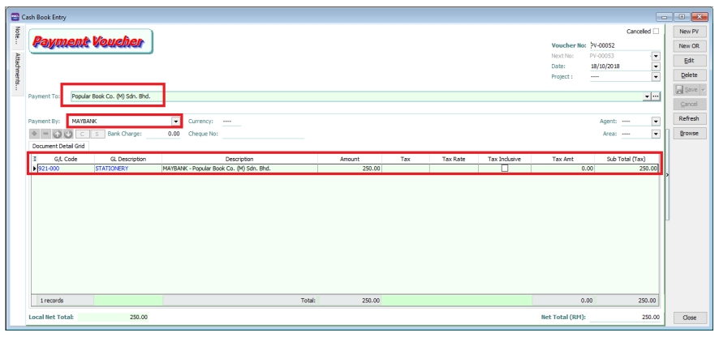

## Opening Balance

:::info
Watch tutorial video here: [Youtube](https://www.youtube.com/watch?v=43y_4awgSlA&feature=youtu.be)
:::

### General Ledger

   1. **GL** > **Maintain Opening Balance**

   2. Highlight the account that you wish to key in as opening balance, and click **Edit**.

   3. **Insert the figure in local Dr or local Cr**. Then **Save**.

   4. **Make sure the Dr and Cr figures tally**

        

### Customer and Supplier

   1. Customer(Supplier) > **New**

   2. Set the **Date** (before system conversion date)

   3. Key in only the **outstanding amount**.

   4. The words “Past Invoice” must appear; (they will not appear if the inserted date is after system conversion date)

   5. Click **Save**.

      

### Stock Value

   1. **GL** > **Maintain Stock Value** > **Edit**

   2. Set the year

   3. **Insert the Opening Balance**

      

      

### Bank Reconciliation

:::info
For further info about bank reconciliation, refer to [Bank Recon](../faq/general-ledger/bank-recon.md) and [Auto Bank Recon](../faq/general-ledger/auto-recon.md).
:::

   1. **GL** > **Bank Reconciliation** > **New**

   2. **Right click, to see Opening Bank Reconciliation**

   3. **Set the Date** (before System Conversion Date)

      

## Journal Entry

:::info
Watch tutorial video here: [Youtube](https://www.youtube.com/watch?v=WHzNMsCmFHg&feature=youtu.be)
:::

1. **GL** > **Journal Entry**

2. **Key in your double entry**

3. Click on **Save** (System will blocked in Dr and Cr are not tally)

   

## Cash Book Entry

:::info
Watch tutorial video here: [Youtube](https://www.youtube.com/watch?v=rh0L-Kol1ts&feature=youtu.be)
:::

Cash book entry is normally used for a non-customer/ supplier payment or receipt e.g. payment for salaries, utilities etc.

1. **GL** > **Cash Book Entry** > **New** (choose between Payment Voucher or Official Receipt)

   

2. **Insert Payable Name** > Select **GL Code > Tax > Amount**

   
