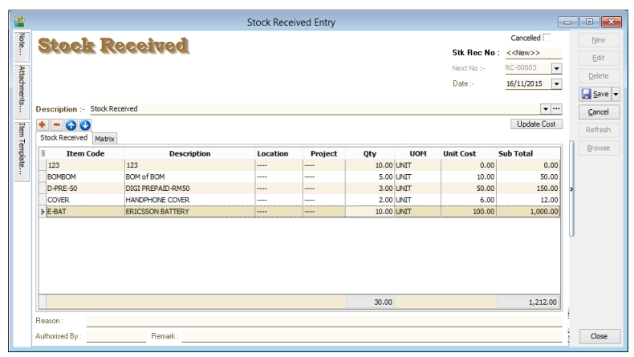
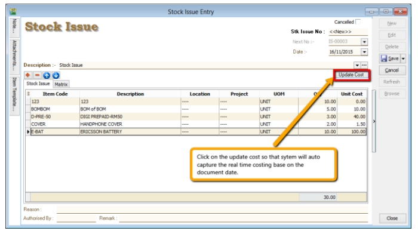
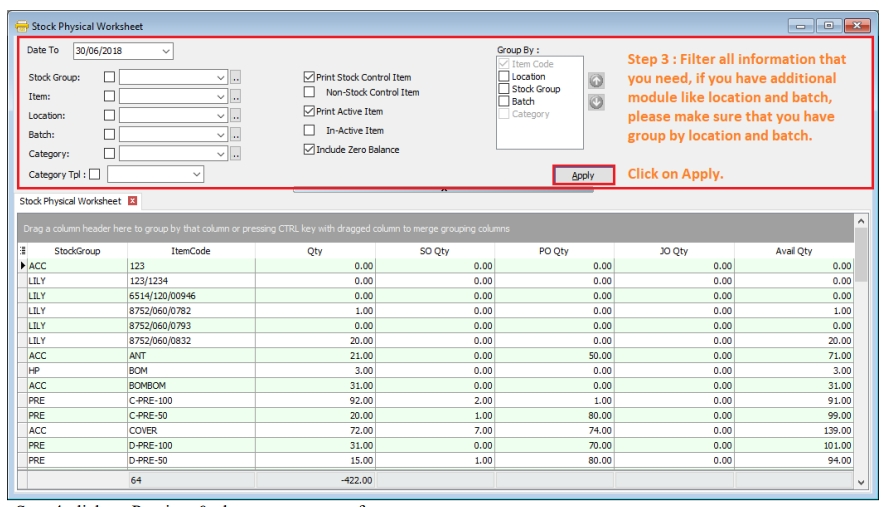
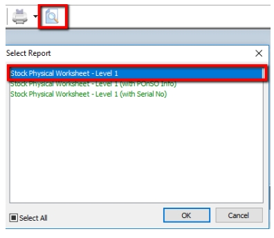
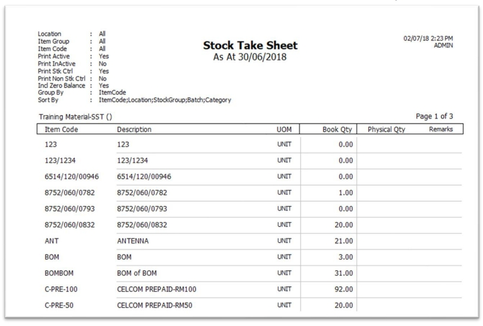
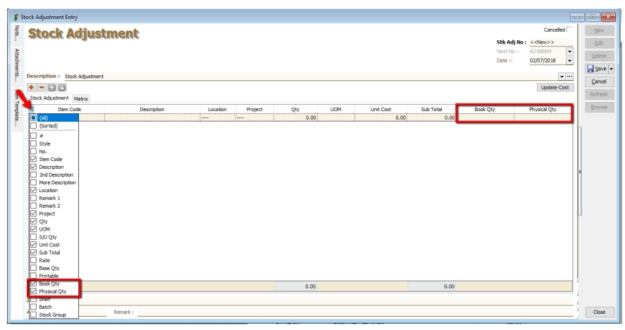
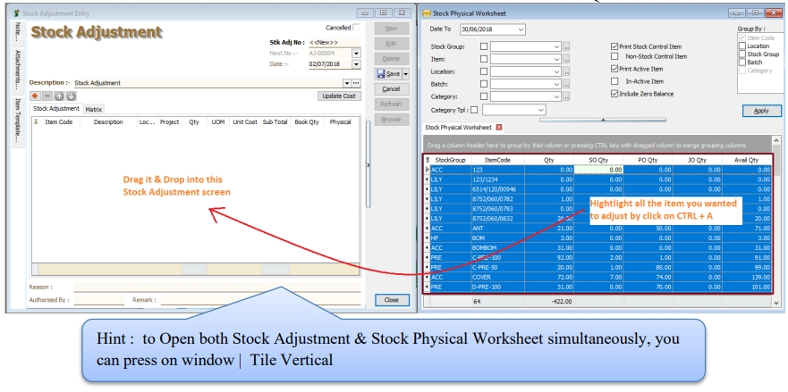
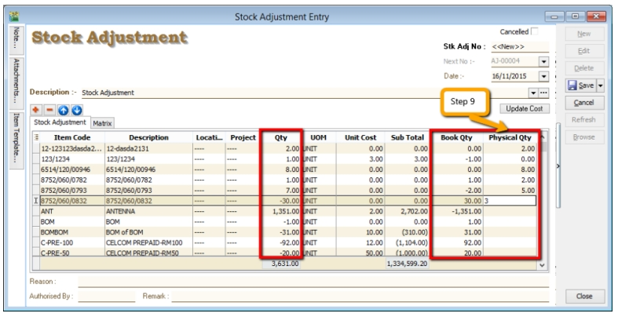

## Stock Received

Allows user to increase stock quantity without purchasing. It is normally used when you have assembled or manufactured finished goods. Just key-in the item code, quantity IN and cost that you want.

1. **Stock** > **Stock Received** > **New**.

   

## Stock Issue

Allows user to **decrease stock quantity without selling**. It is normally used when you consume raw material during assembly or when manufacturing finished goods or even sometimes for internal usage. Just key-in the item code, quantity OUT and cost and you may also click on the Update Cost, then the system will auto-detect the actual costing base on your document date.

1. **Stock** > **Stock Issue** > **New**.

   

## Stock Adjustment / Stock Take

:::success[INFO]
Check out our new [Stock Take App](https://www.sql.com.my/sqlstocktake/)
:::

Allows user to key-in quantity in and quantity out from the system, just like a combination of stock received and stock issue. Normally used for stock take purposes. **(Stock > Stock Adjustment > New)**

:::info
Watch tutorial video here: [Youtube](https://www.youtube.com/watch?v=uEbCRAftQ4A&feature=youtu.be)
:::

1. Click on **Stock**

2. Choose **Print Stock Physical Worksheet**

3. **Filter** by date, stock group or others **information** that you want to do for the stock take, please **make sure that you choose the correct location and batch if you have these two modules**.

   

4. lick on Preview & choose your report format.

   

5. **Print out the “Stock Take Sheet”** for stock keeper.

   The stock keeper should manually **fill in the actual quantity into the “physical qty” column**.

   

6. After complete updating the stock take report by your stock-keeper, do your stock adjustment in system from **Stock** > **Stock Adjustment** > **and drag out Book Qty and Physical Qty**.

   

   

7. Click on the first item in **Stock Physical Worksheet**, press on **Ctrl + A** on the keyboard to select all items.

   **Then Drag & Drop into Stock Adjustment**.

   

8. Based on the stock keeper’s Stock Take Report, **fill in the actual physical quantity** in your warehouse into the Stock Adjustment **Physical Qty column**, the system will calculate the variance based on the Book Qty and apply a correction to the Qty column.

   :::note

   **Book Qty** = Quantity that is recorded in system.

   **Physical Qty** = Actual Quantity at your warehouse.

   **Qty** = Variance between Physical and Book Quantity, system will auto-adjust then update accordingly. (Physical Qty – Book Qty)

   :::
