## General Ledger (Maintain Chart of Account)

:::info
Watch tutorial video here: [Youtube](https://www.youtube.com/watch?v=hsdpDJImya4&feature=youtu.be)
:::

1. Creating a New Account

   1. Select **GL** | **Maintain Account** | Select category (e.g. Fixed Assets) | **New**

   2. Enter the **GL Code** and **Description** (alphanumeric characters are acceptable)

   3. Check the **Special Account Type** if applicable, e.g. the account is belonging to Accumulated Deprn Account (Fixed Assets)

   4. Click **OK**. Your new account is now created.

    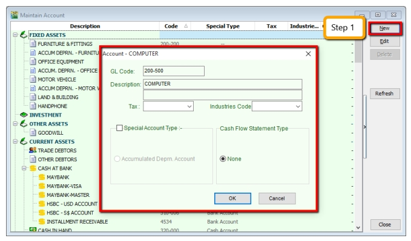

    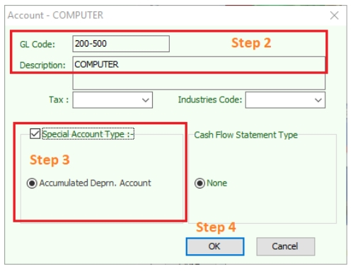

2. Creating a Sub Account

   1. Point to the parent account (e.g. Cash at Bank)

   2. Follow the same steps from **2.1.1 Create New Account**

    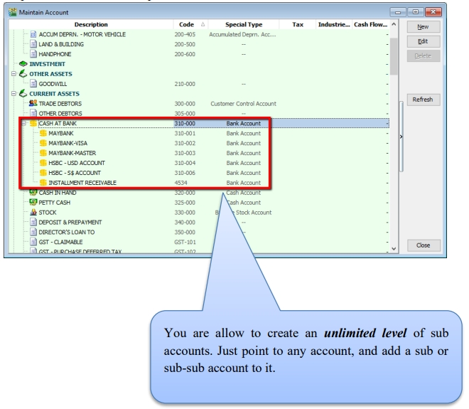

    You are allow to create an unlimited level of sub accounts. Just point to any account, and add a sub or sub-sub account to it.

## Maintain Customer

:::info
Watch tutorial video here: [Youtube](https://www.youtube.com/watch?v=qn0xmeHUZkk&feature=youtu.be)
:::

There are 4 main tabs under Maintain Customer, let’s create a new customer and look at each tab one by one.

### Create New Customer

1. **Customer** | **Maintain Customer** | **New**

2. **Enter the customer’s name and other information accordingly**.

### General (Maintenance)

1. You can categorize your customers into different groups, e.g. Category, agents, area
    How do you create your new agent/ area? Refer to the step below:

    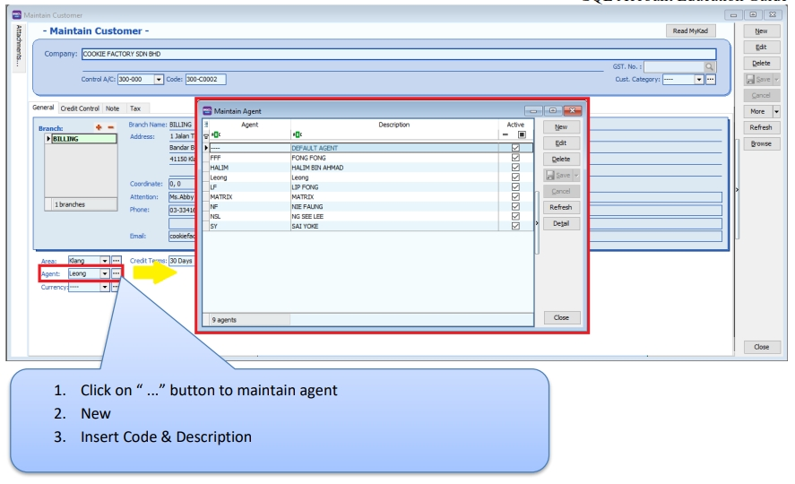

2. You can also insert more than one billing / delivery addresses (unlimited)

3. There are different options for viewing a customer aging and customer statement

    :::note
    1. **Customer Statement**
        - Brought Forward: Summary Statement
        - Open Item: Detail Statement

    2. **Customer Aging**
        - Invoice Date: based on IV Date
        - Due Date: Based on after due date (terms)
    :::

    

    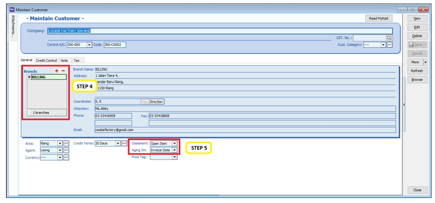

### Advance Credit Control (*Pro Package Inclusive)

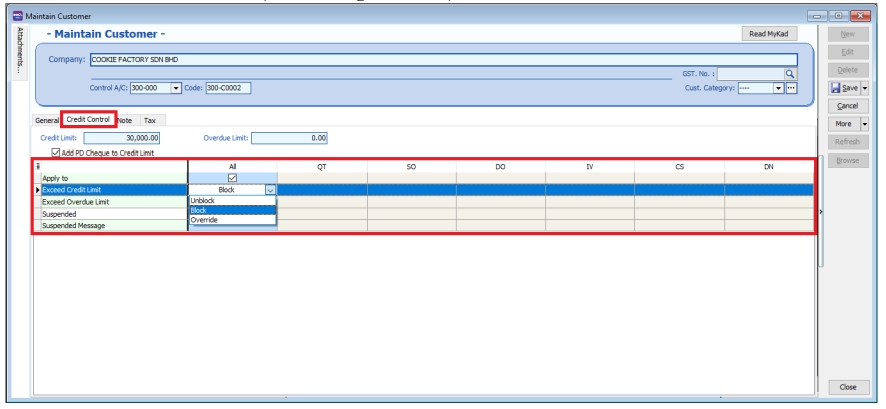

You can set the credit limit and overdue limit amounts as well as blocking a certain transaction entry for specific customers. What does the document include and for the following documents: Quotation(QT), Sales Order(SO), Delivery Order(DO), Invoice (IV), Cash Sales (CS) and Debit Note(DN)

We can also set once exceed limit & overdue limit,

1. Unblock – No restrictions

2. Block – Blocked for all users

3. Override – Certain users which have access rights can key in their username & password to override.

4. Suspended – Blocked with suspended message

### Tax

If the customer provides you with certificate exemption number, you may fill in part A & B as below.

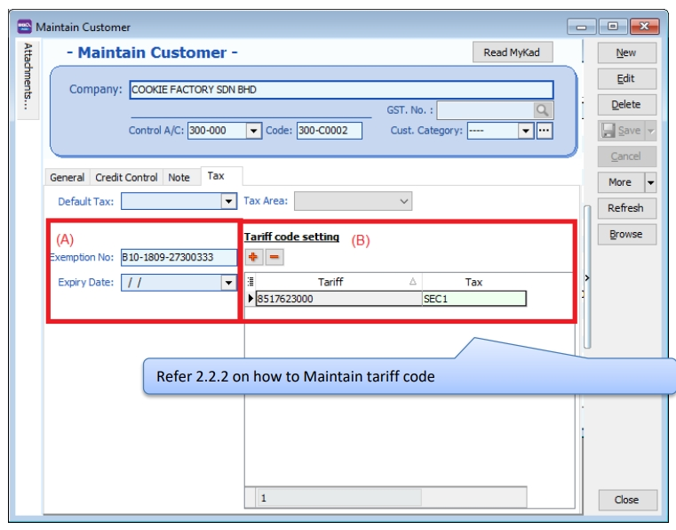

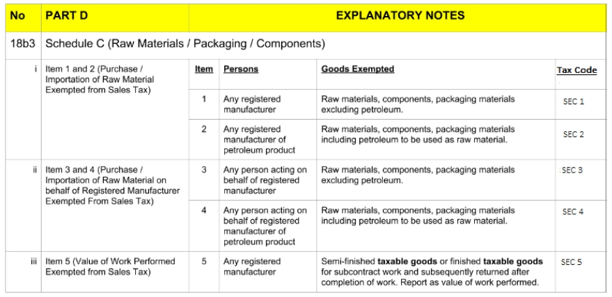

## Maintain Supplier

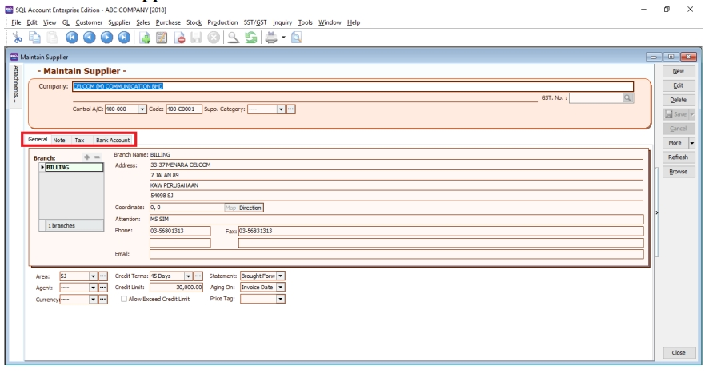

**Maintain Supplier** it’s just a mirror of Maintain Customer, please refer to [Maintain Customer](#maintain-customer).

Additional features: GIRO (beta version)

Please refer here to get more information on [GIRO module](http://www.sql.com.my/document/sqlacc_docs/PDF/13-05-GIRO_SupplierPayment.pdf)

## Maintain Stock Group

Allows the user to set default account posting for the a particular group of items.

:::info
Watch tutorial video here: [Stock Maintain Stock Item](https://www.youtube.com/watch?v=o4Z3oyhdeq0&feature=youtu.be)
:::

1. **Stock** | **Maintain Stock Group** | **New**

    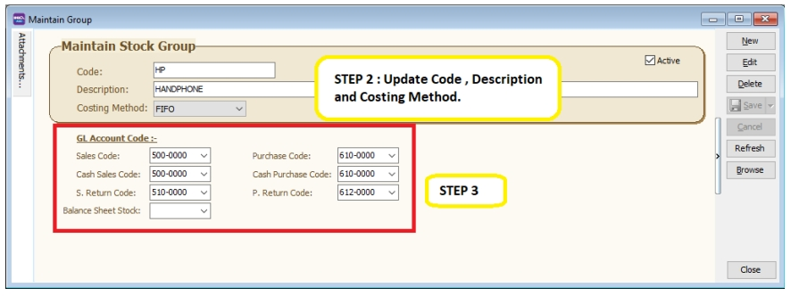

2. You can enter your **code** and **description**; you can also assign your **costing method** e.g. FIFO, Weighted Average & Fixed Cost.

3. Assign the account accordingly to sales, cash sales, sales return, purchase, cash purchase and purchase return.

   :::note
   In this case, you can create a different stock group for a different costing method, to apply on a different item code.
   :::

## Maintain Stock Item

Allows user to maintain an item or service that you provide for your business.

:::info
Watch tutorial video here: [Stock Maintain Stock Item](https://www.youtube.com/watch?v=o4Z3oyhdeq0&feature=youtu.be)
:::

1. **Stock** | **Maintain Stock Item** | **New**

   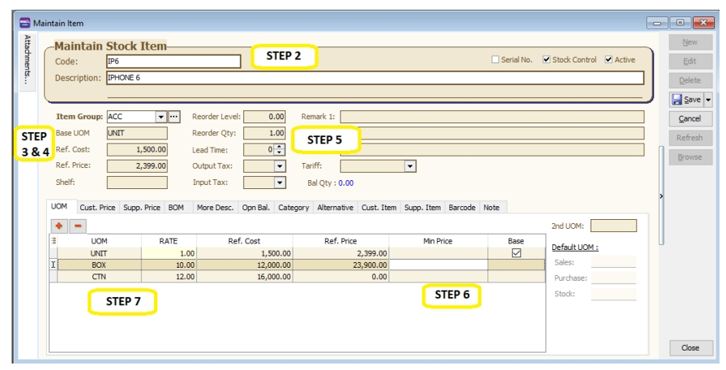

2. You can enter your **code** and **description**.

3. You can assign your item to a **group** (see 2.4 Maintain Stock Group to create a new group)

4. You can insert **Base UOM** as default / **smallest unit of measurement. Ref Cost and Ref Price** are used as **default purchase and sales price**.

5. We categorize **Reorder Level, Reorder Qty and Lead Time** as one group. The settings here allow you to pre-set all these details, so that if the stock quantity drops to the reorder level, report is generated as a reminder to reorder.

   :::note
   **Reorder Level** = When stock balance drops to a certain level, system will be able to prompt you to re-order your stock

   **Reorder Qty** = The quantity you wish to reorder when you print reorder advice report

   **Lead Time** = The number of days required for your stock item to arrive.

   **Output Tax** = Default output tax code for an item (only need to define if different from the system default output tax in **Tools** | **Option** | **Customer**)

   **Input Tax** = Default input tax code for an item (only need to define if different from the system default output tax in **Tools** | **Option** | **Supplier**)

   **If you pre-set Tax in Customer & Stock Item, system default will capture Maintain Customer Tax Code only follow by Stock Item**
   :::

6. You can set **MIN PRICE**, so that your sales personnel won’t sell below min price.

7. **Multiple UOM purpose is useful for different packaging, as illustrated by the scenario below:**

   **Scenario A:**

   I am selling blue pens, blue pens haves different packaging, I can sell by pcs, by box or by carton. Now, I can pre-set them this way:

    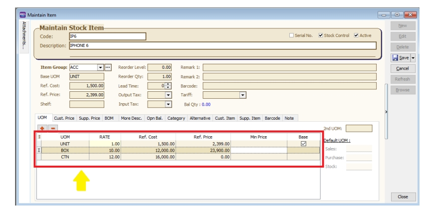

   As you can see above, I have different Units of Measurement (UOM) and different rates,

   :::note
   Base Rate = PCS = 1

   Box = 10 PCS

   Carton = 24 PCS
   :::
