## Submission

In the E-Invoice system, there are few types of documents that can be submitted. The table below shows how each document type in SQL Account is mapped to its corresponding E-Invoice document type. Refer to each section for more detailed information on the specific document types.

| SQL Account Document Type                                     | E-Invoice Document Type           |
| ------------------------------------------------------------- | --------------------------------- |
| [Sales Invoice](e-invoice#sales-invoice--cash-sales)          | Invoice                           |
| [Cash Sales](e-invoice#sales-invoice--cash-sales)             | Invoice                           |
| [Credit Note](e-invoice#credit-note)                          | Credit Note                       |
| [Debit Note](e-invoice#debit-note)                            | Debit Note                        |
| [Payment Voucher](e-invoice#payment-voucher)                  | Self-Billed Invoice / Refund Note |
| [Purchase Invoice](e-invoice#purchase-invoice--cash-purchase) | Self-Billed Invoice               |
| [Cash Purchase](e-invoice#purchase-invoice--cash-purchase)    | Self-Billed Invoice               |
| [Purchase Returned](e-invoice#purchase-returned)              | Self-Billed Credit Note           |
| [Purchase Debit Note](e-invoice#purchase-debit-note)          | Self-Billed Debit Note            |
| [Receipt Voucher](e-invoice#receipt-voucher)                  | Self-Billed Refund Note / Invoice |

1. Click on **MyInvois** > **Submit E-Invoice**

    

2. If the submission is valid, you will see the screen below, where you can see the validated Invoice info from LHDN directly.

    :::info[NOTE]
    Ensure that all required fields are correctly filled before submission to avoid errors. If the submission is invalid, you will need to correct the issues and resubmit.
    :::

    

## Cancellation

At the **first 72 hours** of an submitted invoice, you are able to **cancel** the e-invoice, then re-submit the same invoice again without issuing CN/DN.

In the first 72 hours period, you shall cancel the invoice and resubmit when:

 1. There is a mistake in the submitted e-invoice.
 2. Buyer rejected the invoice and you agreed with the rejection.

To cancel a submitted e-invoice:

1. Go to **MyInvois** > **Cancel Validated E-Invoice**.

    

2. Enter the reason for cancellation then Click **Initiate Cancellation**. To dismiss the dialog, Click **Keep Document**.

    

3. To verify the latest status, go to **MyInvois** > **Check E-Invoice Status**.

    

## Report

Preview the report and you can see the E-Invoice validation QR code is embedded in the invoice.

## Check Status

You can easily check the latest status of an invoice in SQL Account to ensure it has been submitted and processed correctly.

1. Click on **MyInvois** > **Check E-Invoice Status**

    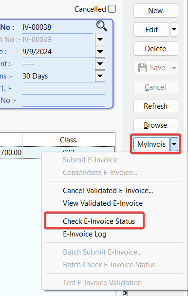

2. You will be able to see the current status of the submitted invoice, along with the QR code and a validation page.

    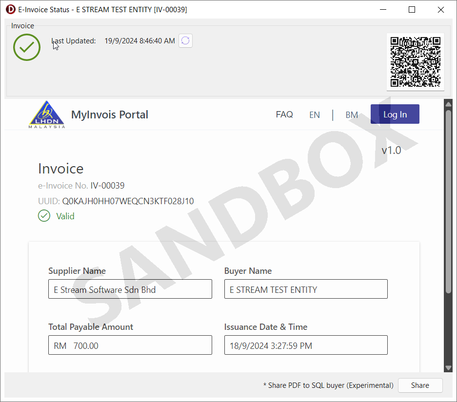

    :::info[NOTE]
    If the invoice status is marked as invalid, a list of errors will be displayed. You can use this information to correct the invoice and resubmit it.
    :::

    

## Submission Log

You can view all past submission and cancellation log of an invoice.

1. Click on **MyInvois** > **MyInvois Log**

    

    

## Purchase Documents Import

SQL Account offers two methods for importing purchase documents from the E-Invoice system:

- [Single Import](#single-import): Enables you to import individual documents.
- [Batch Import](#batch-import): Allows you to import multiple documents at once.

To ensure proper import, it's important to understand how the document types in SQL Account are mapped to those received from the E-Invoice system. The table below shows how the document types in the SQL Account are mapped to those received from the E-Invoice system:

| SQL Account Document Type | E-Invoice Document Type |
| ------------------------- | ----------------------- |
| Purchase Invoice          | Invoice                 |
| Cash Purchase             | Invoice                 |
| Purchase Returned         | Credit Note             |
| Purchase Debit Note       | Debit Note              |

### Single Import

You can view all received documents and single import into SQL Account.

1. Go to document detail screen and click on **MyInvois** > **Single import E-Invoice**

    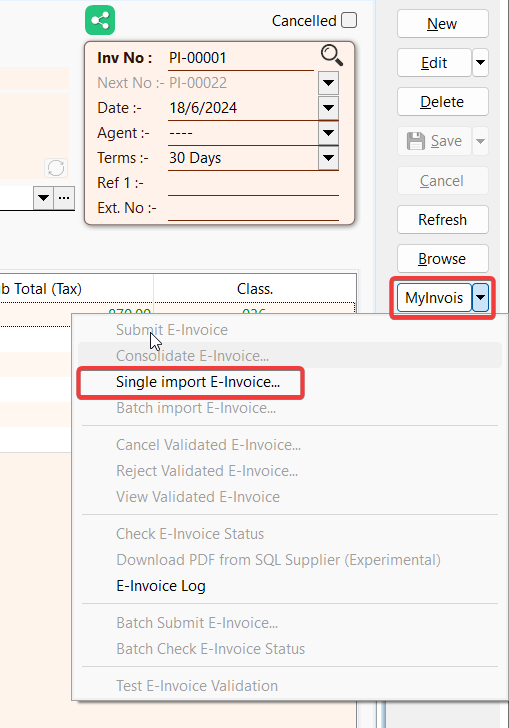

    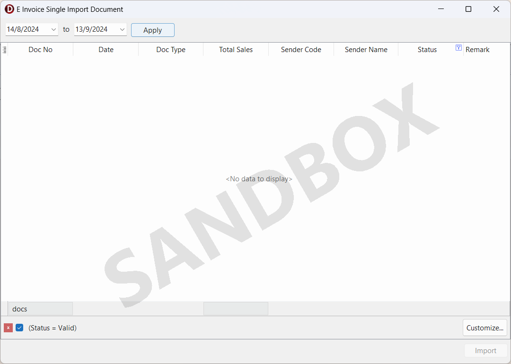

2. Choose the desired date range and press the **Apply** button to filter the documents

    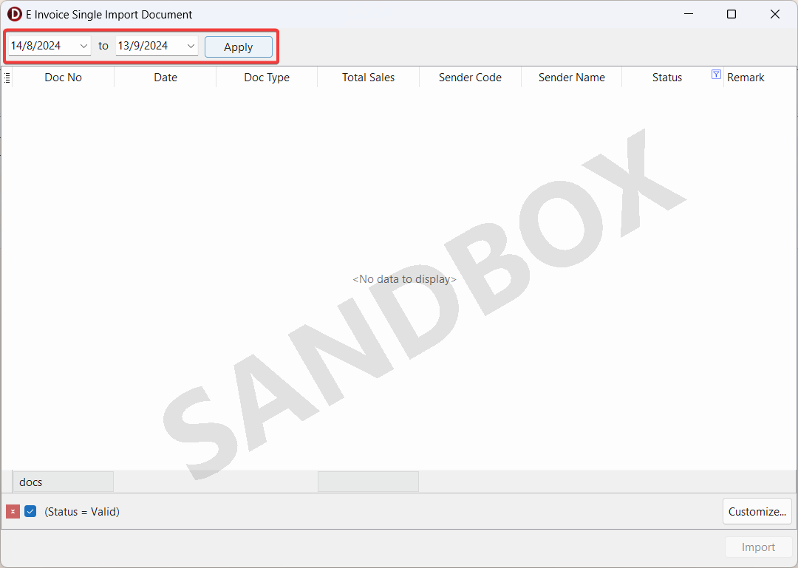

3. The table will display the list of E-Invoice documents your company has received

    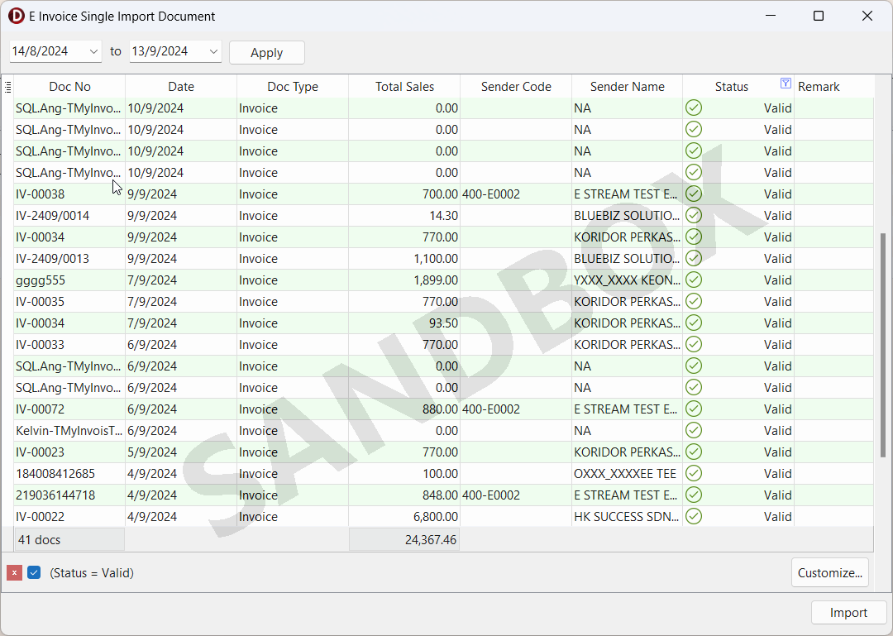

4. SQL Account will auto-map the supplier code if the supplier's TIN matches the TIN in Maintain Supplier

    :::info[NOTE]
    We suggest adding the TIN for existing suppliers or creating a new supplier record
    :::

    :::info[NOTE]
    A supplier code is required. An error message will appear if you attempt to import a document without a supplier code
    :::

    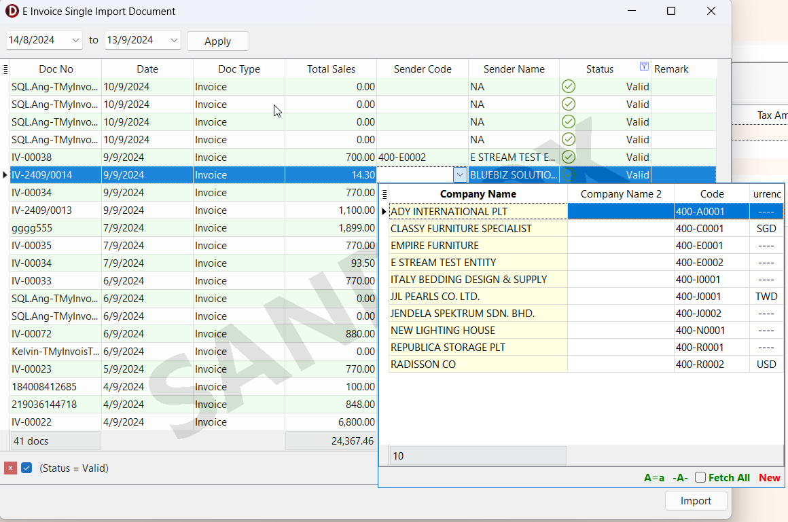

    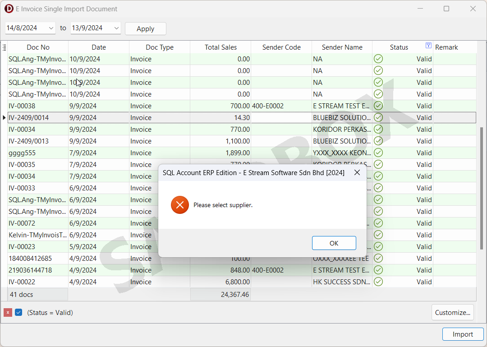

5. Once you have selected the desired documents, click on the **Import** button to proceed with the single import

    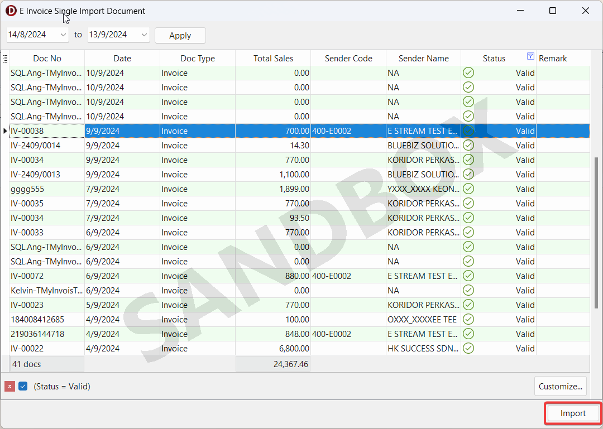

    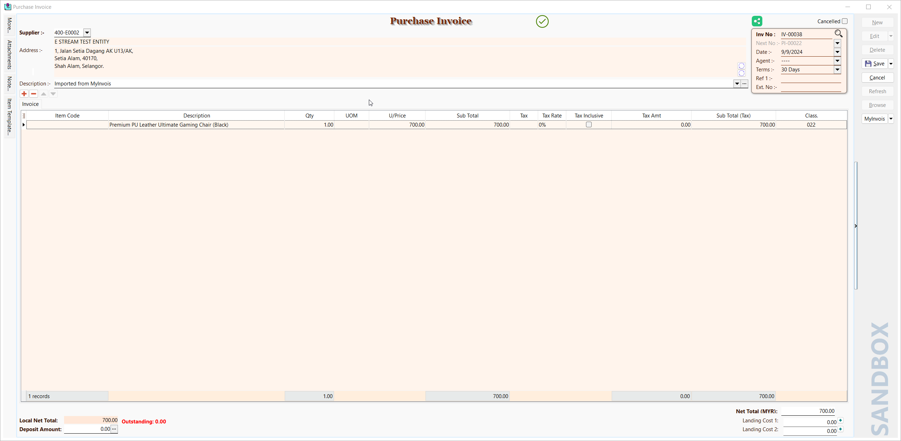

6. After reviewing the document details, click **Save** to complete the process

    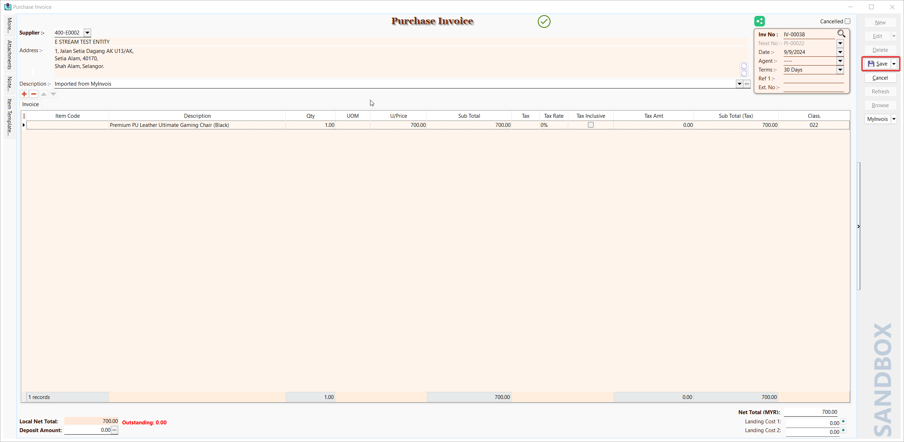

### Batch Import

You can view all received documents and batch import into SQL Account.

1. Click on **MyInvois** > **Batch import E-Invoice**

    

    

2. Choose the desired date range and press the **Apply** button to filter the documents

    

3. There are two tables inside the form:

    - The upper table will display the list of E-Invoice documents your company has received
    - The lower table will show the item details for the document you have selected

    

4. You can select multiple documents using the checkboxes provided
5. SQL Account will auto-map the supplier code if the supplier's TIN matches the TIN in Maintain Supplier

    :::info[NOTE]
    We suggest adding the TIN for existing suppliers or creating a new supplier record
    :::

    

6. A tax code is required for an item if the tax amount is greater than 0

    :::info[NOTE]
    The document will displayed in **red font** if the tax code is missing when it is required
    :::

    

    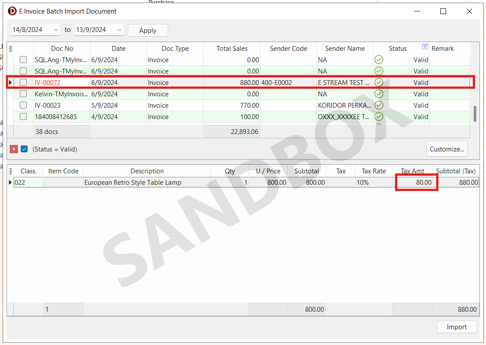

7. Once you have selected the desired documents, click on the **Import** button to proceed with the batch import

    

    

## Rejection (Imported Documents)

At the **first 72 hours** of an received invoice, you are able to **reject** the e-invoice.

In the first 72 hours period, you shall reject the invoice when there is a mistake in the received e-invoice.

To reject a received e-invoice:

1. Go to **MyInvois** > **Reject Validated E-Invoice**.

    

2. Enter the reason for rejection then click **Initiate Rejection**. To dismiss the dialog, Click **Keep Document**.

    

## Share PDF (Experimental)

You can share invoice PDF to SQL buyer.

1. Click on **MyInvois** > **Check E-Invoice Status**

    

2. Click on **Share** to share the invoice PDF with SQL buyer

    

3. Continue to choose the report format to share with SQL buyer

    

    

## Download PDF (Experimental)

You can download the shared invoice PDF from SQL supplier.

1. Click on **MyInvois** > **Download PDF from SQL Supplier (Experimental)**

    :::info[NOTE]
    The option will be enabled if the supplier uploaded the PDF
    :::

    

    
