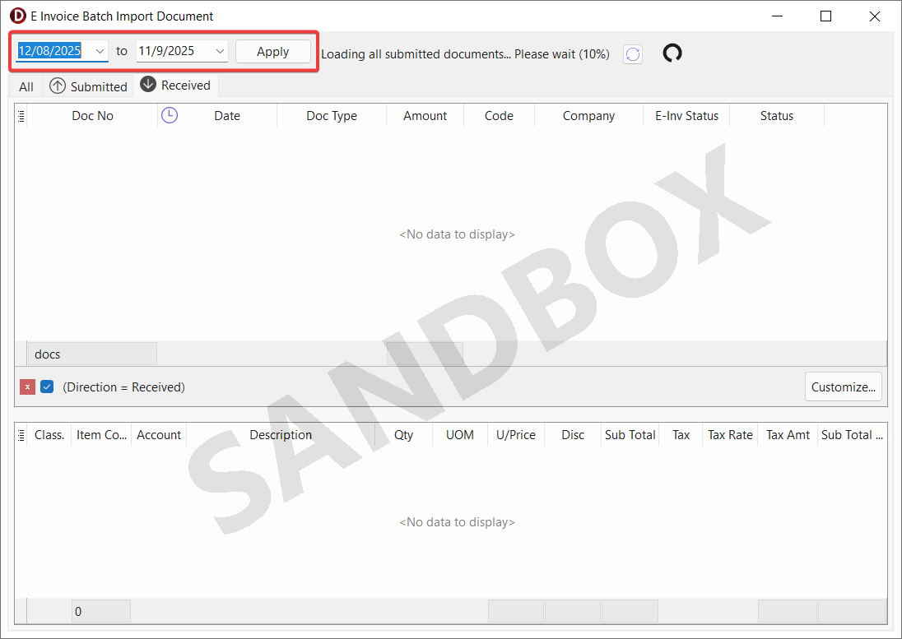

## Submission

In the E-Invoice system, there are few types of documents that can be submitted. The table below shows how each document type in SQL Account is mapped to its corresponding E-Invoice document type. Refer to each section for more detailed information on the specific document types.

| SQL Account Document Type                                     | E-Invoice Document Type           |
| ------------------------------------------------------------- | --------------------------------- |
| [Sales Invoice](e-invoice#sales-invoice--cash-sales)          | Invoice                           |
| [Cash Sales](e-invoice#sales-invoice--cash-sales)             | Invoice                           |
| [Credit Note](e-invoice#credit-note)                          | Credit Note                       |
| [Debit Note](e-invoice#debit-note)                            | Debit Note                        |
| [Payment Voucher](e-invoice#payment-voucher)                  | Self-Billed Invoice / Refund Note |
| [Purchase Invoice](e-invoice#purchase-invoice--cash-purchase) | Self-Billed Invoice               |
| [Cash Purchase](e-invoice#purchase-invoice--cash-purchase)    | Self-Billed Invoice               |
| [Purchase Returned](e-invoice#purchase-returned)              | Self-Billed Credit Note           |
| [Purchase Debit Note](e-invoice#purchase-debit-note)          | Self-Billed Debit Note            |
| [Receipt Voucher](e-invoice#receipt-voucher)                  | Self-Billed Refund Note / Invoice |

### Single Submission

1. Click on **MyInvois** > **Submit E-Invoice**

    

2. If the submission is valid, you will see the screen below, where you can see the validated Invoice info from LHDN directly.

    :::info[NOTE]
    Ensure that all required fields are correctly filled before submission to avoid errors. If the submission is invalid, you will need to correct the issues and resubmit.
    :::

    

### Batch Submission

In the scenario where you already issued a lot of invoices but yet to submit E-Invoice, you can utilize the `Batch Submission` feature to submit them in single operation.

1. Click on **MyInvois** > **Batch Submit E-Invoice**

    

2. Apply the desired date range and untick any invoices that you do not wish to submit yet, then proceed to **Submit**.

    

3. Refer to **Status** column for each E-Invoice status. If there's any errors, go to the specific invoice and update the incorrect details then retry submission again.

    

4. Go back to browse screen, click **Refresh** to see the updated status.

    

### Resolving Submitting Status

Submitting status is not a common status you will encounter. It will only stuck at submitting status during the event SQL Account fails to receive response from MyInvois Portal when the document may or may not be submitted. This mechanism is to **prevent double submission**.

Below show the icon of submitting status, it is a **red** submitted icon.

    

    

There are 2 way to resolve submitting status.

    - Using [refresh status (Single Document)](#refresh-status-single-document).
    - Using [batch refresh status](#batch-refresh-status).

1. After refresh status is clicked, SQL Account will automatically check if the document was submitted successfully to MyInvois Portal. In the event that:

    1. Document is **successfully found** in MyInvois Portal. Confirmation dialog will be prompted. (1) show the current document number that is being resolved. Select the correct document and click **OK** (2) to complete resolving submitting status.

        

    2. Document is **not found** in MyInvois Portal. Action dialog will be prompted.

        

        :::warning
        Sometimes it take a long time for the submitted document to appear in MyInvois Portal. Please ensure it has not been submitted before Reset E-Invoice status to avoid double submission.
        :::

        - Click **Search again** to retry find from MyInvois Portal again.
        - Click **Reset E-Invoice status** to remove submitting status, so you are able to resubmit the document again (This may lead to duplicate submission).

## Test E-Invoice Validation

:::important
The validation process utilizes the MyInvois Sandbox environment, meaning the documents will appear in your MyInvois Portal (Sandbox/Pre-production).

To use this feature, you must complete the [Sandbox Credential Setup](onboarding#sandbox-credentials--intermediary) beforehand.
:::

If you do not have the necessary permissions to submit an E-Invoice, you can now validate the E-Invoice during the issuance process.

This ensures that the invoice can be successfully submitted at a later stage.

1. After issuing an invoice, click **MyInvois** > **Test E-Invoice Validation**

    

2. If there's some missing data, error list or dialog will be shown, you can update the incorrect data and try validate again.

    Example error dialog:

    

3. If the validation is successful, you will see the following confirmation screen:

    

## Consolidate

When the buyer does not require an e-Invoice, the supplier will issue a regular receipt, which does not need to be submitted for IRBM validation.

However, you are required to aggregate these transactions monthly and submit a consolidated e-Invoice to IRBM within **seven calendar days after the month's end**.

1. Click on **MyInvois** > **Consolidate E-Invoice**

    

2. Select the documents to consolidate:
   1. Choose the desired date range
   2. Tick **Include unsubmitted E-Invoices** if you want to include invoices with **E-Invoice** submission type. Refer to [Step 4](e-invoice#sales-invoice--cash-sales)
   3. Click **Apply**

    

3. Review the aggregated invoice details and click **Submit**

    

4. If the consolidated E-Invoice is submitted successfully, you will see the following confirmation screen:

    

## Cancellation

At the **first 72 hours** of an submitted invoice, you are able to **cancel** the e-invoice, then re-submit the same invoice again without issuing CN/DN.

In the first 72 hours period, you shall cancel the invoice and resubmit when:

 1. There is a mistake in the submitted e-invoice.
 2. Buyer rejected the invoice and you agreed with the rejection.

To cancel a submitted e-invoice:

1. Go to **MyInvois** > **Cancel Validated E-Invoice**.

    

2. Enter the reason for cancellation then Click **Initiate Cancellation**. To dismiss the dialog, Click **Keep Document**.

    

3. To verify the latest status, go to **MyInvois** > **Check E-Invoice Status**.

    

## Report

Preview the report and you can see the E-Invoice validation QR code is embedded in the invoice.

## Refresh Status

You can easily check the latest status of an invoice in SQL Account to ensure it has been submitted and processed correctly.

### Refresh Status (Single Document)

1. Click on **MyInvois** > **Check E-Invoice Status** (1) or **Icon** (2).

    

2. You will be able to see the current status of the submitted invoice, along with the QR code and a validation page.

    

    :::info[NOTE]
    If the invoice status is marked as invalid, a list of errors will be displayed. You can use this information to correct the invoice and resubmit it.
    :::

    

### Batch Refresh Status

In certain situations, the status of your E-Invoices may not reflect the latest updates due to various factors such as:

- Slow or unstable internet connectivity
- Manual cancellation of an E-Invoice within the MyInvois Portal
- E-Invoice status showing as Submitted without further updates

To ensure that you are viewing the most up-to-date status of your E-Invoices, follow these steps:

   1. Click the **MyInvois** button.
   2. Select **Batch Check E-Invoice Status**.

This process will retrieve the latest status for all submitted documents, ensuring that your records are accurate and up to date.

    

## Submission Log

You can view all past submission and cancellation log of an invoice.

1. Click on **MyInvois** > **MyInvois Log**

    

    

## Import

SQL Account offers two methods for importing sales or purchase documents from the E-Invoice system:

- [Batch Import](#batch-import): Allows you to import multiple documents at once.
- [Linking](#linking): Allows you to link the existing document with received E-Invoice document.

To ensure proper import, it's important to understand how the document types in SQL Account are mapped to those received from the E-Invoice system. The table below shows how the document types in the SQL Account are mapped to those received from the E-Invoice system:

| SQL Account Document Type | E-Invoice Document Type |
| ------------------------- | ----------------------- |
| Sales Invoice             | Self-Billed Invoice     |
| Cash Sales                | Self-Billed Invoice     |
| Credit Note               | Self-Billed Credit Note |
| Debit Note                | Self-Billed Debit Note  |
| Receipt Voucher           | Self-Billed Invoice     |
| Purchase Invoice          | Invoice                 |
| Cash Purchase             | Invoice                 |
| Purchase Returned         | Credit Note             |
| Purchase Debit Note       | Debit Note              |
| Payment Voucher           | Invoice                 |

### Batch Import

You can view all received documents and batch import into SQL Account.

1. Click on **MyInvois** > **Batch import E-Invoice**

    

    

2. Choose the desired date range and press the **Apply** button to filter the documents

    

3. There are two tables inside the form:

    - The upper table will display the list of E-Invoice documents your company has received
    - The lower table will show the item details for the document you have selected

    

4. Each document will display a status in the **Status** column. Below is the description and import action of each status:

    | Status         | Description                                         | Action                          |
    | -------------- | --------------------------------------------------- | ------------------------------- |
    | (Blank)        | Not yet imported                                    | Create new document             |
    | Doc Exists     | Document already exists in the system               | Update E-Invoice related fields |
    | Different UUID | Document exists but with a different E-Invoice UUID | Create new document             |
    | Done           | Successfully imported                               | -                               |

    :::info[NOTE]
    Double-clicking a row will drill down into the existing document, while double-clicking the **E-Invoice Status** column will open the validation link
    :::

5. SQL Account will auto-map the Customer/Supplier Code using the following conditions:

    - Same **TIN** (prioritized)
    - Same **ID Number** or similar **Company Name**

    

6. A tax code is required for an item if the tax amount is greater than 0

    

7. You may click on the **Import** button to proceed with the import

    

8. A message dialog  will indicate success or display an error, if any

    

    

### Linking

You can view and link the received E-Invoice documents associated with the TIN of the selected document to update its E-Invoice related fields.

1. Click on **🔍** of MyInvois UUID field in more panel

    

2. The form will display only documents related to the same TIN as the selected record

    

3. Select the appropriate document and click on the **Update** button to link it

### Create / Update Customer or Supplier

To create or update a customer or supplier from the import form, follow these steps:

1. Click on the **Company Name** column

    :::info[NOTE]
    If the Customer/Supplier Code has value, SQL Account will update the existing record. If it is empty, a new customer/supplier will be created.
    :::

    

2. A comparison view will appear showing fields from the existing record in Maintain Customer/Supplier and the E-Invoice document

    :::info[NOTE]
    - The selected value will appear in **bold**
    - The unselected value will be shown with a ~~strikethrough~~
    - If both values (from E-Invoice and existing record) are identical, the cell will be merged
    :::

    

3. Click the **Create** or **Update** button to apply the changes to the customer or supplier record

## Rejection (Imported Documents)

At the **first 72 hours** of an received invoice, you are able to **reject** the e-invoice.

In the first 72 hours period, you shall reject the invoice when there is a mistake in the received e-invoice.

To reject a received e-invoice:

1. Go to **MyInvois** > **Reject Validated E-Invoice**.

    

2. Enter the reason for rejection then click **Initiate Rejection**. To dismiss the dialog, Click **Keep Document**.

    

## Share PDF (Experimental)

You can share invoice PDF to SQL buyer.

1. Click on **MyInvois** > **Check E-Invoice Status**

    

2. Click on **Share** to share the invoice PDF with SQL buyer

    

3. Continue to choose the report format to share with SQL buyer

    

    

## Download PDF (Experimental)

You can download the shared invoice PDF from SQL supplier.

1. Click on **MyInvois** > **Download PDF from SQL Supplier (Experimental)**

    :::info[NOTE]
    The option will be enabled if the supplier uploaded the PDF
    :::

    

    

## E-Invoice Request

The E-Invoice Request feature streamlines the process of collecting buyer information for E-Invoice submission. By providing a link, buyers can easily submit their personal or company details, ensuring accurate and real-time invoice creation with a validated LHDN QR code.

:::warning[IMPORTANT]
The invoice will auto submit to LHDN once the buyer has submitted the required information
:::

### Create E-Invoice Request

To create E-Invoice Request that allows buyers to fill in their personal or company information and submit it for E-Invoice

1. Click on **MyInvois** > **E-Invoice Request** in detail mode

    

2. Select the desired report from the report list

    

3. Share the report with the buyer

4. The buyer can scan the QR code included in the report to fill in their personal or company information and submit it for E-Invoice

5. An hourglass icon will appear next to the invoice with the E-Invoice Request

    :::info[NOTE]
    When clicked, the icon will open the link shared with the buyer
    :::

    

    

6. A filled hourglass icon indicates that the buyer has completed and submitted the required information for E-Invoice

    :::info[NOTE]
    When clicked, the icon updates the invoice with the submitted details and opens the link shared with the buyer
    :::

    

    

### Cancel E-Invoice Request

To cancel the E-Invoice Request and prevent the buyer from submitting information for E-Invoice

1. Click on **MyInvois** > **Cancel E-Invoice Request** in detail mode

    

### Refresh E-Invoice Request status

To check if the buyer has submitted information for E-Invoice and update the invoice with the submitted details

1. Click on **MyInvois** > **Refresh E-Invoice Request status** in detail mode

    

2. If the buyer has submitted the required information, the status icon will change to "Valid" and the invoice will be updated with the submitted details

    

### Batch Refresh E-Invoice Request status

To check if buyers have submitted information for E-Invoice and update the status for multiple invoices

1. Click on **MyInvois** > **Batch Refresh E-Invoice Request status** in browse mode

    

2. A progress dialog will appear and retrieve the latest status for all invoices with E-Invoice Request

    

### Batch Submit E-Invoice & Consolidate E-Invoice

When selected invoices include those with E-Invoice Request (Hourglass icon), the following options will appear in the Batch Submit E-Invoice and Consolidate E-Invoice forms:

- Refresh - Verify that the selected invoices have been submitted for E-Invoice by the buyers and update the information
- Cancel - Cancel the E-Invoice Request for the selected invoices to prevent buyers from submitting information for E-Invoice

    

    :::info[NOTE]
    You may click the Valid icon to perform refresh status
    :::

    

    
