Submitting E-Invoices via SQL Account is seamless and integrates smoothly with your existing workflow.

## Sales

### Sales Invoice / Cash Sales

:::info[NOTE]
These documents generate MyInvois Invoice which is a commercial document that itemises and records a transaction between your customer and you.
:::

1. Go to **Sales** > **Invoice / Cash Sales** > **New** to issue a new invoice / cash sales.
2. Select an existing customer or create a new customer.

    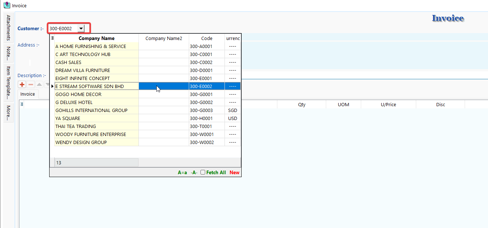

3. Click on **More** (1) to view mandatory info required for e-invoice, it will be prefilled with the info from existing customer's profile. Click on 📌(2) to pin the tab for easier view.

    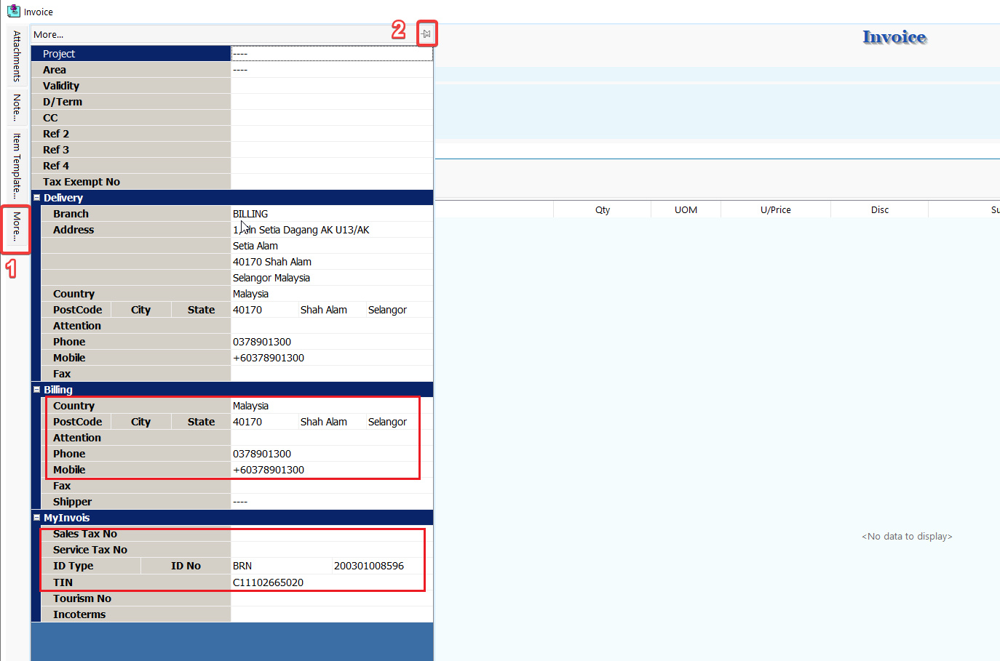

4. Select the submission type for this document.
    - If you do not want to use the default submission type from the customer's profile, select a different option for this document.

    :::info[SUBMISSION]
    - None – Exclude this document from E-Invoice submission.
    - E-Invoice – This document will be submitted as E-Invoice.
    - Consolidate – This document will be submitted as consolidated E-Invoice.
    :::

    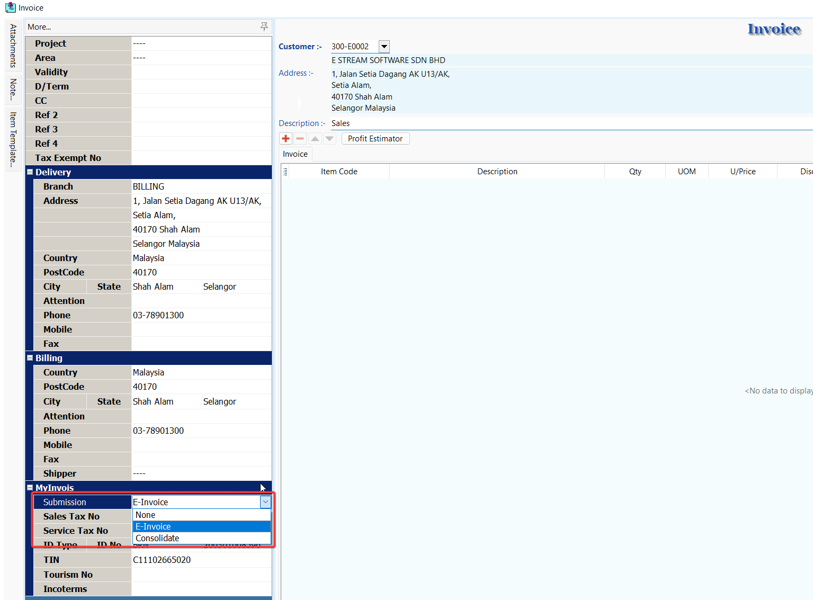

5. Continue with usual invoice / cash sales entry and **Save**.

#### E-Invoice Operation {#e-invoice-operation-sales-invoice}

After saving your Sales Invoice or Cash Sales document, you can access E-Invoice operations through the **MyInvois** button. These operations help you manage your E-Invoices efficiently. Use the links below to navigate to the specific operation section for detailed instructions:

- [Submission](e-invoice-operation#submission)
- [Consolidate](e-invoice-operation#consolidate)
- [Cancellation](e-invoice-operation#cancellation)
- [Refresh Status](e-invoice-operation#refresh-status)
- [Log](e-invoice-operation#submission-log)
- [Batch Submission](e-invoice-operation#batch-submission)
- [Batch Refresh Status](e-invoice-operation#batch-refresh-status)
- [Test E-Invoice Validation](e-invoice-operation#test-e-invoice-validation)
- [Share PDF](e-invoice-operation#share-pdf-experimental)
- [E-Invoice Request](e-invoice-operation#e-invoice-request)
- [Batch Import](e-invoice-operation#batch-import)
- [Linking](e-invoice-operation#linking)

### Credit Note

:::info[NOTE]
This document generate MyInvois Credit Note which is issued by you to correct errors, apply discounts, or account for returns in a previously issued E-Invoice with the purpose of reducing the value of the original E-Invoice. This is used in situations where the reduction of the original E-Invoice does not involve return of monies to your customer.
:::

When creating a credit note, you have the option to reference validated E-Invoices. There are three methods to do this:

:::warning[IMPORTANT]
Please ensure that the referenced documents are validated E-Invoices. If they are not, the system will be unable to find the reference, and the credit note reference field will automatically indicate not applicable and become an unreferenced credit note.
:::

#### Transfer To

1. Open validated invoice / cash sales in entry form. (Browse Mode)

2. **Right Click on Invoice / Cash Sales title**, select **Transfer To Sales Credit Note**.

3. Click on **More** (1) to view mandatory info required for e-invoice, it will be prefilled with the info from the validated invoice / cash sales. Click on 📌(2) to pin the tab for easier view.

    :::info[SUBMISSION]
    - None – Exclude this document from Credit Note submission.
    - E-Invoice – This document will be submitted as Credit Note.
    - Consolidate – This document will be submitted as consolidated Credit Note.
    :::

    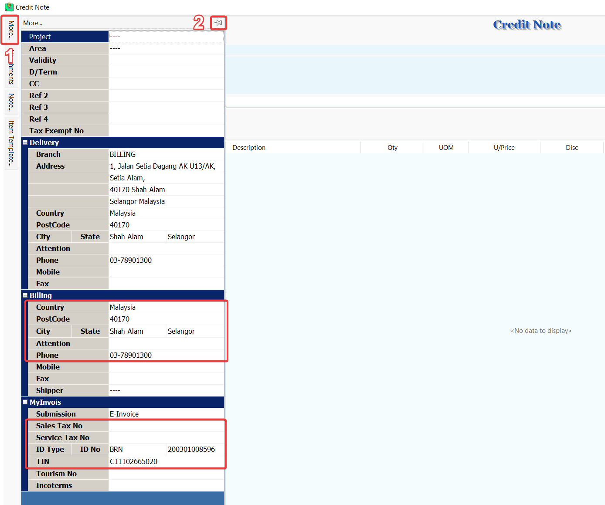

4. Continue with usual credit note entry and **Save**.

#### Transfer From

1. Go to **Sales** > **Credit Note** > **New** to issue a new credit note.

2. **Right Click on Credit Note title**, select **Transfer From Sales Invoice** / **Transfer From Cash Sale**, then do transfer from operation as usual (Choose validated documents for valid references).

3. Click on **More** (1) to view mandatory info required for e-invoice, it will be prefilled with the info from the validated invoice / cash sales. Click on 📌(2) to pin the tab for easier view.

    :::info[SUBMISSION]
    - None – Exclude this document from Credit Note submission.
    - E-Invoice – This document will be submitted as Credit Note.
    - Consolidate – This document will be submitted as consolidated Credit Note.
    :::

    

4. Continue with usual credit note entry and **Save**.

#### From Doc

1. Go to **Sales** > **Credit Note** > **New** to issue a new credit note.

2. Select an existing customer or create a new customer.

    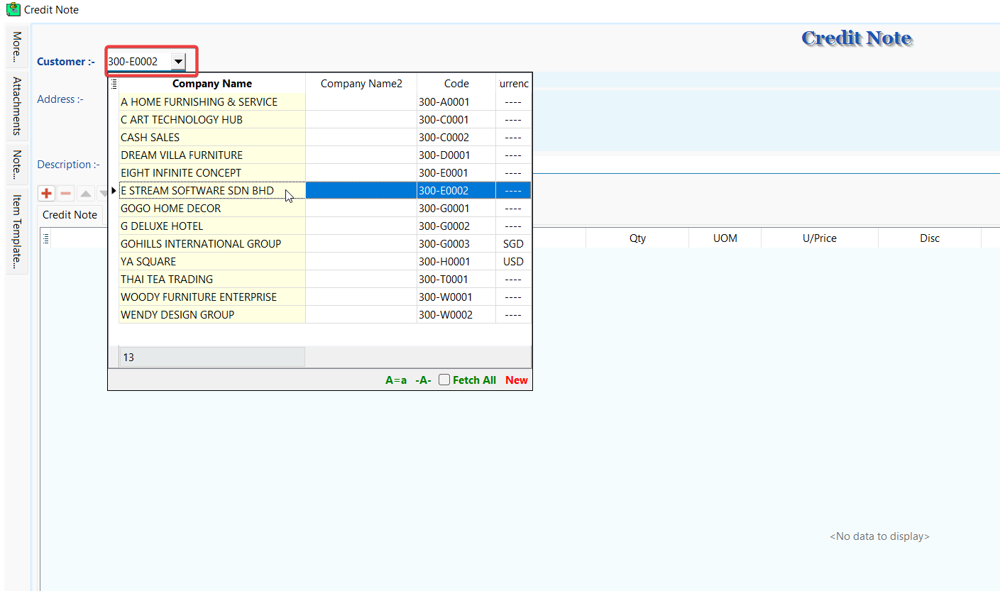

3. Click on **More** (1) to view mandatory info required for e-invoice, it will be prefilled with the info from existing customer's profile. Click on 📌(2) to pin the tab for easier view.

    :::info[SUBMISSION]
    - None – Exclude this document from Credit Note submission.
    - E-Invoice – This document will be submitted as Credit Note.
    - Consolidate – This document will be submitted as consolidated Credit Note.
    :::

    

4. Click on From Doc button **⋯** (1) to manually **select one or more** validated invoices / cash sales (2) to establish the reference.

    :::tip
    From Doc field allow you to manually select one or more validated invoices / cash sales as reference without affecting transfer quantity.
    :::

    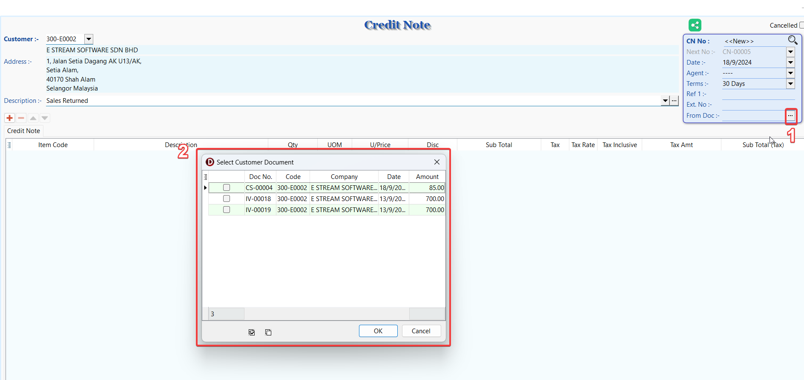

5. Continue with usual credit note entry and **Save**.

#### E-Invoice Operation {#e-invoice-operation-sales-credit-note}

After saving your Credit Note document, you can access E-Invoice operations through the **MyInvois** button. These operations help you manage your E-Invoices efficiently. Use the links below to navigate to the specific operation section for detailed instructions:

- [Submission](e-invoice-operation#submission)
- [Cancellation](e-invoice-operation#cancellation)
- [Refresh Status](e-invoice-operation#refresh-status)
- [Log](e-invoice-operation#submission-log)
- [Batch Submission](e-invoice-operation#batch-submission)
- [Batch Refresh Status](e-invoice-operation#batch-refresh-status)
- [Test E-Invoice Validation](e-invoice-operation#test-e-invoice-validation)
- [Share PDF](e-invoice-operation#share-pdf-experimental)
- [Batch Import](e-invoice-operation#batch-import)
- [Linking](e-invoice-operation#linking)

### Debit Note

:::info[NOTE]
This document generate MyInvois Debit Note which is issued by you to indicate additional charges on a previously issued E-Invoice.
:::

When creating a debit note, you have the option to reference validated E-Invoices.

:::warning[IMPORTANT]
Please ensure that the referenced documents are validated E-Invoices. If they are not, the system will be unable to find the reference, and the debit note reference field will automatically indicate not applicable and become an unreferenced debit note.
:::

1. Go to **Sales** > **Debit Note** > **New** to issue a new debit note.

2. Select an existing customer or create a new customer.

    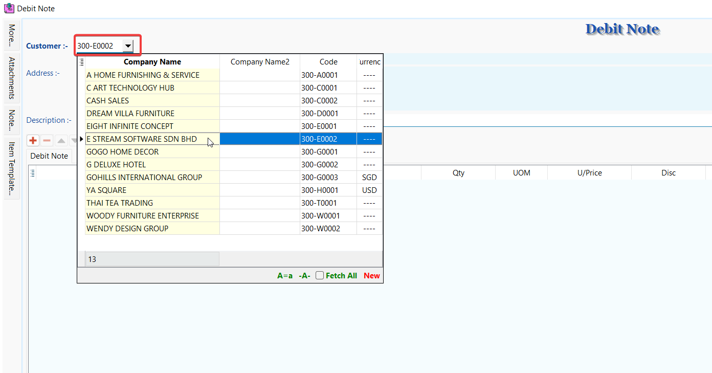

3. Click on **More** (1) to view mandatory info required for e-invoice, it will be prefilled with the info from existing customer's profile. Click on 📌(2) to pin the tab for easier view.

    :::info[SUBMISSION]
    - None – Exclude this document from Debit Note submission.
    - E-Invoice – This document will be submitted as Debit Note.
    - Consolidate – This document will be submitted as consolidated Debit Note.
    :::

    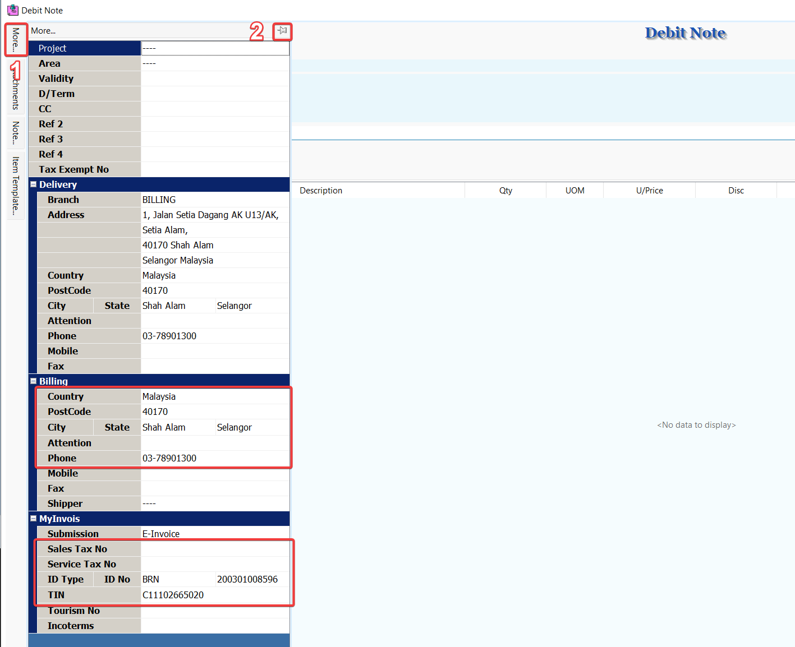

4. Click on From Doc button **⋯** (1) to manually **select one or more** validated invoices / cash sales (2) to establish the reference.

    :::tip
    From Doc field allow you to manually select one or more validated invoices / cash sales as reference without affecting transfer quantity.
    :::

    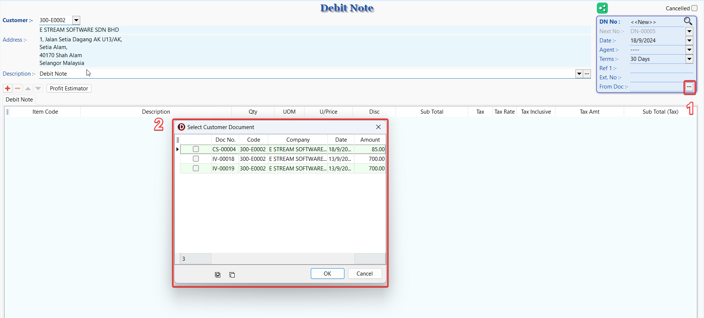

5. Continue with usual debit note entry and **Save**.

#### E-Invoice Operation {#e-invoice-operation-sales-debit-note}

After saving your Debit Note document, you can access E-Invoice operations through the **MyInvois** button. These operations help you manage your E-Invoices efficiently. Use the links below to navigate to the specific operation section for detailed instructions:

- [Submission](e-invoice-operation#submission)
- [Cancellation](e-invoice-operation#cancellation)
- [Refresh Status](e-invoice-operation#refresh-status)
- [Log](e-invoice-operation#submission-log)
- [Batch Submission](e-invoice-operation#batch-submission)
- [Batch Refresh Status](e-invoice-operation#batch-refresh-status)
- [Test E-Invoice Validation](e-invoice-operation#test-e-invoice-validation)
- [Share PDF](e-invoice-operation#share-pdf-experimental)
- [Batch Import](e-invoice-operation#batch-import)
- [Linking](e-invoice-operation#linking)

## Purchase

### Purchase Invoice / Cash Purchase

:::info[NOTE]
These documents generate MyInvois Self-Billed Invoice which is a commercial document to document expenses that itemises and records a transaction between your supplier and you. For E-Invoice purposes, you shall issue Self-Billed E-Invoices for the following transactions:

1. Payment to agents, dealers, distributors, etc.
2. Goods sold or services rendered by foreign suppliers
3. Profit distribution (e.g., dividend distribution)
4. Electronic commerce ("e-commerce") transactions
5. Pay-out to all betting and gaming winners1
6. Transactions with individuals (who are not conducting a business) (applicable only if the other self-billed circumstances are not applicable)
7. Interest payment, except:
    1. Businesses (e.g., financial institutions, etc.) that charge interest to public at large (regardless of whether they are businesses or individuals);
    2. Interest payment made by employee to employer; and
    3. Interest payment made by foreign payor to Malaysian taxpayers.
8. Claim, compensation or benefit payments from the insurance business of an insurer

:::

1. Go to **Purchase** > **Purchase Invoice / Cash Purchase** > **New** to issue a new purchase invoice / cash purchase.
2. Select an existing supplier or create a new supplier.

    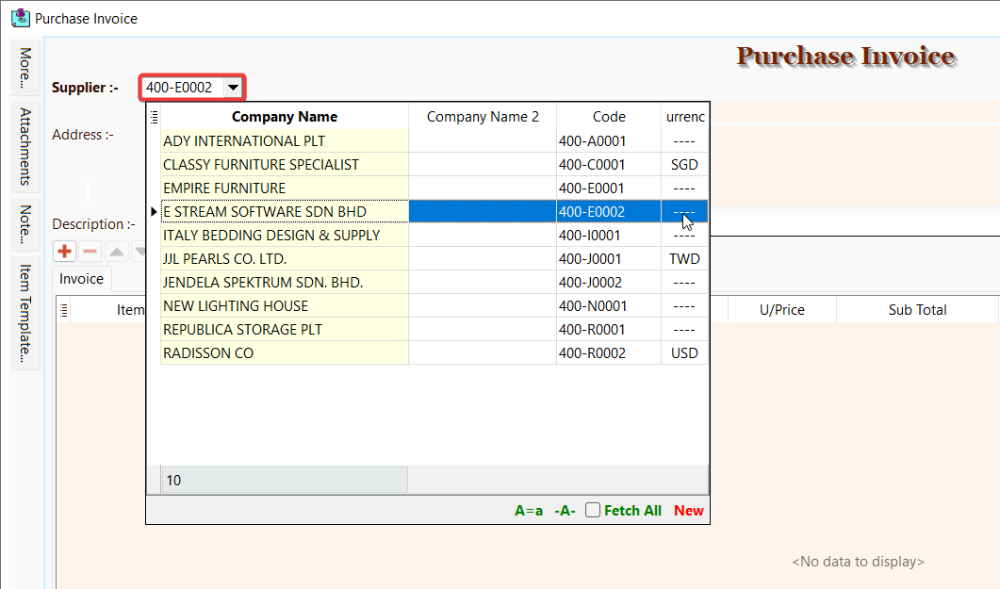

3. Click on **More** (1) to view mandatory info required for Self-Billed E-Invoice, it will be prefilled with the info from existing supplier's profile. Click on 📌(2) to pin the tab for easier view.

    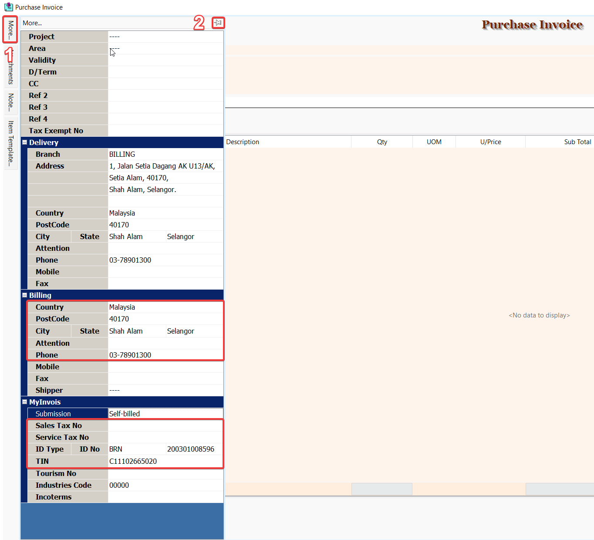

4. Select the submission type for this document.
    - If you do not want to use the default submission type from the supplier's profile, select a different option for this document.

    :::info[SUBMISSION]
    - None – Exclude this document from Self-Billed E-Invoice submission.
    - Self-billed – This document will be submitted as Self-Billed E-Invoice.
    - Consolidate – This document will be submitted as consolidated Self-Billed E-Invoice.
    :::

    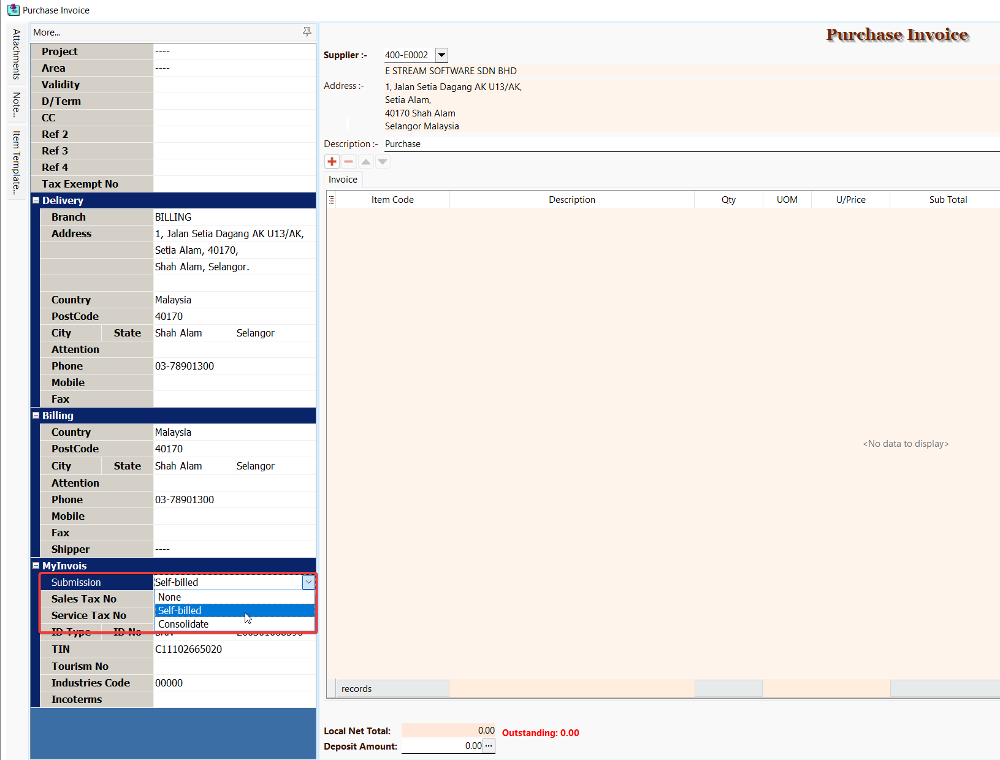

5. Continue with usual purchase invoice / cash purchase entry and **Save**.

#### E-Invoice Operation {#e-invoice-operation-purchase-invoice}

After saving your Purchase Invoice or Cash Purchase document, you can access E-Invoice operations through the **MyInvois** button. These operations help you manage your E-Invoices efficiently. Use the links below to navigate to the specific operation section for detailed instructions:

- [Submission](e-invoice-operation#submission)
- [Consolidate](e-invoice-operation#consolidate)
- [Batch Import](e-invoice-operation#batch-import)
- [Linking](e-invoice-operation#linking)
- [Cancellation (Self-Billed)](e-invoice-operation#cancellation)
- [Rejection (Imported)](e-invoice-operation#rejection-imported-documents)
- [Refresh Status](e-invoice-operation#refresh-status)
- [Log](e-invoice-operation#submission-log)
- [Batch Submission](e-invoice-operation#batch-submission)
- [Batch Refresh Status](e-invoice-operation#batch-refresh-status)
- [Test E-Invoice Validation](e-invoice-operation#test-e-invoice-validation)
- [Download PDF](e-invoice-operation#download-pdf-experimental)

### Purchase Returned

:::info[NOTE]
This document generate MyInvois Self-Billed Credit Note which is issued by you to correct errors, apply discounts, or account for returns in a previously issued Self-Billed E-Invoice with the purpose of reducing the value of the original Self-Billed E-Invoice. This is used in situations where the reduction of the original Self-Billed E-Invoice does not involve return of monies to the you
:::

When creating a purchase returned, you have the option to reference validated Self-Billed E-Invoices. There are three methods to do this:

:::warning[IMPORTANT]
Please ensure that the referenced documents are validated Self-Billed E-Invoices. If they are not, the system will be unable to find the reference, and the purchase returned reference field will automatically indicate not applicable and become an unreferenced Self-Billed Credit Note.
:::

#### Transfer To {#transfer-to-purchase-returned}

1. Open validated purchase invoice / cash purchase in entry form. (Browse Mode)

2. **Right Click on Purchase Invoice / Cash Purchase title**, select **Transfer To Purchase Returned**.

3. Click on **More** (1) to view mandatory info required for Self-Billed Credit Note, it will be prefilled with the info from the validated purchase invoice / cash purchase. Click on 📌(2) to pin the tab for easier view.

    :::info[SUBMISSION]
    - None – Exclude this document from Self-Billed Credit Note submission.
    - Self-billed – This document will be submitted as Self-Billed Credit Note.
    - Consolidate – This document will be submitted as consolidated Self-Billed Credit Note.
    :::

    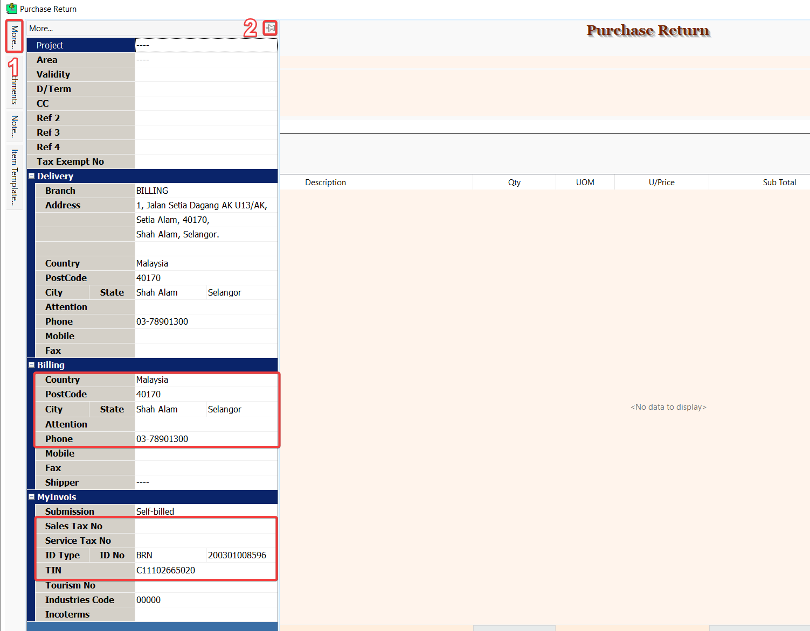

4. Continue with usual purchase returned entry and **Save**.

#### Transfer From {#transfer-from-purchase-returned}

1. Go to **Purchase** > **Purchase Returned** > **New** to issue a new purchase returned.

2. **Right Click on Purchase Return title**, select **Transfer From Purchase Invoice** / **Transfer From Cash Purchase**, then do transfer from operation as usual (Choose validated documents for valid references).

3. Click on **More** (1) to view mandatory info required for Self-Billed Credit Note, it will be prefilled with the info from the validated purchase invoice / cash purchase. Click on 📌(2) to pin the tab for easier view.

    :::info[SUBMISSION]
    - None – Exclude this document from Self-Billed Credit Note submission.
    - Self-billed – This document will be submitted as Self-Billed Credit Note.
    - Consolidate – This document will be submitted as consolidated Self-Billed Credit Note.
    :::

    

4. Continue with usual purchase returned entry and **Save**.

#### From Doc {#from-doc-purchase-returned}

1. Go to **Purchase** > **Purchase Returned** > **New** to issue a new purchase returned.

2. Select an existing supplier or create a new supplier.

    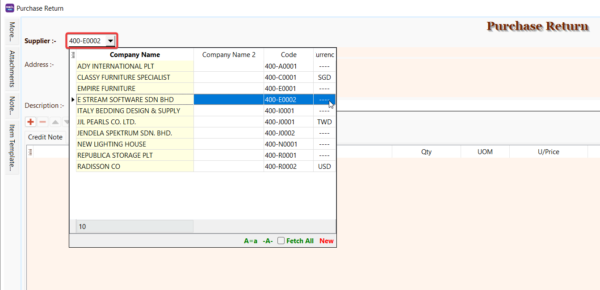

3. Click on **More** (1) to view mandatory info required for Self-Billed Credit Note, it will be prefilled with the info from the validated purchase invoice / cash purchase. Click on 📌(2) to pin the tab for easier view.

    :::info[SUBMISSION]
    - None – Exclude this document from Self-Billed Credit Note submission.
    - Self-billed – This document will be submitted as Self-Billed Credit Note.
    - Consolidate – This document will be submitted as consolidated Self-Billed Credit Note.
    :::

    

4. Click on From Doc button **⋯** (1) to manually **select one or more** validated purchase invoices / cash purchases (2) to establish the reference.

    :::tip
    From Doc field allow you to manually select one or more validated purchase invoices / cash purchases as reference without affecting transfer quantity.
    :::

    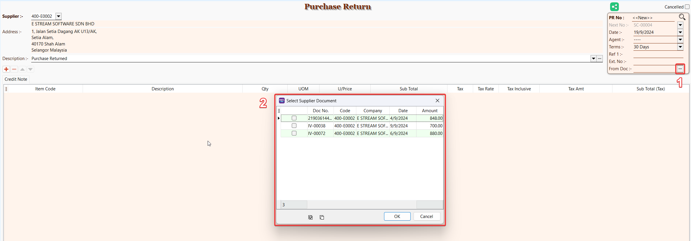

5. Continue with usual purchase returned entry and **Save**.

#### E-Invoice Operation {#e-invoice-operation-purchase-returned}

After saving your Purchase Returned document, you can access E-Invoice operations through the **MyInvois** button. These operations help you manage your E-Invoices efficiently. Use the links below to navigate to the specific operation section for detailed instructions:

- [Submission](e-invoice-operation#submission)
- [Batch Import](e-invoice-operation#batch-import)
- [Linking](e-invoice-operation#linking)
- [Cancellation (Self-Billed)](e-invoice-operation#cancellation)
- [Rejection (Imported)](e-invoice-operation#rejection-imported-documents)
- [Refresh Status](e-invoice-operation#refresh-status)
- [Log](e-invoice-operation#submission-log)
- [Batch Submission](e-invoice-operation#batch-submission)
- [Batch Refresh Status](e-invoice-operation#batch-refresh-status)
- [Test E-Invoice Validation](e-invoice-operation#test-e-invoice-validation)
- [Download PDF](e-invoice-operation#download-pdf-experimental)

### Purchase Debit Note

:::info[NOTE]
This document generate MyInvois Self-Billed Debit Note which is issued by you to indicate additional charges on a previously issued Self-Billed E-Invoice.
:::

When creating a purchase debit note, you have the option to reference validated Self-Billed E-Invoices.

:::warning[IMPORTANT]
Please ensure that the referenced documents are validated Self-Billed E-Invoices. If they are not, the system will be unable to find the reference, and the purchase debit note reference field will automatically indicate not applicable and become an unreferenced Self-Billed Debit Note.
:::

1. Go to **Purchase** > **Purchase Debit Note** > **New** to issue a new purchase debit note.

2. Select an existing supplier or create a new supplier.

    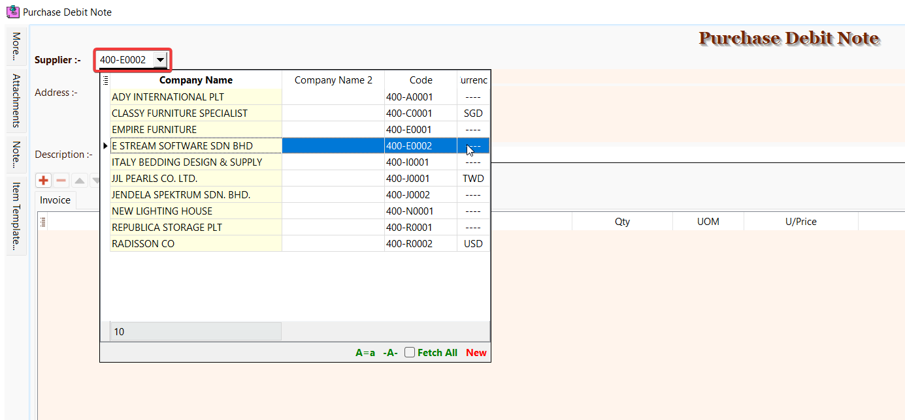

3. Click on **More** (1) to view mandatory info required for Self-Billed Debit Note, it will be prefilled with the info from existing supplier's profile. Click on 📌(2) to pin the tab for easier view.

    :::info[SUBMISSION]
    - None – Exclude this document from Self-Billed Debit Note submission.
    - Self-billed – This document will be submitted as Self-Billed Debit Note.
    - Consolidate – This document will be submitted as consolidated Self-Billed Debit Note.
    :::

    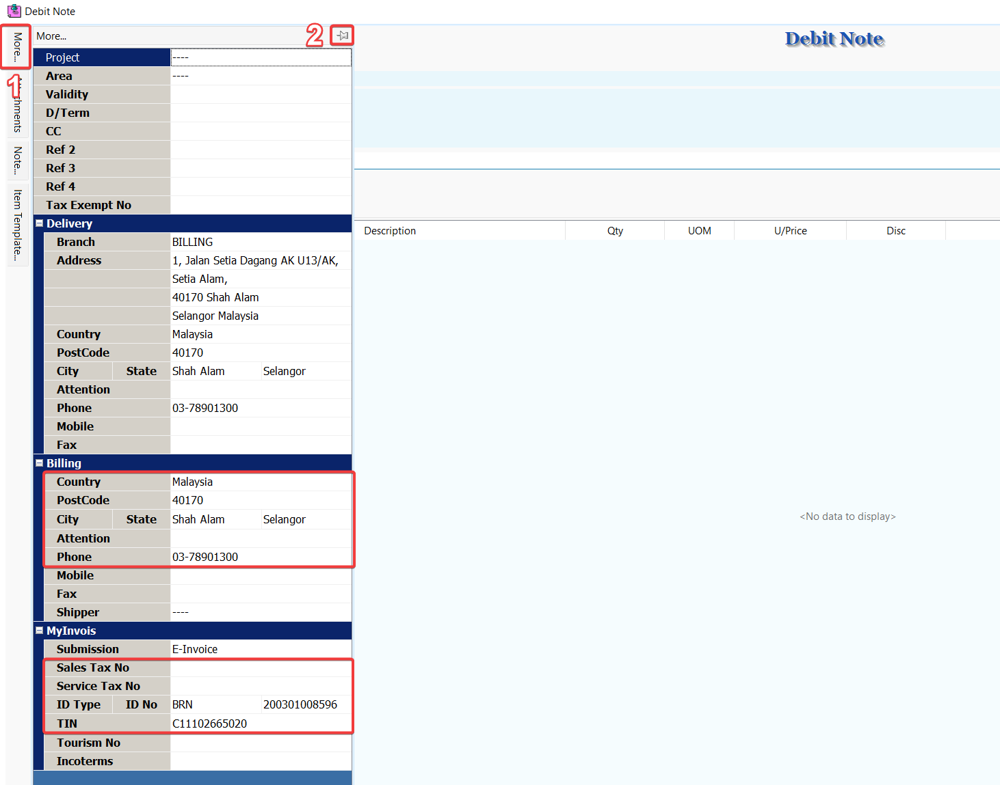

4. Click on From Doc button **⋯** (1) to manually **select one or more** validated purchase invoices / cash purchases (2) to establish the reference.

    :::tip
    From Doc field allow you to manually select one or more validated purchase invoices / cash purchases as reference without affecting transfer quantity.
    :::

    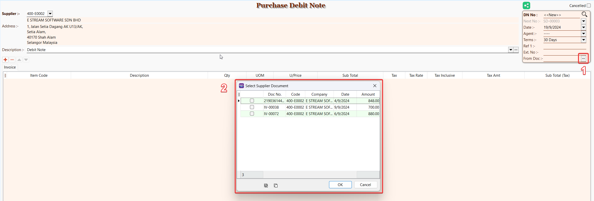

5. Continue with usual purchase debit note entry and **Save**.

#### E-Invoice Operation {#e-invoice-operation-purchase-debit-note}

After saving your Purchase Debit Note document, you can access E-Invoice operations through the **MyInvois** button. These operations help you manage your E-Invoices efficiently. Use the links below to navigate to the specific operation section for detailed instructions:

- [Submission](e-invoice-operation#submission)
- [Batch Import](e-invoice-operation#batch-import)
- [Linking](e-invoice-operation#linking)
- [Cancellation (Self-Billed)](e-invoice-operation#cancellation)
- [Rejection (Imported)](e-invoice-operation#rejection-imported-documents)
- [Refresh Status](e-invoice-operation#refresh-status)
- [Log](e-invoice-operation#submission-log)
- [Batch Submission](e-invoice-operation#batch-submission)
- [Batch Refresh Status](e-invoice-operation#batch-refresh-status)
- [Test E-Invoice Validation](e-invoice-operation#test-e-invoice-validation)
- [Download PDF](e-invoice-operation#download-pdf-experimental)

## Cash Book

### Mandatory Fields

Cash Book does not use customer / supplier info from maintain customer / supplier. The mandatory fields is filled with last used info in Cash Book itself.

1. Go to **GL** > **Cash Book Entry** > **New PV** / **New OR** to issue a new payment voucher / receipt voucher.

2. Click on **More** (1) to fill in mandatory fields. Click on 📌(2) to pin the tab for easier view.

    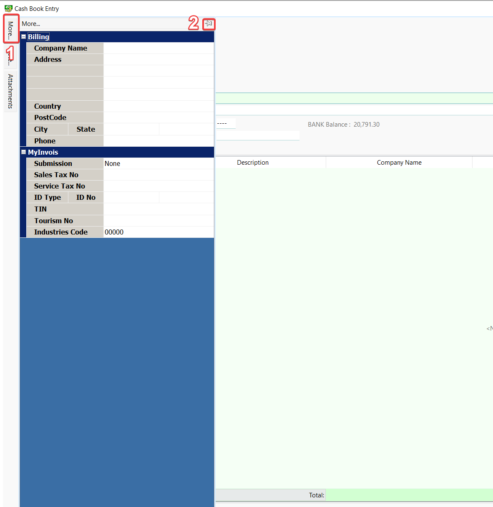

3. Fill in **Company Name**. You may **click on the label** (1) or press **enter** to fill in company name.

    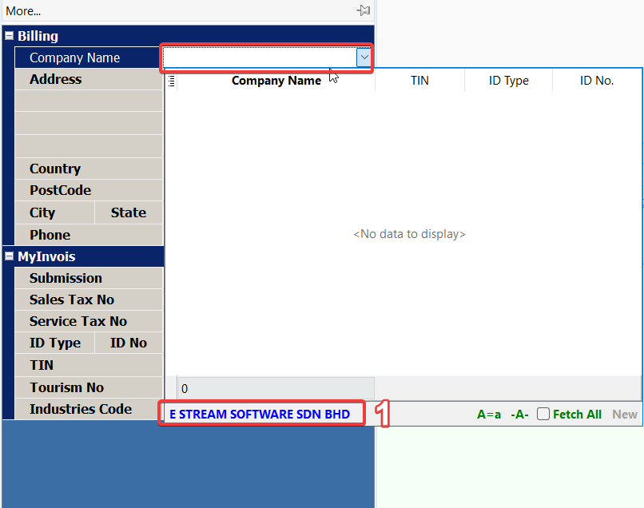

4. Manually fill in the mandatory fields below. **TIN** must be filled.

    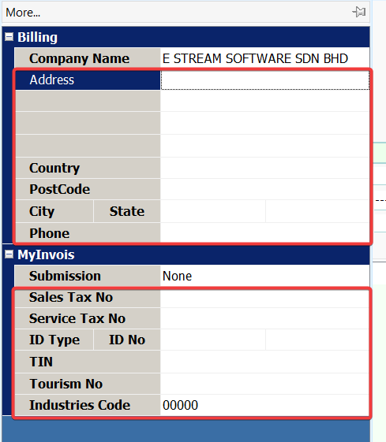

    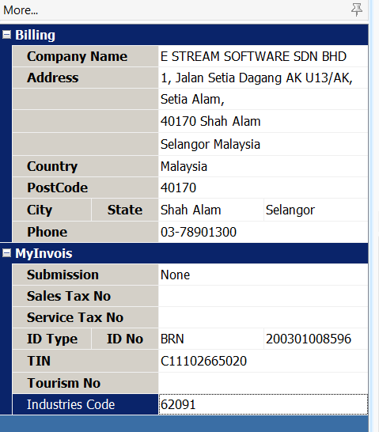

5. Continue with cash book entry following [Payment Voucher guide](#payment-voucher) or [Receipt Voucher guide](#receipt-voucher) below and **Save**.

6. For the next entry, you can reuse the mandatory info filled in during Step 4. It can be found in the company name lookup.

    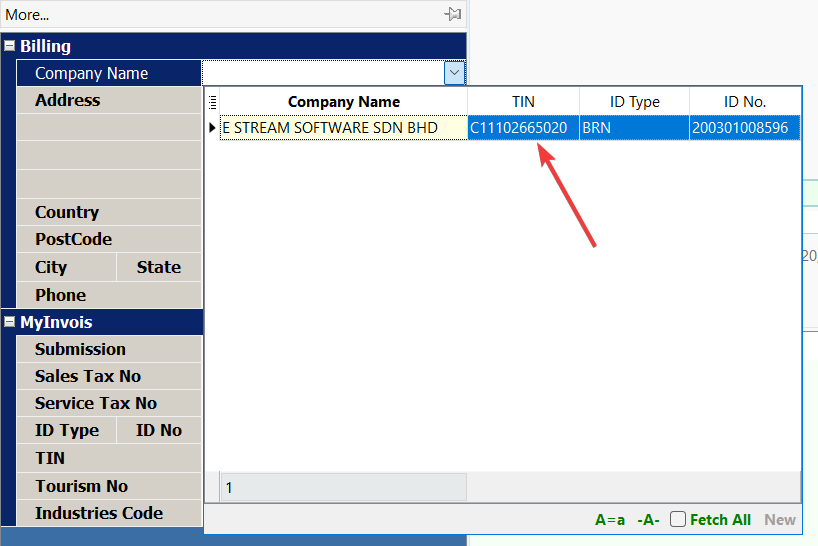

### Payment Voucher

This document can generate either MyInvois Self-Billed Invoice or MyInvois Refund Note based on submission type.

:::info[SUBMISSION]

- None – Exclude this document from submission.
- Self-billed – This document will be submitted as Self-Billed Invoice.
- E-Invoice Refund – This document will be submitted as Refund Note.
- Consolidate – This document will be submitted as consolidated Self-Billed Invoice.

:::

#### Self-Billed Invoice

:::info[NOTE]
Self-Billed Invoice is a commercial document that itemises and records a transaction between your supplier and you.

For E-Invoice purposes, you shall issue Self-Billed E-Invoices for the following transactions:

1. Payment to agents, dealers, distributors, etc.
2. Goods sold or services rendered by foreign suppliers
3. Profit distribution (e.g., dividend distribution)
4. Electronic commerce ("e-commerce") transactions
5. Pay-out to all betting and gaming winners1
6. Transactions with individuals (who are not conducting a business) (applicable only if the other self-billed circumstances are not applicable)
7. Interest payment, except:
    1. Businesses (e.g., financial institutions, etc.) that charge interest to public at large (regardless of whether they are businesses or individuals);
    2. Interest payment made by employee to employer; and
    3. Interest payment made by foreign payor to Malaysian taxpayers.
8. Claim, compensation or benefit payments from the insurance business of an insurer

:::

1. Go to **GL** > **Cash Book Entry** > **New PV** to issue a new payment voucher.

2. Fill in mandatory fields following the [guide](#mandatory-fields).

3. Select **Self-billed** submission type.

    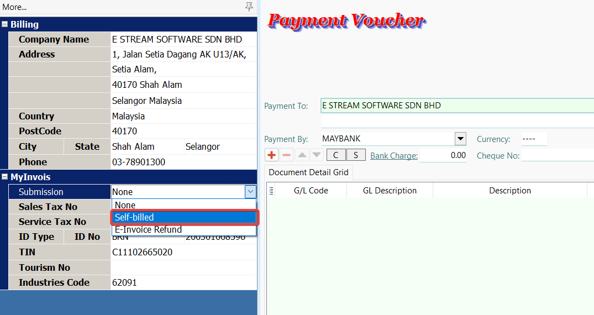

4. Continue with usual payment voucher entry and **Save**.

#### E-Invoice Operation {#e-invoice-operation-payment-voucher-self-billed}

After saving your Payment Voucher document, you can access E-Invoice operations through the **MyInvois** button. These operations help you manage your E-Invoices efficiently. Use the links below to navigate to the specific operation section for detailed instructions:

- [Submission](e-invoice-operation#submission)
- [Cancellation](e-invoice-operation#cancellation)
- [Refresh Status](e-invoice-operation#refresh-status)
- [Log](e-invoice-operation#submission-log)
- [Batch Submission](e-invoice-operation#batch-submission)
- [Batch Refresh Status](e-invoice-operation#batch-refresh-status)
- [Test E-Invoice Validation](e-invoice-operation#test-e-invoice-validation)

#### Refund Note

:::info[NOTE]
Refund Note is the document issued by you to confirm the refund of your customer payment. This is used in situations where there is a return of monies to your customer.
:::

When creating a refund note, you have the option to reference validated E-Invoices from Receipt Voucher.

:::warning[IMPORTANT]
Please ensure that the referenced documents are validated E-Invoices (Receipt Voucher). If they are not, the system will be unable to find the reference, and the Refund Note reference field will automatically indicate not applicable and become an unreferenced Refund Note.
:::

1. Go to **GL** > **Cash Book Entry** > **New PV** to issue a new payment voucher.

2. Click on From Doc button **⋯** (1) to manually **select one or more** validated Receipt Voucher (2) to establish the reference.

    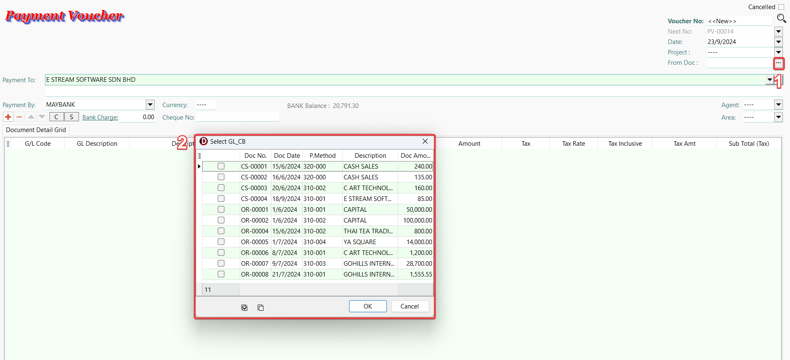

3. Fill in mandatory fields following the [guide](#mandatory-fields).

4. Select **E-Invoice Refund** submission type.

    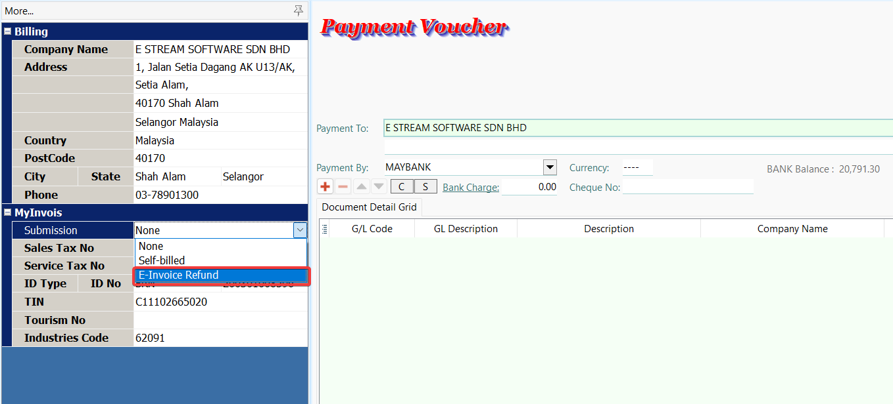

5. Continue with usual payment voucher entry and **Save**.

#### E-Invoice Operation {#e-invoice-operation-payment-voucher-e-invoice-refund}

After saving your Payment Voucher document, you can access E-Invoice operations through the **MyInvois** button. These operations help you manage your E-Invoices efficiently. Use the links below to navigate to the specific operation section for detailed instructions:

- [Submission](e-invoice-operation#submission)
- [Cancellation](e-invoice-operation#cancellation)
- [Refresh Status](e-invoice-operation#refresh-status)
- [Log](e-invoice-operation#submission-log)
- [Batch Submission](e-invoice-operation#batch-submission)
- [Batch Refresh Status](e-invoice-operation#batch-refresh-status)
- [Test E-Invoice Validation](e-invoice-operation#test-e-invoice-validation)

### Receipt Voucher

This document can generate either MyInvois Invoice or MyInvois Self-Billed Refund Note based on submission type.

:::info[SUBMISSION]

- None – Exclude this document from submission.
- E-Invoice – This document will be submitted as E-Invoice.
- Self-Billed Refund – This document will be submitted as Self-Billed Refund Note.
- Consolidate – This document will be submitted as consolidated E-Invoice.

:::

#### Invoice

:::info[NOTE]
Invoice is a commercial document that itemises and records a transaction between your customer and you.
:::

1. Go to **GL** > **Cash Book Entry** > **New OR** to issue a new receipt voucher.

2. Fill in mandatory fields following the [guide](#mandatory-fields).

3. Select **E-Invoice** submission type.

    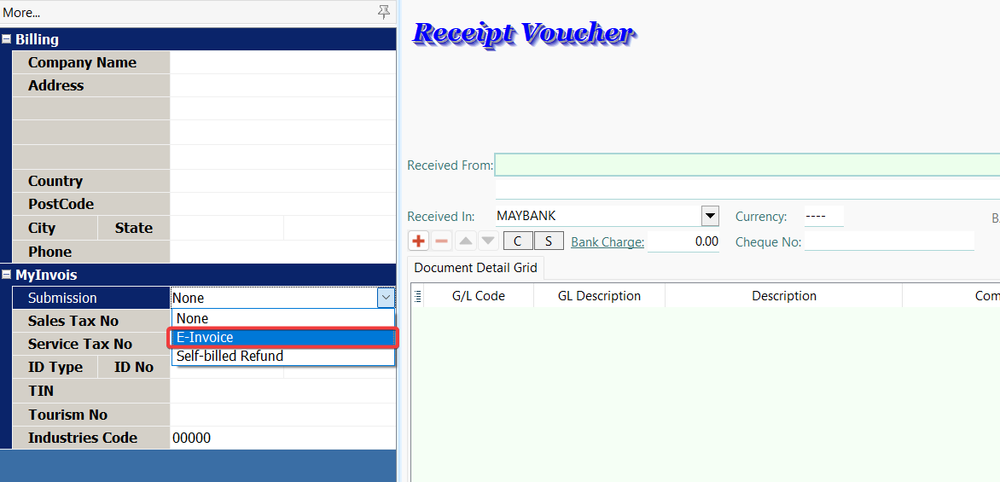

4. Continue with usual receipt voucher entry and **Save**.

#### E-Invoice Operation {#e-invoice-operation-receipt-voucher-e-invoice}

After saving your Receipt Voucher document, you can access E-Invoice operations through the **MyInvois** button. These operations help you manage your E-Invoices efficiently. Use the links below to navigate to the specific operation section for detailed instructions:

- [Submission](e-invoice-operation#submission)
- [Cancellation](e-invoice-operation#cancellation)
- [Refresh Status](e-invoice-operation#refresh-status)
- [Log](e-invoice-operation#submission-log)
- [Batch Submission](e-invoice-operation#batch-submission)
- [Batch Refresh Status](e-invoice-operation#batch-refresh-status)
- [Test E-Invoice Validation](e-invoice-operation#test-e-invoice-validation)

#### Self-Billed Refund Note

:::info[NOTE]
Self-Billed Refund Note is the document issued by you to confirm the refund of your payment. This is used in situations where there is a return of monies to your supplier.
:::

When creating a self-billed refund note, you have the option to reference validated Self-Billed E-Invoices from Payment Voucher.

:::warning[IMPORTANT]
Please ensure that the referenced documents are validated Self-Billed E-Invoices (Payment Voucher). If they are not, the system will be unable to find the reference, and the Self-Billed Refund Note reference field will automatically indicate not applicable and become an unreferenced Self-Billed Refund Note.
:::

1. Go to **GL** > **Cash Book Entry** > **New OR** to issue a new receipt voucher.

2. Click on From Doc button **⋯** (1) to manually **select one or more** validated Payment Voucher (2) to establish the reference.

    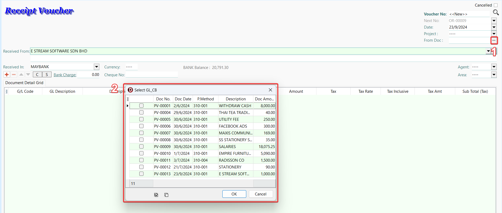

3. Fill in mandatory fields following the [guide](#mandatory-fields).

4. Select **Self-billed Refund** submission type.

    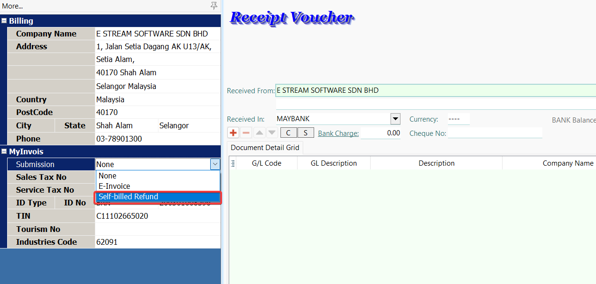

5. Continue with usual receipt voucher entry and **Save**.

#### E-Invoice Operation {#e-invoice-operation-receipt-voucher-self-billed-refund}

After saving your Receipt Voucher document, you can access E-Invoice operations through the **MyInvois** button. These operations help you manage your E-Invoices efficiently. Use the links below to navigate to the specific operation section for detailed instructions:

- [Submission](e-invoice-operation#submission)
- [Cancellation](e-invoice-operation#cancellation)
- [Refresh Status](e-invoice-operation#refresh-status)
- [Log](e-invoice-operation#submission-log)
- [Batch Submission](e-invoice-operation#batch-submission)
- [Batch Refresh Status](e-invoice-operation#batch-refresh-status)
- [Test E-Invoice Validation](e-invoice-operation#test-e-invoice-validation)
