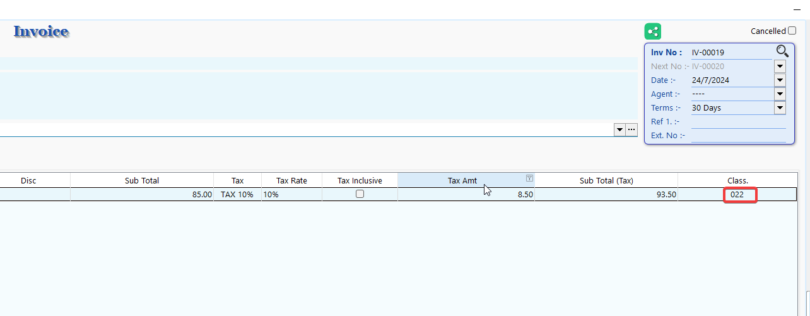
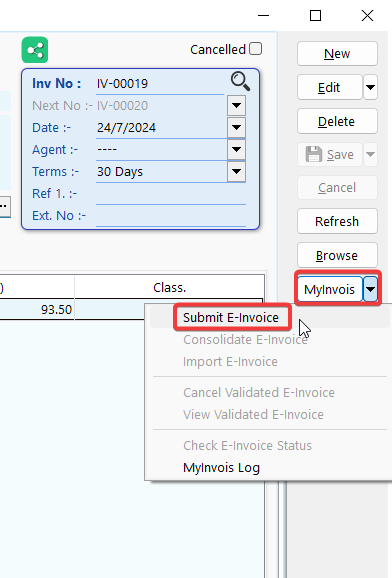
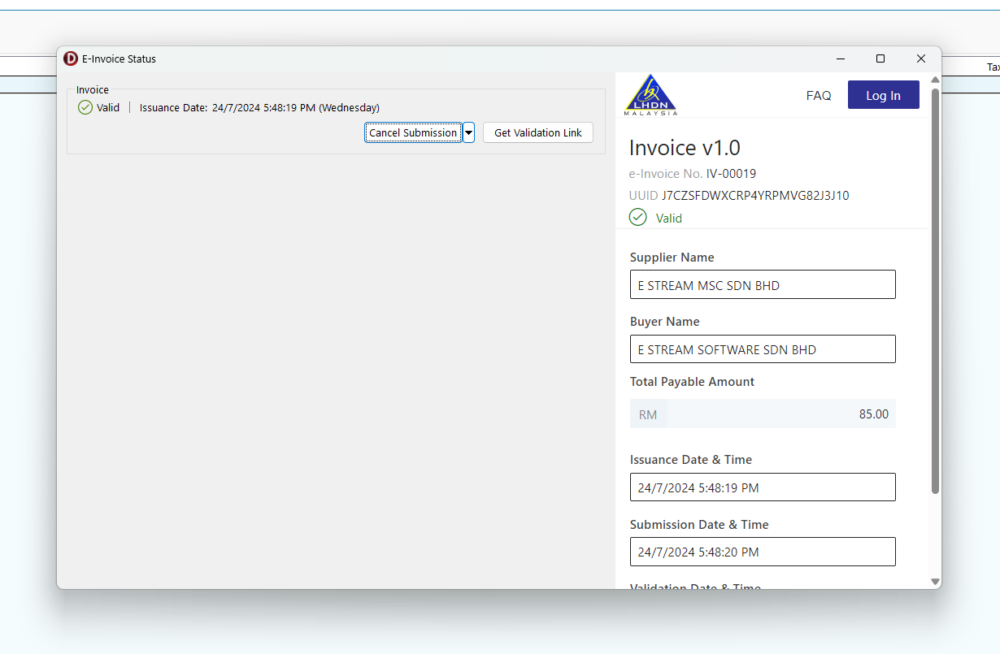
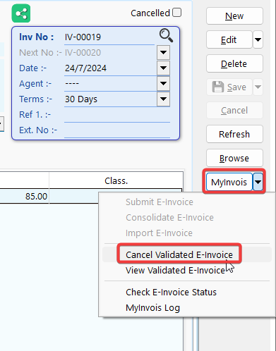
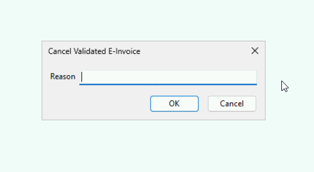
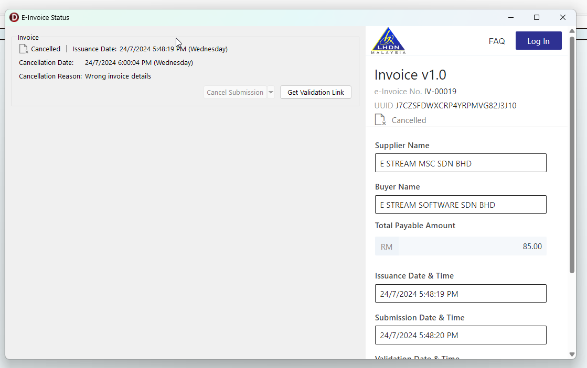
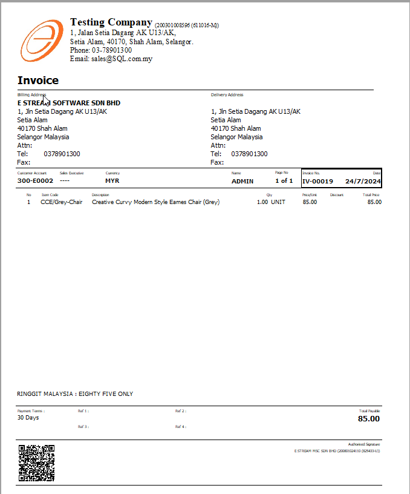
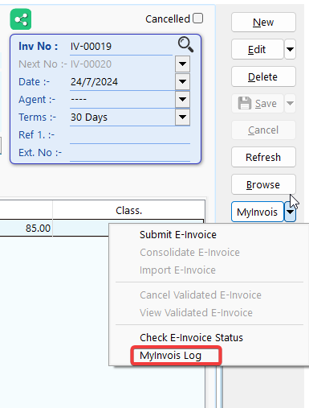
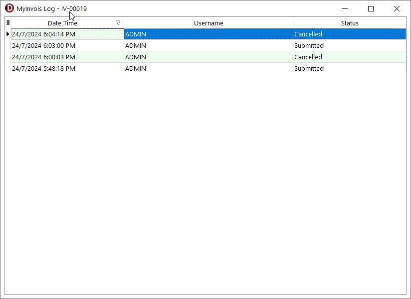

Submitting E-Invoices via SQL Account is seamless and integrates smoothly with your existing workflow.

## Sales Invoice

### Submission

1. Go to **Sales** > **Invoice** > **New** to issue a new invoice.
2. Select an existing customer or create a new customer.

    

3. Click on **More** (1) to view mandatory info required for e-invoice, it will be prefilled with the info from existing customer profile. Click on 📌(2) to pin the tab for easier view.

    

4. Continue with usual invoice entry and **Save**, make sure stock Classification code had been filled in correctly.

    

5. Click on **MyInvois** > **Submit E-Invoice**

    

6. If the submission is valid, you will see the screen below, where you can see the validated Invoice info from LHDN directly.

    

### Cancellation

At the **first 72 hours** of an submitted invoice, you are able to **cancel** the e-invoice, then re-submit the same invoice again without issuing CN/DN.

In the first 72 hours period, you shall cancel the invoice and resubmit when:

 1. There is a mistake in the submitted e-invoice.
 2. Buyer rejected the invoice and you agreed with the rejection.

To cancel a submitted e-invoice:

1. Go to **MyInvois** > **Cancel Validated E-Invoice**.

    

2. Enter the reason for cancellation then Click **OK**.

    

3. To verify the latest status, go to **MyInvois** > **Check E-Invoice Status**.

    

### Report

Preview the report and you can see the E-Invoice validation QR code is embedded in the invoice.

### Submission Log

You can view all past submission and cancellation log of an invoice.

1. Click on **MyInvois** > **MyInvois Log**

    

    
