Before issuing an E-Invoice or self-billed E-Invoice, you will need to make sure some mandatory fields is updated correctly.

## Update Customer Info

Customer info will be used for issuing E-Invoice.

1. Go to **Customer** > **Maintain Customer** > **New** or **Edit** an existing customer.
2. Fill in the mandatory fields as shown below.

    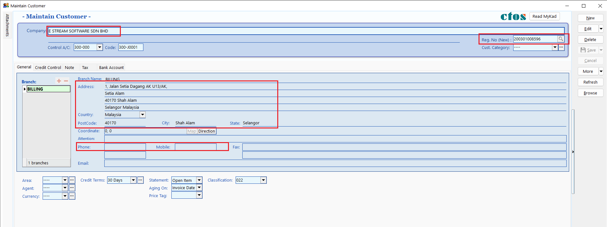

3. Select the default **submission type** to be used when issuing a document. This can be modified at the time of document creation if needed.

    :::info[SUBMISSION]
    - None – Documents created for this customer will be excluded from E-Invoice submission by default.
    - E-Invoice – Documents created for this customer will be submitted as E-Invoice by default.
    - Consolidate – Documents created for this customer will be submitted as consolidated E-Invoice by default.
    :::

    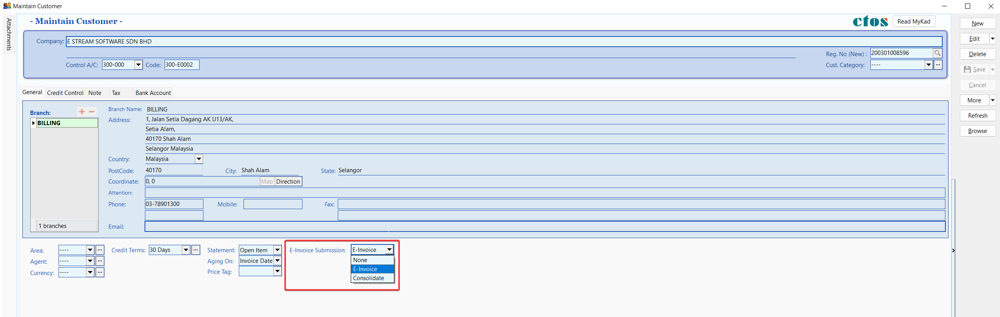

4. Click on **Tax** tab, and fill in customer tax info according to [guide](#customer--supplier-tax-info).

## Update Supplier Info

Supplier info will be used for issuing self-billed E-Invoice.

1. Go to **Supplier** > **Maintain Supplier** > **New** or **Edit** an existing supplier.
2. Fill in the mandatory fields as shown below.

    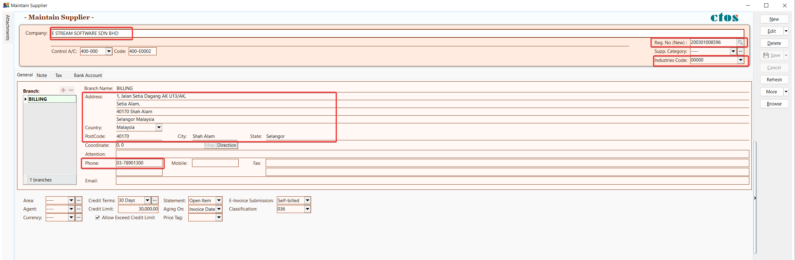

3. Select the default **submission type** to be used when issuing a document. This can be modified at the time of document creation if needed.

    :::info[SUBMISSION]
    - None – Documents created for this customer will be excluded from self-billed E-Invoice submission by default.
    - Self-billed – Documents created for this customer will be submitted as self-billed E-Invoice by default.
    - Consolidate – Documents created for this customer will be submitted as consolidated self-billed E-Invoice by default.
    :::

    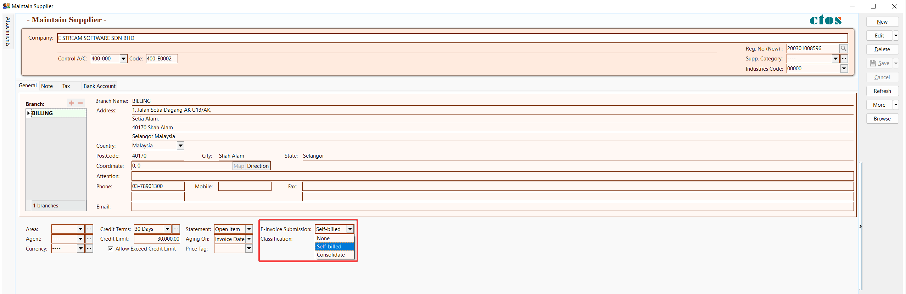

4. Select the default **classification** to be used for item detail when issuing a document.

    

5. Click on **Tax** tab, and fill in supplier tax info according to [guide](#customer--supplier-tax-info).

## Info Request in Maintain Customer/Supplier

The Info Request feature makes it easy to collect accurate company details from customers or suppliers, especially for E-Invoice submissions. It generates a secure link you can share by email, allowing recipients to enter their information directly.

### Create Info Request

To generate an Info Request that allows customers or suppliers to submit their company information

1. Go to detail mode for the selected customer or supplier

2. Right click on an empty space, click on **Create Info Request**

    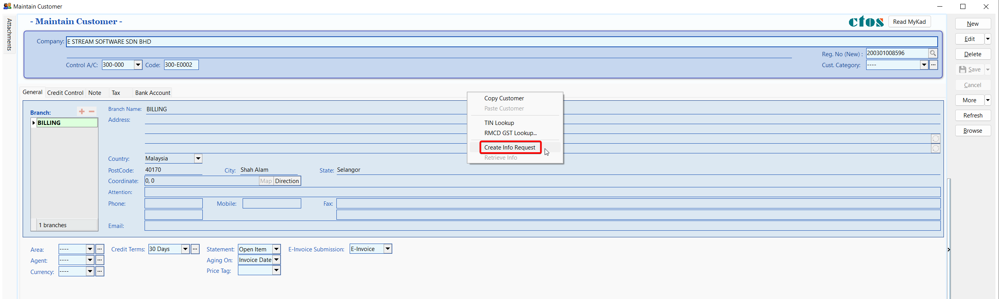

3. A dialog will appear showing a unique link. You can copy the link and share it manually or email it directly to the customer/supplier

    :::info[NOTE]
    An email address is required to use the email option
    :::

    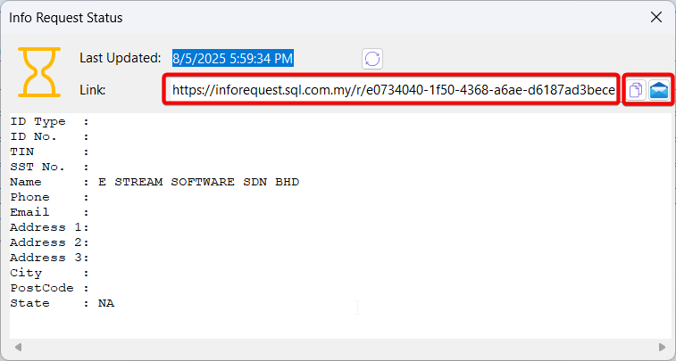

### Retrieve Info

To collect the submitted data and update the customer's or supplier’s record

1. Go to detail mode for the selected customer or supplier

2. Right click on an empty space, click on **Retrieve Info**

    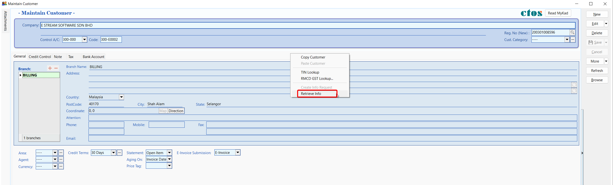

3. A dialog will display the submitted details along with the original request link

    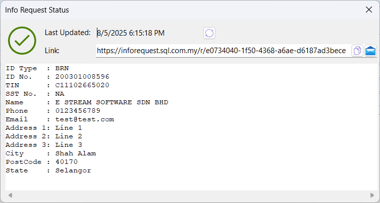

4. Once you close the dialog, the record will be update automatically with the new information

    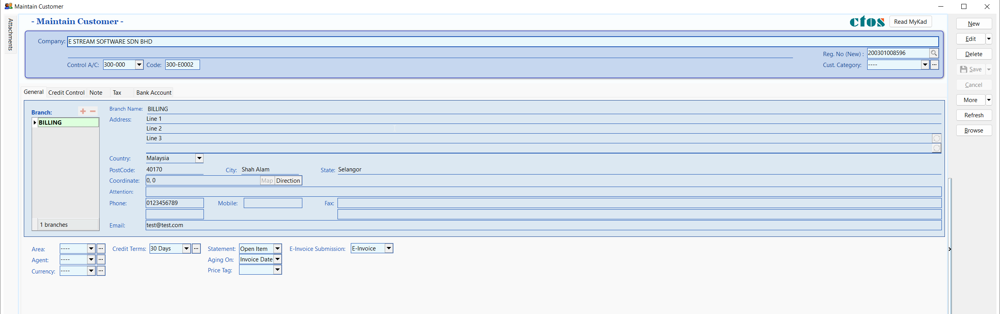

### Batch Retrieve Info

To retrieve and update information for multiple customers or suppliers at once

:::info[NOTE]
An hourglass icon will appear next to customers or suppliers who has created Info Request
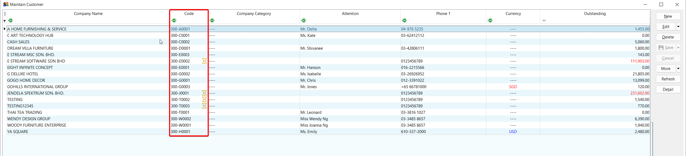
:::

1. In the browse screen, right-click on the button panel, click on **Batch Retrieve Info**

    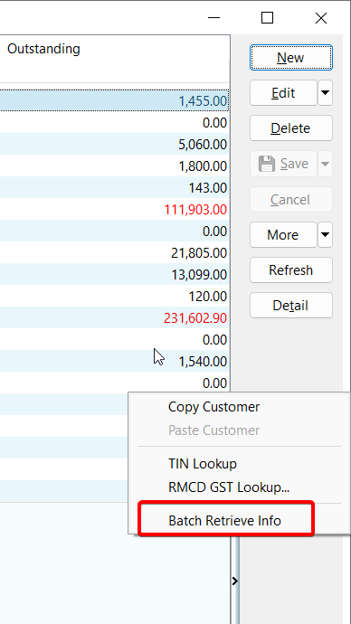

2. A progress dialog will appear and automatically fetch the submitted data for all customers/suppliers

    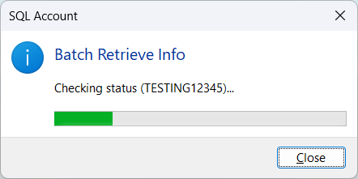

## Customer / Supplier Tax Info

### Local Business (Companies registered with local authorities)

If your customers / suppliers are a registered entity in Malaysia (e.g.: SSM registered), you must fill in the BRN & TIN of the customer in order to issue E-Invoice / self-billed E-Invoice to the buyer / supplier.

    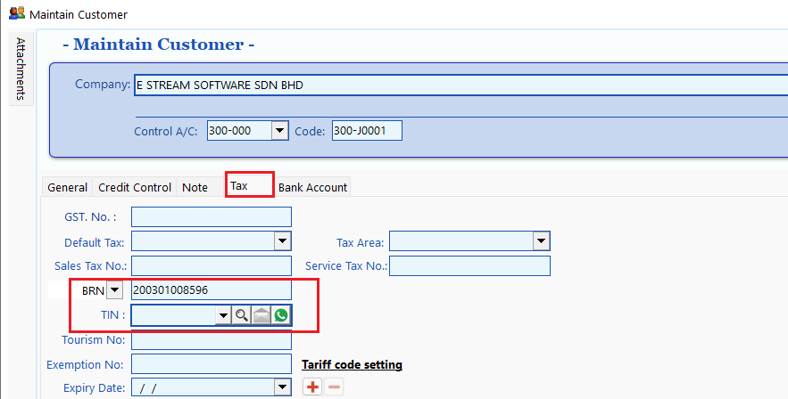

### Individual / Foreign Buyer

In facilitating a more efficient E-Invoice issuance process as well as to ease the burden of individuals in providing their Tax Identification Number (TIN) and identification number details, IRBM provides the following concession to individuals:

1. For Malaysian Individuals to provider either:
   1. TIN only
   2. MyKad / MyTentera identification number only
   3. Both TIN and MyKad / MyTentera identification number
2. For non-Malaysian individuals to provide either:
   1. TIN only (TIN assigned by IRBM or use General TIN **EI00000000020**)
   2. Both TIN and BRN of foreign company
   3. Both TIN and passport number / MyPR / MKAS identification number

For Malaysian Individuals:

|Scenario|In SQL Account|
|---|---|
|TIN only|**ID Type**: NRIC, **ID Value**: Leave Empty, **TIN**: Buyer / Supplier TIN|
|MyKad only|**ID Type**: NRIC, **ID Value**: Buyer / Supplier NRIC, **TIN**: General Public **EI00000000010** |
|Both TIN & MyKad|**ID Type**: NRIC, **ID Value**: Buyer / Supplier NRIC, **TIN**: Buyer / Supplier TIN|

For non-Malaysian Individuals:

|Scenario|In SQL Account|
|---|---|
|TIN only|**ID Type**: Passport, **ID Value**: Leave Empty, **TIN**: Buyer / Supplier TIN or General TIN **EI00000000020**|
|Both TIN & BRN of Foreign Company|**ID Type**: BRN, **ID Value**: Buyer / Supplier BRN, **TIN**: Buyer / Supplier TIN or General TIN **EI00000000020**|
|Both TIN & Passport|**ID Type**: Passport, **ID Value**: Buyer / Supplier Passport Number, **TIN**: Buyer / Supplier TIN or General TIN **EI00000000020**|

**Reference:**

1. List of ID Type in Maintain Customer / Supplier:

    

2. List of General TIN in Maintain Customer / Supplier:

    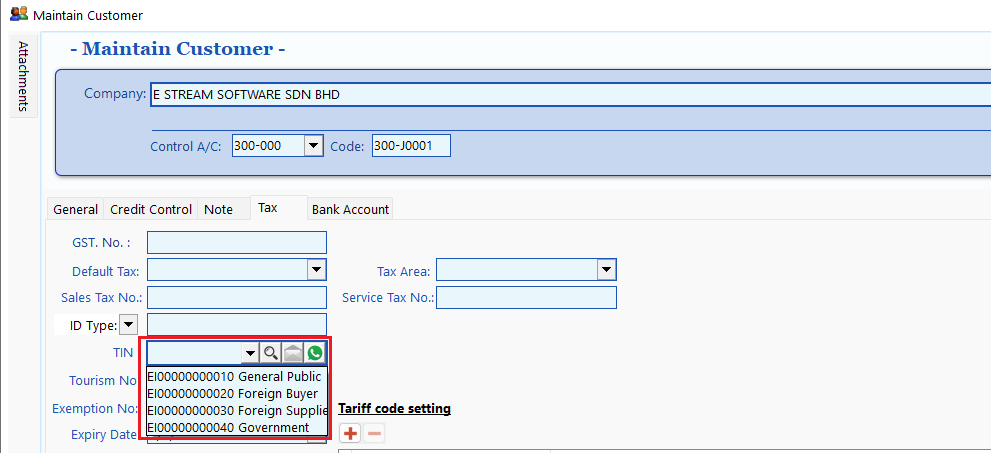

### Batch TIN Lookup

:::info
This feature enables users to **quickly look up missing New BRN/TIN information for customers** and is exclusively available to those with an active SQL Account license
:::

1. Navigate to **Customer** > **Maintain Customer** or **Supplier** > **Maintain Supplier**.

    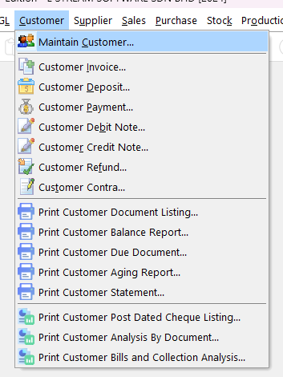

2. Right click on the menu bar (located at the right side of the window), select **TIN Lookup**.

    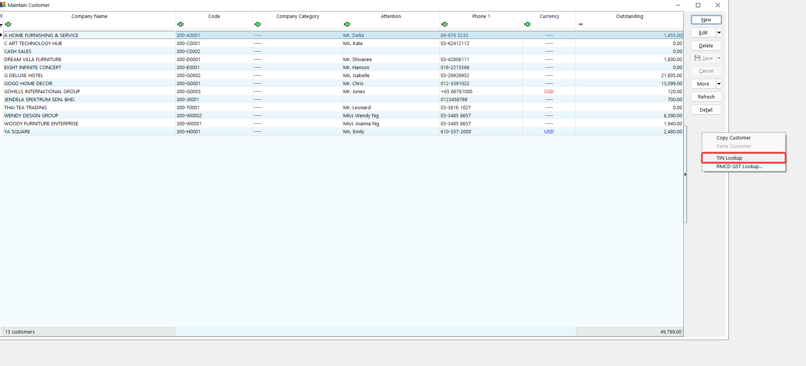

3. In the **Tin Lookup** window, you will be able to view all of your customers / suppliers details such as *Old BRN, New BRN, TIN* and etc. Click on the **🔍** to do a quick lookup on the missing fields, when you are done, click **Save** to apply.

    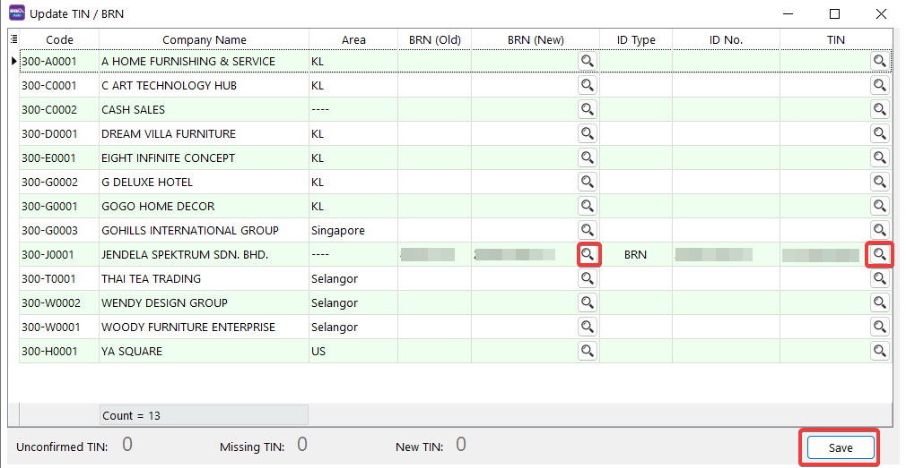

## Update Stock Item

IRBM (LHDN) has introduced [Classification Codes](https://sdk.myinvois.hasil.gov.my/codes/classification-codes/) to define the category of products or services being billed as a result of a commercial transaction.

1. Go to **Stock** > **Maintain Stock Item** > **Edit** stock
2. Update the classification accordingly.

    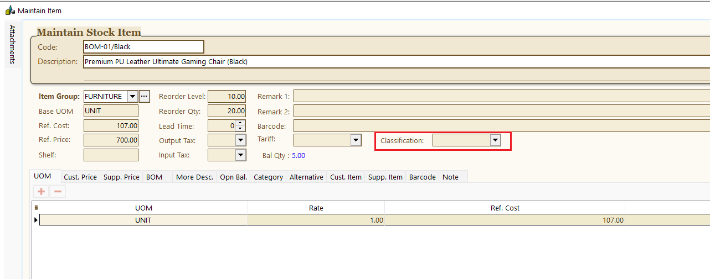

3. Repeat Step 1-2 for all stocks.

:::info
You can also override the stock item classification codes during sales invoice entry.

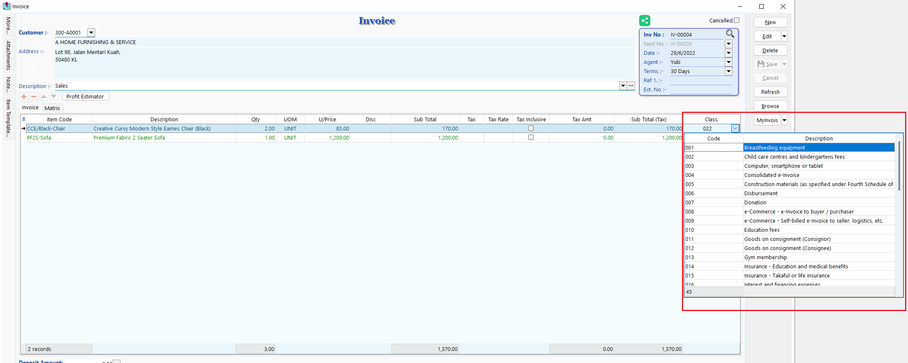
:::
