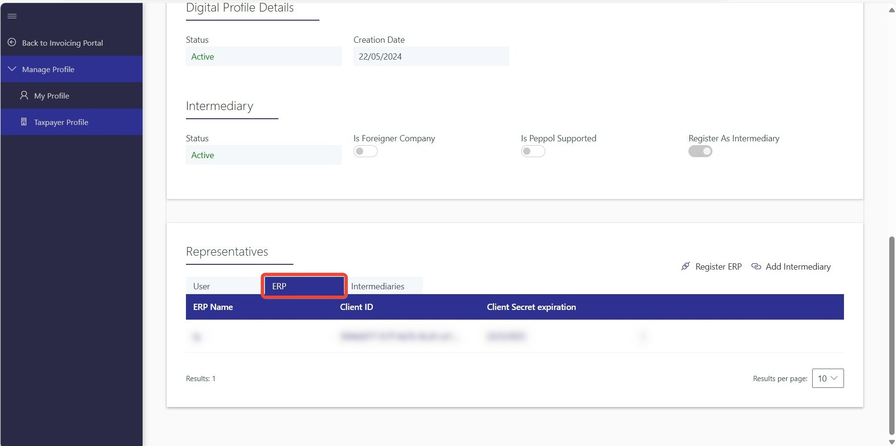
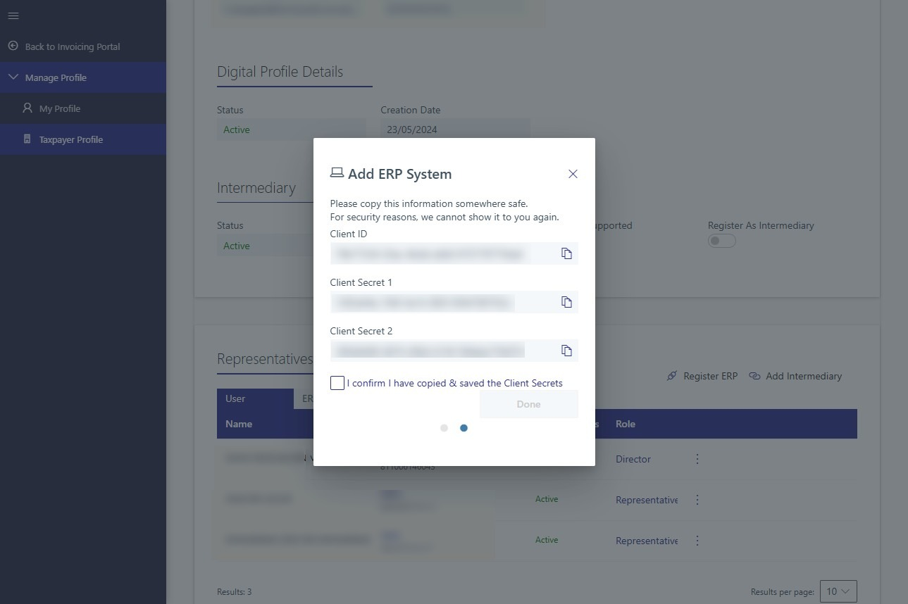

An e-Invoice is a digital representation of a transaction between a supplier and a buyer. e-Invoice replaces paper or electronic documents such as invoices, credit notes, and debit notes.

## MyInvois Portal Setup

### First Time Login

1. Go to the [MyTax Portal](https://mytax.hasil.gov.my).
2. Select ID type and enter your ID (e.g. NRIC).
3. Enter your Mytax Portal password and proceed to login.
4. Access [MyInvois Portal](https://myinvois.hasil.gov.my/).

    

5. Read and accept Terms & Conditions.
6. **Important** You will be directed to create a taxpayer profile, update thee details and **Save**:
   - Make sure Address, Country, State, Postal Code is correct
   - SST registration number
   - Tax registration number
   - Default notification language
   - Notification details
7. Proceed to create user profile, update the following details if necessary then **Save**:
   - Default Notification Language
   - Notification E-mail
8. Once both profiles are created and saved, you will receive a confirmation page. Click **Finish Setup** to continue.

### Register ERP

:::info
You will need to register an ERP to obtain the required Client ID & Client Secret (username & password) to allow SQL Account to access LHDN API securely.
:::

1. On the top-right corner of the MyInvois Portal, locate the profile dropdown menu. From the options available, choose **View Taxpayer Profile** to access the taxpayer's profile.
2. Scroll down on the Taxpayer Profile page and click on the **ERP** tab under Representatives to view the system representatives.

    

3. Click on **Register ERP** to register a new System Representative.
4. Input the following details:
    - **ERP Name**: SQL Account
    - **Client Secret Expiration**: 3 Year
    :::warning[client secret expiration]
    You will need to regenerate the secret after expiration.
    :::
5. Copy the **Client ID** and **Client Secrets** displayed and input into **SQL Account Company Profile**, then check the box to confirm that you have copied, then click on **Done**.

    

### Add Intermediary

:::info
You will need to add SQL Account as your intermediary to utilize our **Digital Certificate** signing and enable a seamless submission experience.
:::

1. On the top-right corner of the MyInvois Portal, locate the profile dropdown menu. From the options available, choose **View Taxpayer Profile** to access the taxpayer's profile.
2. Scroll down on the Taxpayer Profile page and click on the **Intermediary** tab under Representatives to view the Intermediary Representatives.
3. Click on **Add Intermediary** and input the following details:
   - **TIN**: C24050894070
   - **BRN**: 200801024110
   - **Name**: SQL Account
4. Click on **Continue**.
5. Modify the **Representation From** and **Representation To** dates as per your requirement.
6. Allow all permissions by toggle all radio button to **Yes**.
7. Click on **Add Intermediary** and you are done.
