To streamline the e-invoice submission through SQL Account, some configuration would be needed in taxpayer's MyInvois Portal.

## Summary

:::info[important]

Please make sure you are accessing the live MyInvois portal at [https://myinvois.hasil.gov.my](https://myinvois.hasil.gov.my).

:::

1. [MyInvois Portal](https://myinvois.hasil.gov.my/) onboard process:
   - The onboarding request 2 **mandatory** steps A & B shown below.

    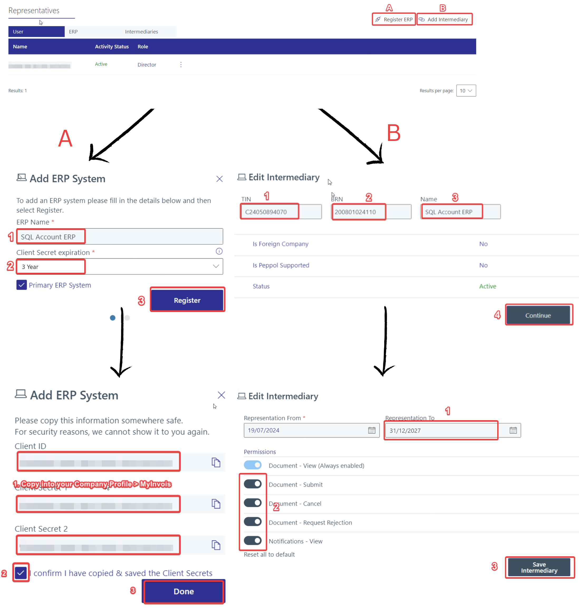

2. SQL Account Company Profile setup:

    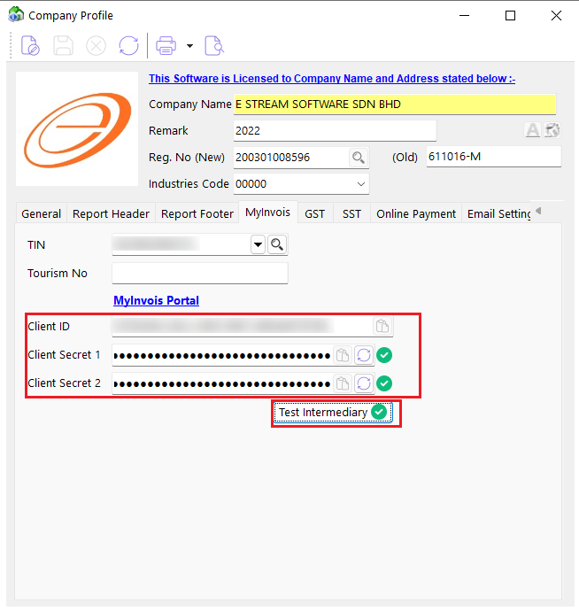

:::info
*Please continue reading for **detailed** instructions.*
:::

## MyInvois Portal Setup

### First Time Login

1. Go to **File** > **Company Profile** > **MyInvois** > **MyInvois Portal**

    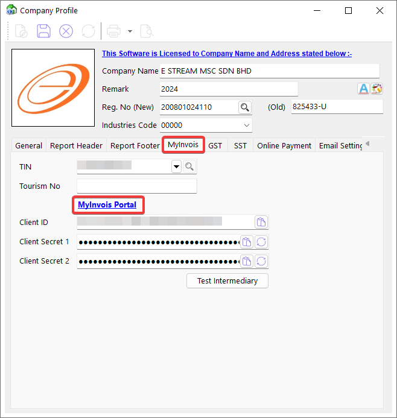

2. Select ID type and enter your ID (e.g. NRIC), then enter password and proceed to login.

    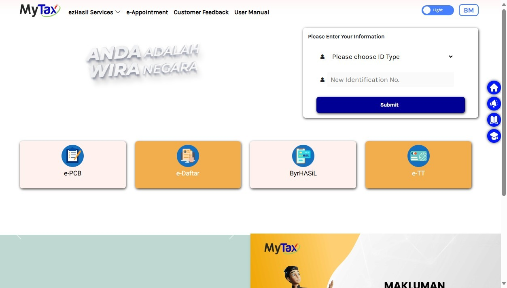

3. Access [MyInvois Portal](https://myinvois.hasil.gov.my/).

    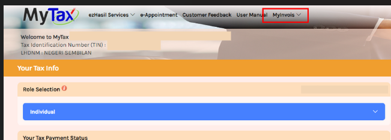

4. Read and accept Terms & Conditions.
5. **Important** You will be directed to create a taxpayer profile, update the details and **Save**:
   - Make sure Address, Country, State, Postal Code is correct
   - SST registration number
   - Tax registration number
   - Default notification language
   - Notification details
6. Proceed to create user profile, update the following details if necessary then **Save**:
   - Default Notification Language
   - Notification E-mail
7. Once both profiles are created and saved, you will receive a confirmation page. Click **Finish Setup** to continue.

### Register ERP

:::info
You will need to register an ERP to obtain the required Client ID & Client Secret (username & password) to allow SQL Account to access LHDN API securely.
:::

1. On the top-right corner of the MyInvois Portal, locate the profile dropdown menu. From the options available, choose **View Taxpayer Profile** to access the taxpayer's profile.

2. Scroll down and click on **Register ERP** to register a new System Representative.

    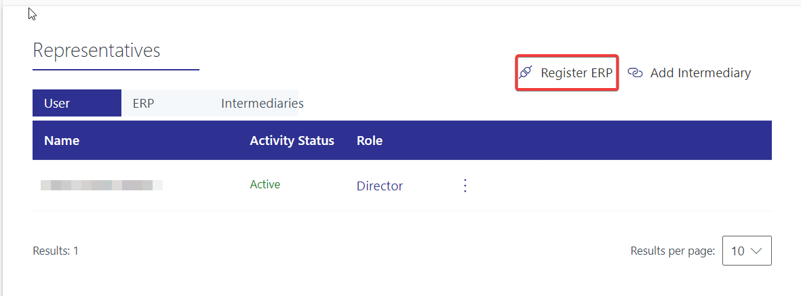

3. Input the following details:
    - **ERP Name**: SQL Account ERP
    - **Client Secret Expiration**: 1 Year

    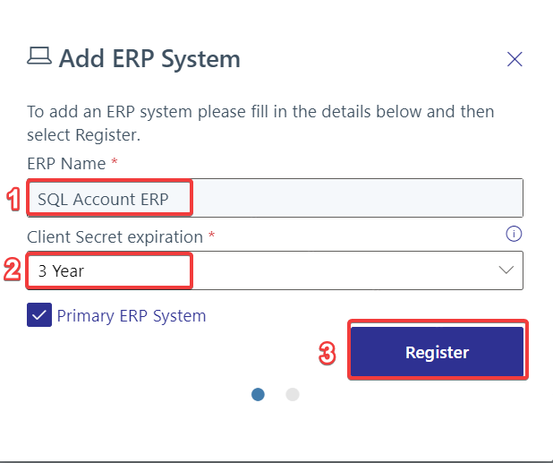

    :::warning[client secret expiration]
    You will need to regenerate the secret after expiration.
    :::

4. Copy the **Client ID** and **Client Secrets** displayed and input into [SQL Account Company Profile](#company-profile), then check the box to confirm that you have copied, then click on **Done**.

    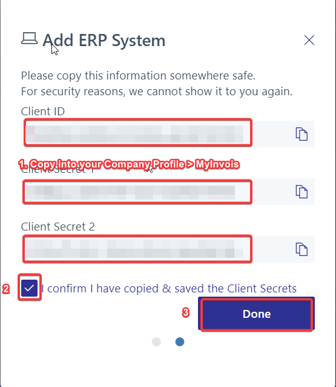

### Add Intermediary

:::info
You will need to add SQL Account as your intermediary to utilize our **Digital Certificate** signing and enable a seamless submission experience.
:::

1. On the top-right corner of the MyInvois Portal, locate the profile dropdown menu. From the options available, choose **View Taxpayer Profile** to access the taxpayer's profile.
2. Scroll down and click on **Add Intermediary** to add a new Intermediary.

    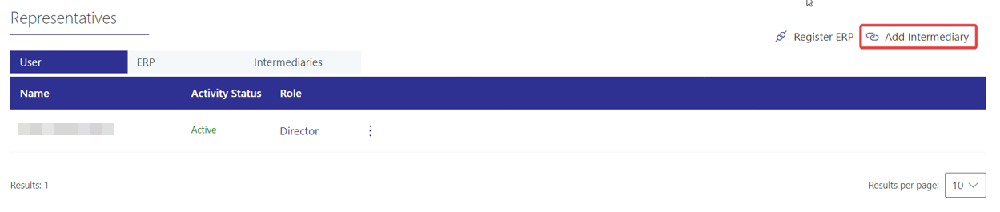

3. Input the following details and **Continue**:
   - **TIN**: C24050894070
   - **BRN**: 200801024110
   - **Name**: SQL Account ERP

    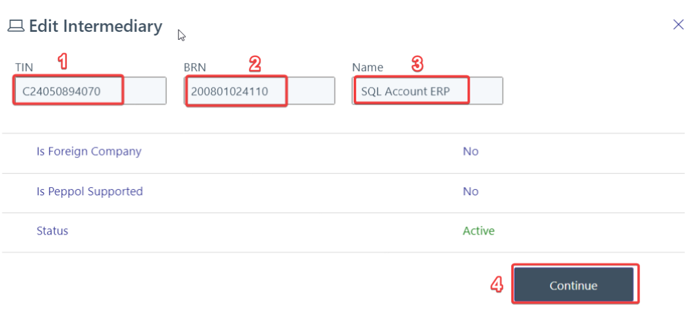

4. Update the date & permissions and **Save Intermediary**:
    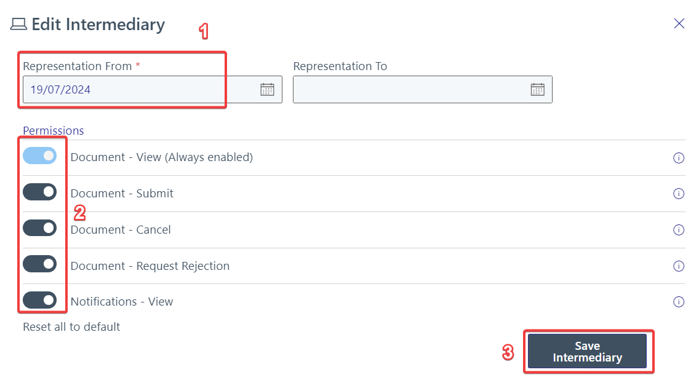

## SQL Account Setup

### Company Profile

1. Go to **File** > **Company Profile**.
2. Fill in your new & old BRN OR utilize our auto BRN lookup by clicking on the 🔍 button.
3. Make sure the **Country** has been set as **Malaysia** and fill in relevant info such as Address, Postcode, etc.
4. Click on **MyInvois** tab.
5. Fill in your TIN number.
6. Fill in the Client ID, Client Secret 1 and Client Secret 2 obtained from [Register ERP](#register-erp).
7. After that, click on **Test Intermediary**, you shall see 3 green ticks ✅ as shown below.

    

8. Click **Save** and you are done with MyInvois onboarding.
