:::info
Watch tutorial video here: [Youtube](https://youtu.be/q97_s92bmZQ)
:::

## Setup production accounts and stock items

### Chart of Account

   1. GL > Maintain Account

   2. Create finished good, raw material, WIP’s closing stock account in your balance sheet current asset account as below.

      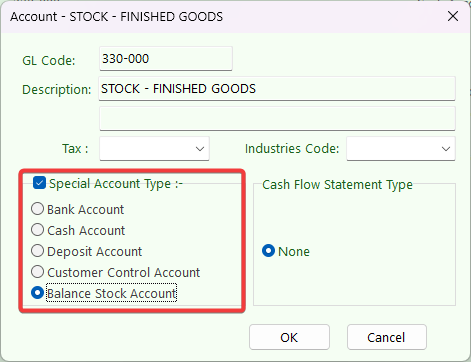
      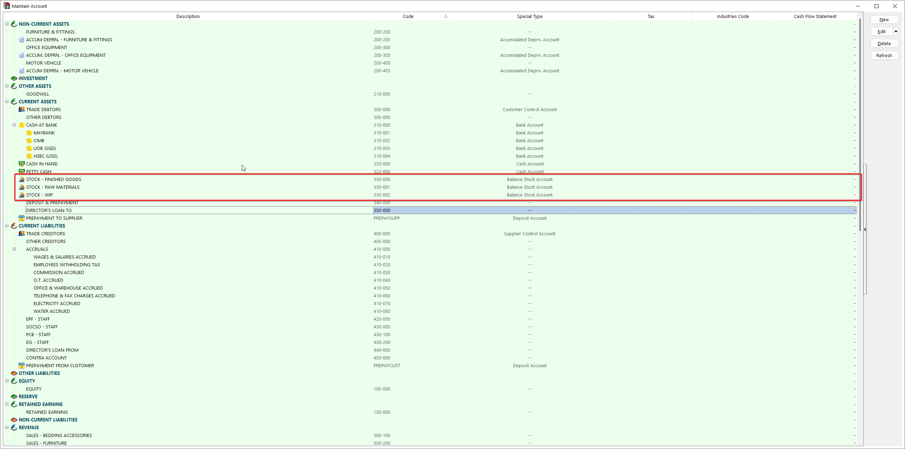

   3. Create Manufacturing Account under Cost of Goods Sold (Profit & Loss)

      1. Highlight on Cost of Goods Sold and click on NEW Button, Insert GL Code, Description and make sure tick on special Account type Manufacturing Control Account.

         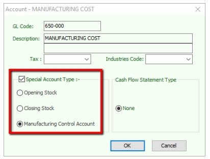

      2. Create all your raw materials opening stock, closing stock, production overhead charges group into Manufacturing cost account under Cost of Goods Sold.

         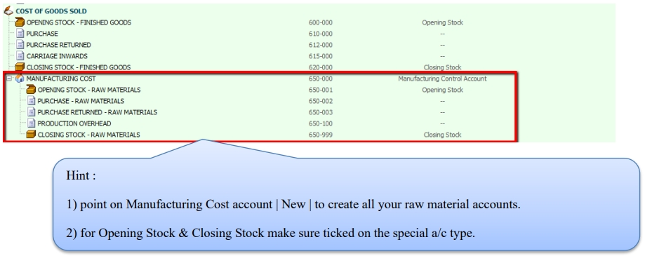

### Stock Group

   Stock > Maintain Stock Group

   Use to differentiate the types of stocks and the costing method use for the stock, eg. raw materials, finished goods, etc.

   To produce a chemical products, the costing calculation based on stock group:-

   1. Raw Materials

      Assign your Raw Material Purchase code, Cash Purchase code, Purchase Return code.

      \- Costing Method : FIFO

      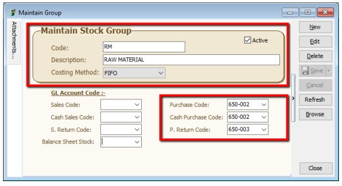

   2. Water

      Assigned your Raw Material Purchase code, Cash Purchase code, Purchase Return code.

      \- Costing Method : Fixed Costing

      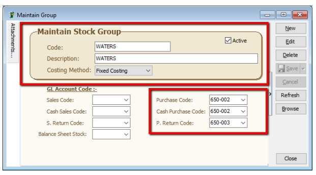

   3. Finished Goods

      Assigned your Finished Goods Purchase code, Cash Purchase code, Purchase Return code.

      \- Costing Method : FIFO

      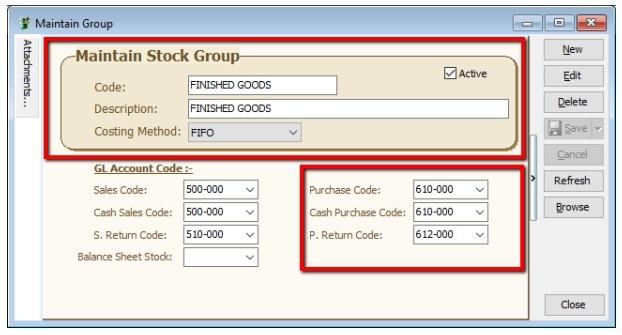

### Stock Item

   Stock > Maintain Stock Item

   Setup the stock item master data for all types of stock. Eg. raw materials, end products, trading products, etc.

   1. Create all your raw materials items and assigned stock group respectively.

      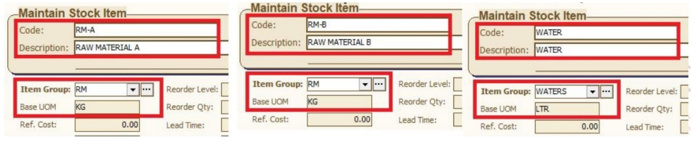

   2. Create your finished goods item and assign raw materials.

      1. assigned stock group, enter based UOM, ref cost and ref price.

      2. go to **BOM** tab, choose this product it a **BOM** item, and assigned all the raw materials, quantity needed.

         **Location** is the Raw Materials keep and deducted from which warehouse.

         **Overhead Cost** is a fixed additional cost to the material cost incurred during to each material process.

         **Assembly Cost** is a fixed cost incurred to the entire process for final products.

            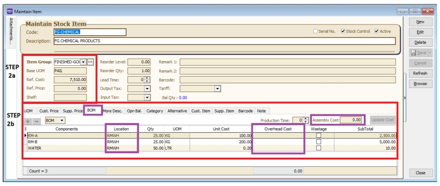

### Location (Warehouse)

   Stock > Maintain Location

   Define the warehouse code to identify the stock movement between the locations.

   1. Receive raw materials from purchase and keep at **Raw Materials Warehouse**.

   2. Production use the materials to produce the final products. Raw materials must deduct from the **Raw Materials Warehouse**.

   3. Final products will be kept at **Finished Goods Warehouse**.

   4. Work in progress stock kept in **WIP Warehouse**.

      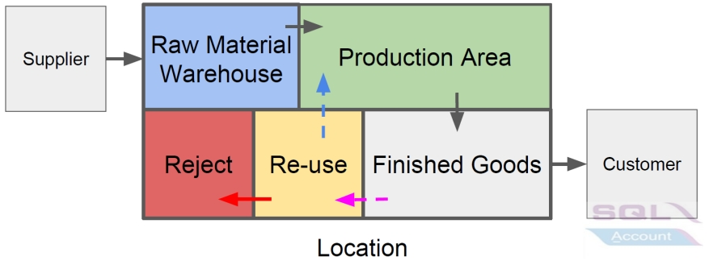

## Overview of Manufacturing Business Flow

Sales coordinator usually will input the Sales Order (SO) based on the customer PO received. The stock products will be updated into the system as ordered qty. If the stock are purchased from supplier, then the purchaser has to transfer from SO to PO.

Unless the stock is manufactured, then you have to proceed to Job Order process. How much of the materials/components
required to meet the products ordered by customer? This question raised by the Material Planning department. Therefore, the Job Order takes place as the order to be input after Sales Order. It will planned the materials/components required based on the qty ordered from Sales Order.

When products produce out, you have to transfer the Job Order to Stock Assembly to commit on the stock on hand.

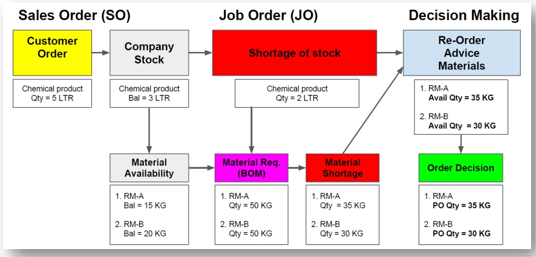

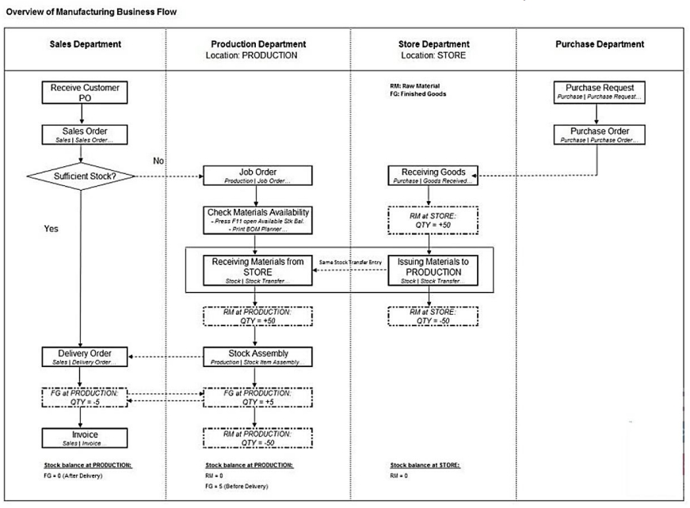

### Sales Order

   Customer order will be enter via Sales Order by Sales Coordinator.

   1. Sales > Sales Order > New > choose your customer > enter the items orders from your customer > save.

      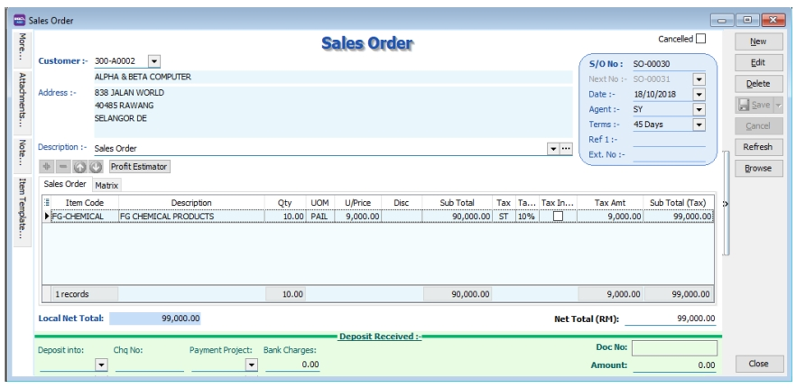

   2. : You can also press on **CTRL + F11** to check Available Stock Balance, if there is sufficient stock on hand you may directly proceed to delivery, but there is short of stock you may need to proceed to Job Order on the planning to manufacturer the items.

      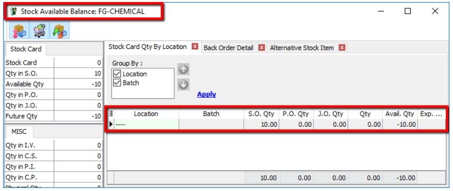

### Production Job Order

   A Job Order is a document that contains the requirements and instruction to produce a particular of goods.

   1. **Production** > **Job Order** > **New**

   2. Select **Customer Code**

   3. **Right Click on Job Order** title, select **Transfer from Sales Order**.

   4. enter the **X/F Qty** for the quantity you want to produce.

      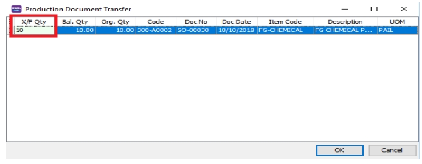

   5. Save the Job Order.

   6. you can also click **CTRL + F11** to check all your raw material stock available balance.

      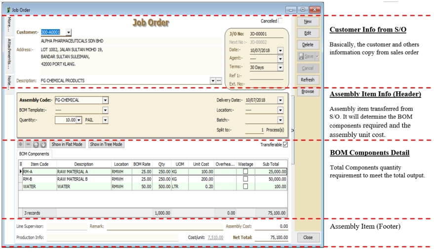

### Stock Item Assembly

   Stock Item Assembly is an entry form to record the actual components (materials) usage to convert/produce the final product based on the actual output. Unit cost will be used to revalue the stock balance.

   Actual components (materials) used will be deduct out from the stock balance. However, the final products will be replenished the stock balance. You can always check the stock movement from the stock card report.

   1. **Production** > **Stock Item Assembly** > **New**

   2. **Right Click**, select **Transfer from Job Order**.

   3. enter the **X/F Qty** for the quantity produced.

      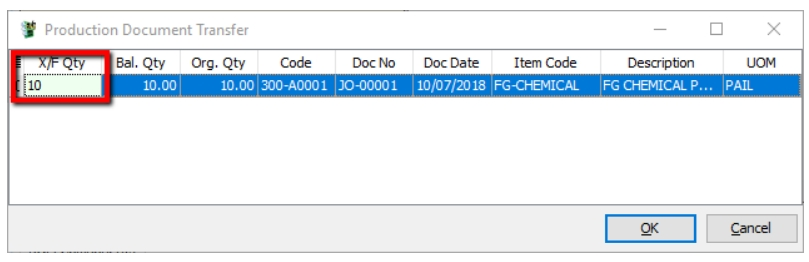

   4. Save the Stock Item Assembly.

      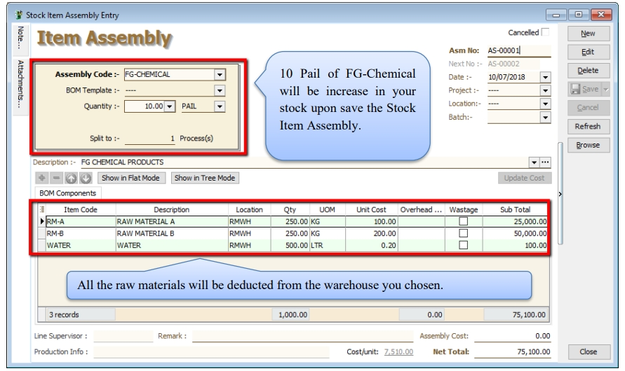

## Stock Batch

:::info

Watch tutorial video here: [Stock Maintain Batch](https://youtu.be/QUlp-Js_cnk)

:::

This module commonly used in food manufacturing, pharmaceutical, cosmetic/skin care product. It helps to trace the expiry date of the products. It can set the manufacturing date for label print purposes and easy to identify the stock expired to write off using stock adjustment.

1. **Stock** > **Maintain Batch** > **New**

   Insert the code, description, Expiry date, Manufacturing date & items that will expire on this expiry date.

   

2. **Purchase** > **Purchase Invoice** > **New**

   You can enable Batch column from the hidden bar and assign your stock batch during purchase for every individual item.

   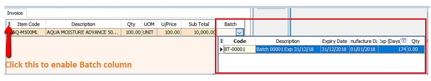

3. **Sales** > **Sales Invoice** > **New**

   In Sales Invoice, you can select the item issue out from which batch (expiry date), system will also show the expiry day & quantity available.

   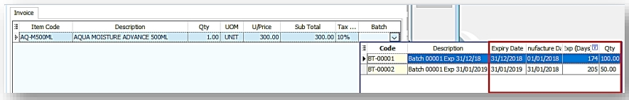

4. **Stock** > **Print Stock Batch Expiry**

   You can also check the listing of your product that will be expire soon as well as you can trace the product manufacture date.

   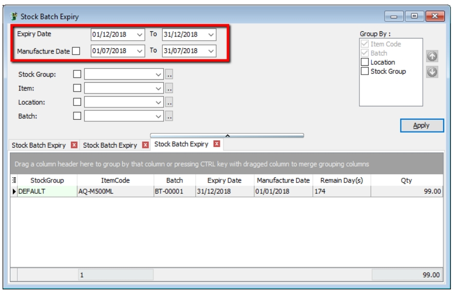
