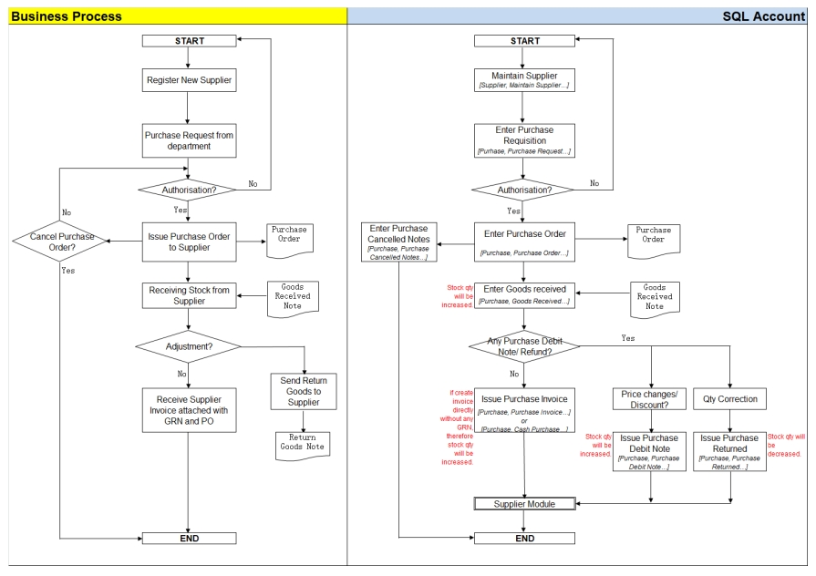
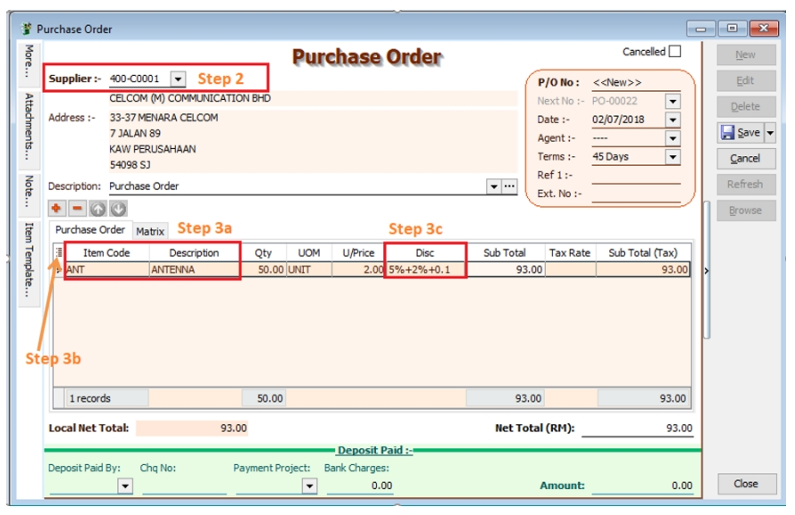
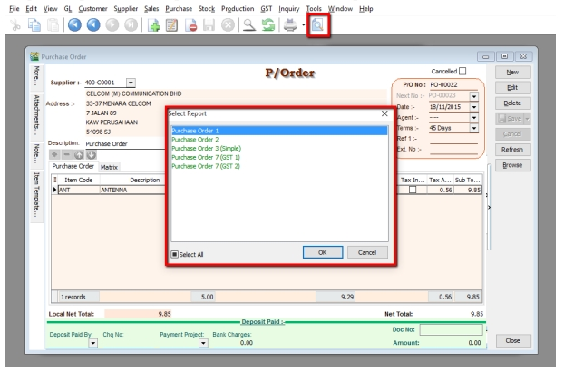
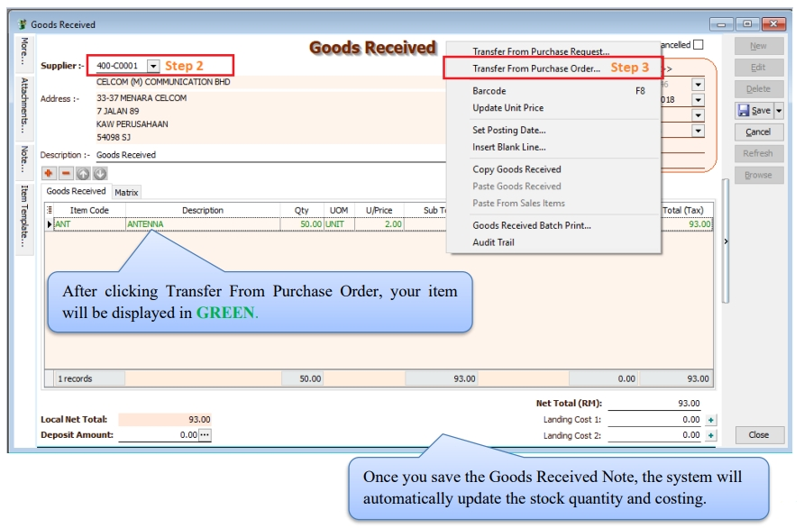
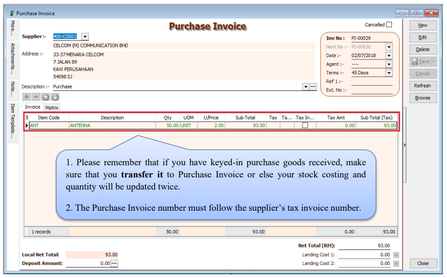

## Purchase Work Flow

Example of sales process work flow aligned with SQL Account flow:

## Purchase Order

1. **Purchase** | **Purchase Order** | **New**

2. **Select Supplier**

3. **Insert Item Code**

   3a. **Insert Item Code and details** (e.g. Qty, Unit Cost)

      :::note

      You can navigate the search column by using the “TAB” button on your keyboard. It will apply to all drop down tables.

      :::

   3b. **Click on the show/hide/move column icon to customize your column layout**.

   3c. If you want to key in for a discount amount, you may tick the discount field by following step 3b and update the discount field. You can key in multiple levels of discount as shown by the picture attached.

   

4. After updating, click **Save**

5. To preview the report, you may click on the preview button and select the format you wish to print.

   

## Purchase Goods Received

1. **Purchase** | **Goods Received** | **New**

2. Select **Supplier Code**

3. **Right Click on G/R Note title**, select **Transfer from Purchase Order**, tick the document that you wish to transfer

4. **Save** the Goods Received Note

   

## Purchase Invoice

1. **Purchase** | **Purchase Invoice** | **New**

2. **Select Supplier Code**

3. **Right Click on Purchase Invoice title**, select **Transfer from Goods Received**, tick the document that you wish to transfer

4. **Save** the Purchase Invoice

   
