## General Ledger

### Balance Sheet

1. Go to **GL** > **Print Balance Sheet** > Select your date

2. Choose your preferred format

3. “Show Up to Level” under Option refer to the depth of sub-accounts in your Maintain Chart of Account, the higher the value, the more level of detail will be shown.

4. In Option Upper Level

    1. **Use second description** – use second description which is controlled at GL > Maintain Chart of Account

    2. **Zero Balance Account** – choose to show accounts in the report even if their amount is 0.

    3. **Display Trade Debtor/Creditor in Details** – show per customer account in detail

5. In Option Bottom Level

    1. **Print Sub Account Only** – Select a certain account to view

    2. **Print Project Comparison** – you are allowed to view your report by project (project module requested)

    3. **Show Column Options** – you can preset setting as attached

6. **Apply**

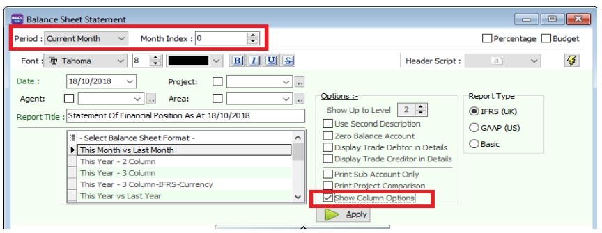

### Profit & Loss Statement

1. Go to **GL** > **Print Profit and Loss Statement** > Select your date

2. Choose your preferred format

3. In Option Upper Level

   1. **Use second description** – use second description which is maintained under GL > Maintain Chart of Account

   2. **Zero Balance Account** – choose to show accounts in the report even if their amount is 0

4. In Option Upper Level

   1. **Print Sub Account Only** – Select a certain account to view

   2. **Print Manufacturing Account** – you are only allowed to view manufacturing account if you have set it up under Maintain Chart of Account

   3. **Print Project Comparison** – you are allowed to view your report by project (project module requested)

   4. **Show Column Options** – refer Balance Sheet

5.**Apply**

   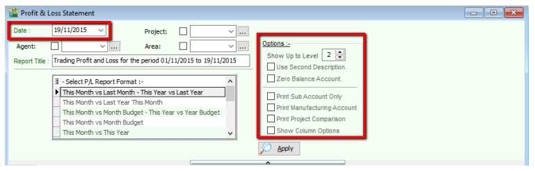

### Trial Balance

1. Go to **GL** > **Print Trial Balance** > Select your date

2. Filter by project, area, agent (optional)

3. Tick whether you want to view General Ledger, Sales Ledger(Customer) or Purchase Ledger (Supplier)

4. In Option Upper Level

   1. **Use second description** – use second description is which maintained under GL > Maintain Chart of Account

   2. **Zero Balance Account** – choose to show accounts in the report even if their amount is 0

5. **Apply**

   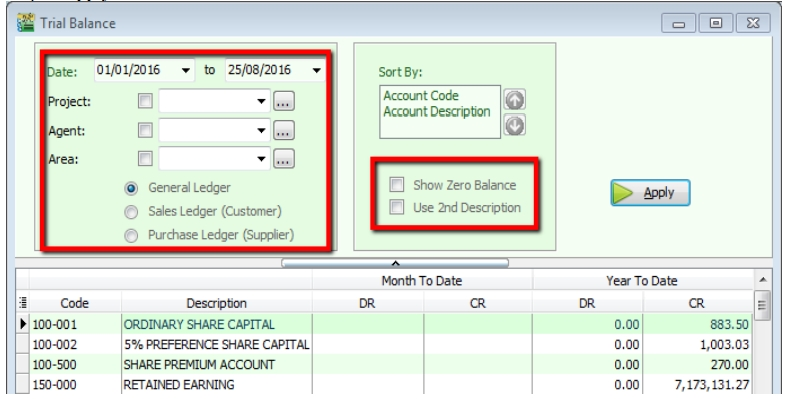

### Ledger Report

1. Go to **GL** > **Print Ledger Report** > Select your date

2. Filter by account, project, area, agent (optional)

3. Tick whether you want to view General Ledger, Sales Ledger(Customer) or Purchase Ledger (Supplier)

4. System can generate by group and give you a summary of each group (group/sort by)

5. In Option Upper Level

   1. **Merge GL Code for same document** – if you have the same account in one single transaction, the system will automatically merge, if you want to separate the account code for the same document, please un-tick.

   2. **Exclude Project when merging** – exclude project when merge GL Account.

   3. **Use second description** – use second description which is maintained under GL > Maintain Chart of Account

   4. **Include Zero Closing Balance** – choose to show accounts in the report even if their amount is 0

   5. **Include Zero Transaction** – choose to show accounts in the report even if there are 0 transactions.

   6. **Local Currency & Foreign Currency** – If you have foreign currency transactions, you can tick the foreign currency so that the system will show the figures in foreign currency compare versus local currency.

   7. **Apply**.

   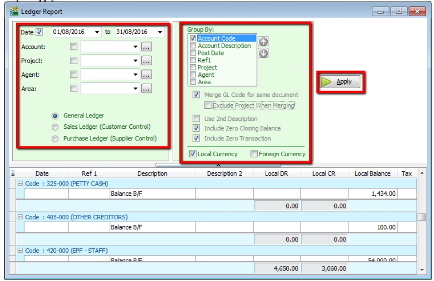

## Customer Report

### Customer Aging

1. **Customer** > **Print Customer Aging** > **Filter Aging Date**

2. Choose your preferred report format options.

3. You can select either 4 months, 6 months or 12 months aging

4. Click on **Apply**

### Customer Statement

1. **Customer** > **Print Customer Statement** > **Set Date Range**

2. Choose your preferred options.

   1. **Default Statement Type** – The default Setting preset under Maintain Customer

   2. **Open Item Statement** – Show all outstanding transaction row by row

   3. **Brought Forward Statement** – Show outstanding amount from previous months as a lump-sum

3. You can select either 6 months or 12 months’ statement

4. Click on **Apply**

   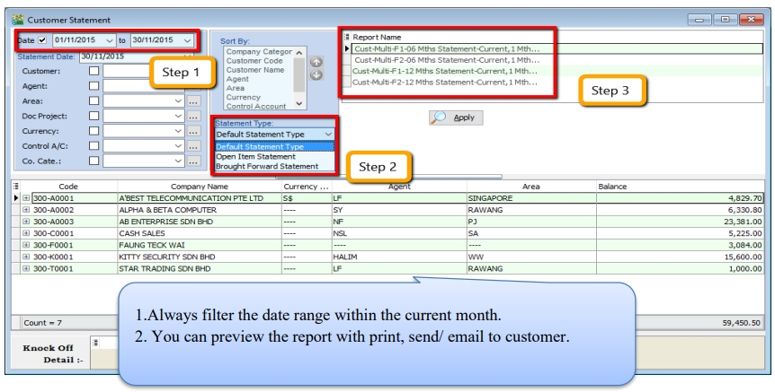

### Customer Due Document Listing

In this report, you can print a reminder letter to remind customers of outstanding amounts.

1. **Filter by Date, Document** (Invoice, Debit Note, Credit Note, Contra)

2. Overdue or Undue document.

3. System can generate by group and give you a summary on each group (group/sort by)

4. **Apply**.

    

5. If you want to **print a reminder letter, make sure you tick the customer code under “group / sort by”** and **Apply**.

    

6. Preview the report and you will see **Cust Overdue Letter**, choose your preferred format.

    

    

7. Customer Analysis By Document

    This report is used to analyse all customer documents in one report. You can check total Invoice, Credit Note, Debit Note, Payment and the rest of the document amount.

8. **Customer** > **Customer Analysis By Document**

9. Filter by Document Date and any others optional field to display.

10. **Apply**

    

## Sales Report

### Sales Document Listing

   1. Go to **Sales** > **Print Sales Document Listing** >  filter which type of document you want: for example, **Sales Quotation /Sales Order/ Deliver Order/ Invoice Listing**

   2. Filter by **date**, if left untick means all periods will be shown

   3. Filter area by pipelines (It’s optional)

   4. System can generate by group and can give you a summary on each diff group (group/sort by)

   5. Click **Apply** to generate, whenever you change any setting under Step 3 or 4, please redo by clicking Apply

      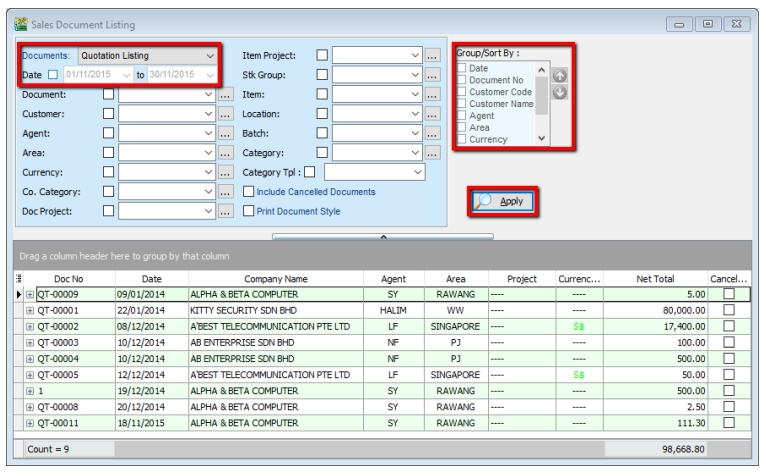

   :::note

   1. **Export report into Excel**

      1. **Right click on any title bar**

      2. **Click on Grid Export > Export to Excel**.

         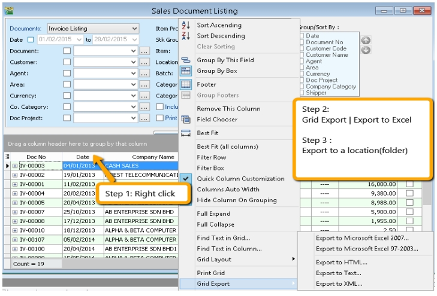

   2. **Batch Printing Invoices**

      If you want to print out entire month invoices by batch and into a page-by-page format,

      1. **Sales** > **Print Sales Document Listing**.

      2. Tick **“Print Document Style”**

   :::

   :::info

   Watch tutorial video here: [Sales Invoicing Batch Print Invoices](ttps://www.youtube.com/watch?v=MbNMVn0mBiw&feature=youtu.be)

   :::

   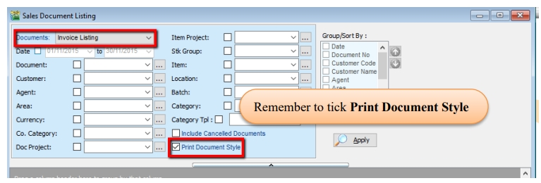

### Outstanding Sales Document Listing (Require Partial Delivery Module)

This report can help you check the transfer document’s info, such as the amount of outstanding items for the particular document and; which invoices the DO have been transferred to.

1. **Sales** > **Print Outstanding Sales Document Listing**.

2. Filter the information that you want and apply.

3. Criteria

   1. **Print Outstanding Item** – to check outstanding items which have not yet been transferred.

   2. **Print Fulfilled Item** – to check those documents which have been fully transferred and transferred to which document.

   3. **Include cancelled documents** – tick to show cancelled documents in the report.

   4. **Outstanding SO & PO** – to check the number of outstanding items from sales order and purchase order

   5. **Transfer Doc Date Follow Filtered Date** – tick this if you want the document transfer date (e.g. transfer document Sales Order to Invoice both will followed filtered date.

4. **Apply**

   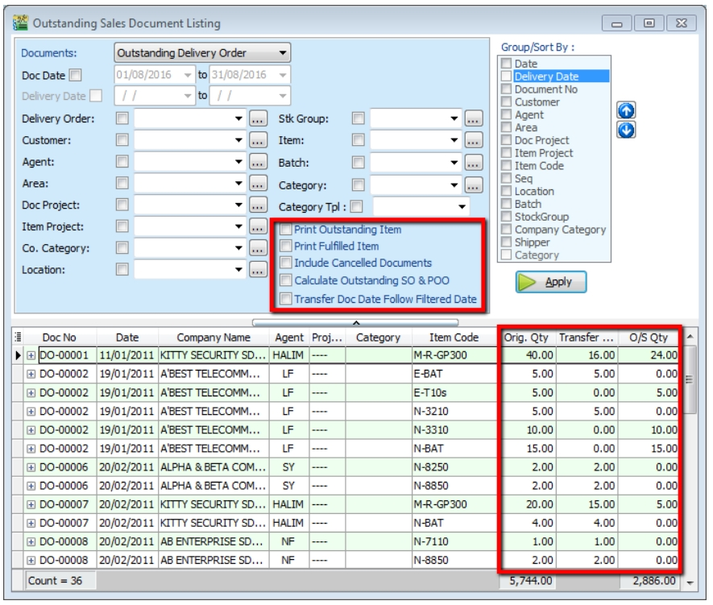

5. If you want to know where this **document has already been transferred** to, you just **Preview** the report.

   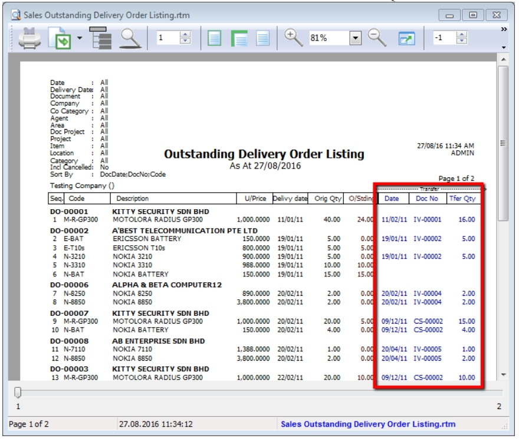

## Inventory Report

A subsidiary report where each individual movement of stock is recorded, including stock movements from Purchases, Sales and Returns.

### Stock Card

   Step: **Stock** > **Print Stock Card** > **Apply**

   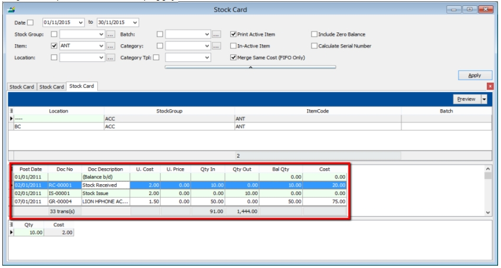

### Stock Card Qty

   Same purpose with stock card but stock card qty is without costing and pricing, this is useful for customers who want to block specific users from viewing stock costing.

   1. **Stock** > **Print Stock Card Qty** > **Apply**.

      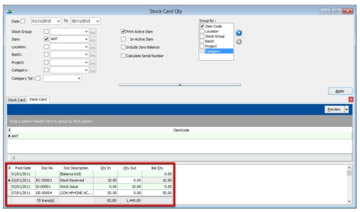

### Stock Month End Balance

   The Monthly Stock Balance Report summarizes the stock balances of the participant as of a calendar month end. The report also shows the monthly custody fee charged for each stock.

   1. **Stock** > **Print Stock Card Qty** > **Apply**.

      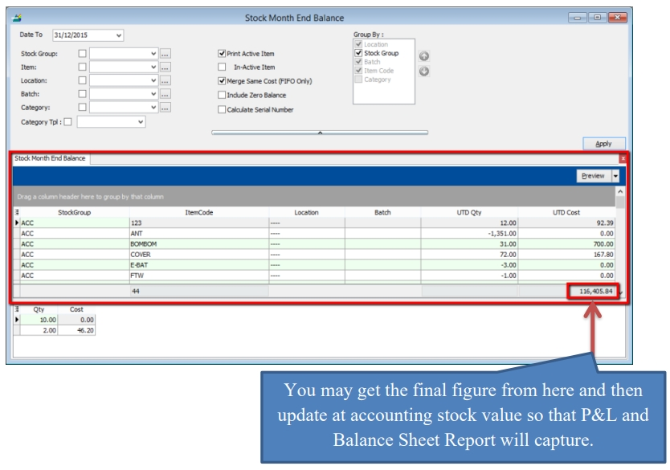

### Stock Reorder Advice

   This report is to show reorder advice according to stock level, normally used to trace pending Purchase Orders and Sales Orders. You may compare as seen below:

   1. **Stock** > **Print Stock Reorder Advice** > **Apply**.

      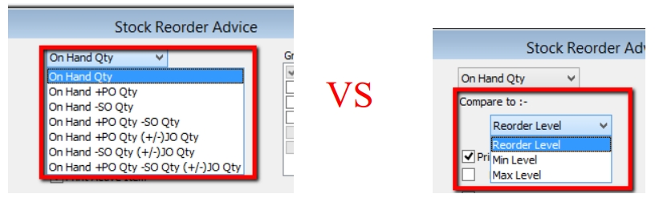

      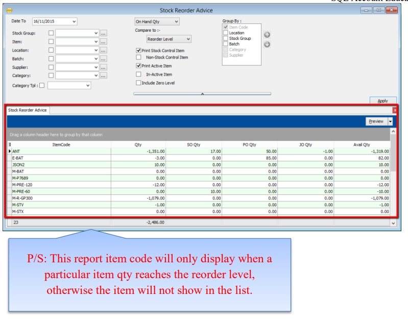
