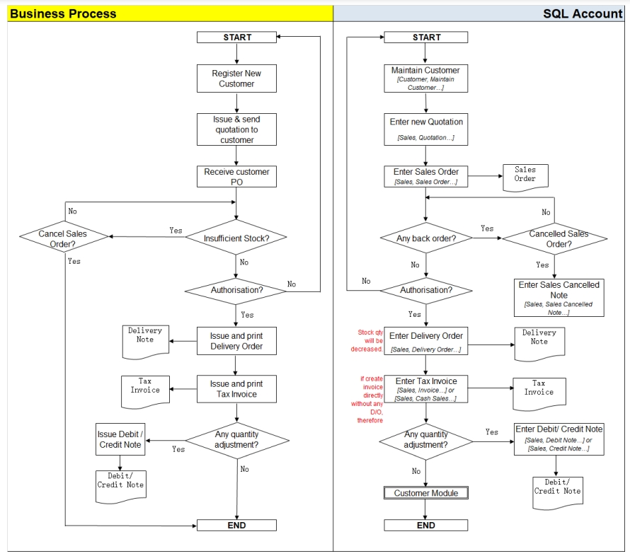
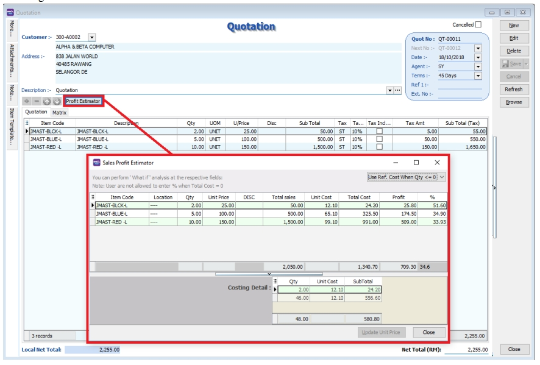
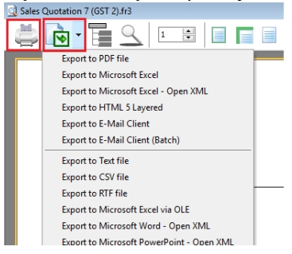
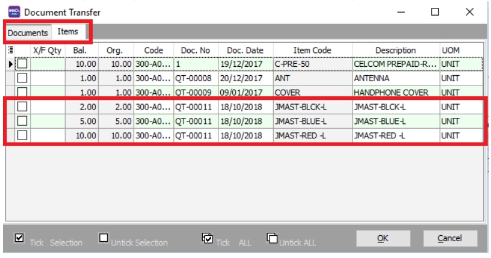
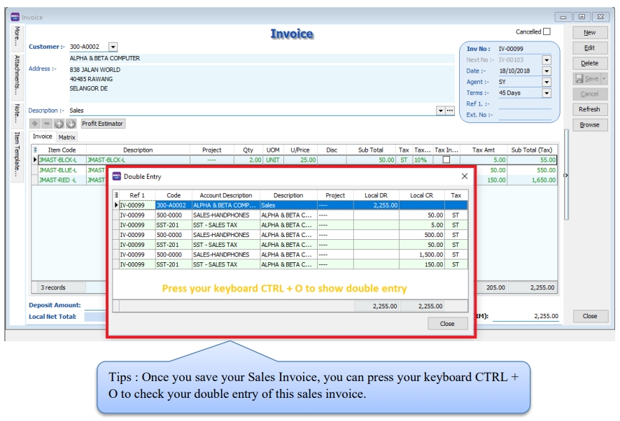
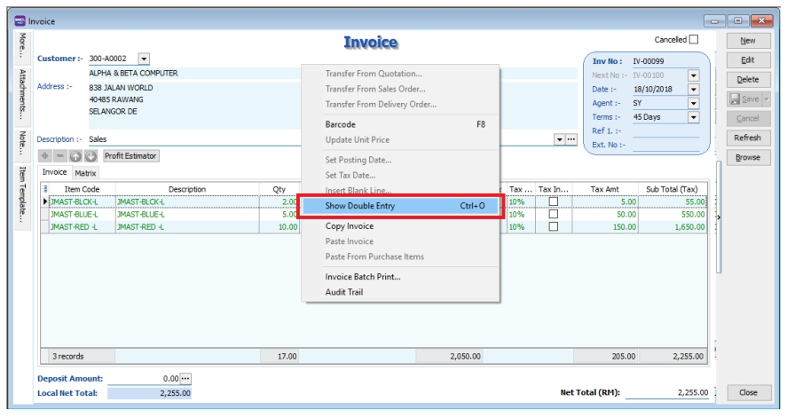
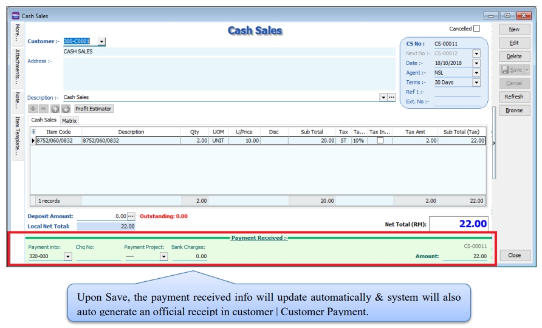
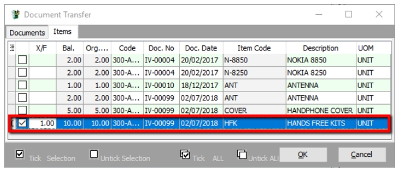
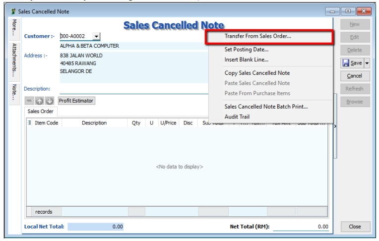

## Sales Work Flow

Example of sales process work flow aligned with SQL Account flow:

## Sales Quotation

:::info
Watch tutorial video here:  [Sales Quotation](http://www.sql.com.my/video/sqlacc_tutorial/06-01_Sales_Quotation.mp4)
:::

1. **Sales** | **Quotation** | **New**

2. Select **Customer Code**

3. Insert the item that is requested by the customer, and you can estimate your profit & loss in this transaction by checking on **Profit Estimator**

   

4. After everything is keyed in correctly, save the **Sales Quotation**

5. **Preview** the report and you can **print** or **export** it into PDF/ Email/ RTF(Microsoft Word)/Excel or others.

   

## Sales Order

:::info
Watch tutorial video here: [Sales Invoicing Sales Order](https://www.youtube.com/watch?v=klEAjmFT0og&feature=youtu.be)
:::

1. **Sales** | **Sales Order** | **New**

2. Select **Customer Code**

3. **Right Click on Sales Order title**, select **Transfer from Quotation**. You can either transfer the whole quotation or only part of the quotation document (*Partial Delivery Module requested)

   

4. Save the **Sales Order**.

   :::note
   For additional reports showing outstanding sales orders, you can access **Sales | Print Outstanding Sales Document Listing**, and select **Sales Order** to view. This also applies to other sales documents.
   :::

## Sales Delivery Order

1. **Sales** | **Delivery Order** | **New**

2. Select **Customer Code**

3. **Right Click on D/Order title**, select **Transfer from Sales Order**.

4. Save the **Delivery Order**.

   :::note
   Once the delivery order is saved, the stock will be deducted.
   :::

## Sales Invoice

### Create New Invoice

:::info
Watch tutorial video here: [Sales Invoicing Sales Invoice](https://www.youtube.com/watch?v=hQ6bX5pOKRQ&feature=youtu.be)
:::

1. **Sales** | **Invoice** | **New**

2. Select **Customer Code**

3. **Right Click on Invoice** title, select **Transfer from Delivery Order**.

4. **Save** the Invoice.

### Show Double Entry

   :::info
   Watch tutorial video here: [Ctrl + O](https://www.youtube.com/watch?v=FAKSzjEezjo&t=9s)
   :::

**There have 2 methods to show double entry of the transactions:**

1. After you save then invoice then you can press on keyboard short cut key “ Ctrl + O” to get the show double entry result.

   

2. After you save the invoice, you may right click on the wording of Invoice then select “Show Double Entry”.

   

## Cash Sales

1. **Sales** | **Cash Sales** | **New**

2. Select **Customer Code**

3. Insert item and **Save** the **Cash Sales**.

4. When saving, the system will prompt a **Payment/ Change** dialog box

   

   

## Sales Credit Note

:::info
Watch tutorial video here: [Sales Invoicing Sales Credit Note](https://www.youtube.com/watch?v=2LrsegwiWJM&feature=youtu.be)
:::

1. **Sales** | **Credit Note** | **New**

2. Select **Customer Code**

3. **Right Click on Credit Note title**, select **Transfer from Sales Invoice/ Cash Sales**, enter the returned quality in X/F column.

4. **Save** the Credit Note.

   

## Sales Cancelled Note (required partial delivery module)

Sales Cancelled Note is used for the cancelling of any outstanding Sales Order.

1. **Sales** | **Sales Cancelled Note** | **New**.

2. **Right Click on the Cancelled Note title**, select **Transfer from Sales Order**; (in Sales Cancelled Note, items can only be inserted by transferring from Sales Order)

   

3. You can choose to transfer the sales order either by the whole document or partially.

   

4. **Save** the Cancelled Note.
