## Maintain User

### Create New User

1. Select **Tools** > **Maintain User** > **New**

2. Enter the **Code and Name** (both can be the same e.g. Code = ALI, Name = ALI)

3. Click on **More** Options and look for **Change Password**

   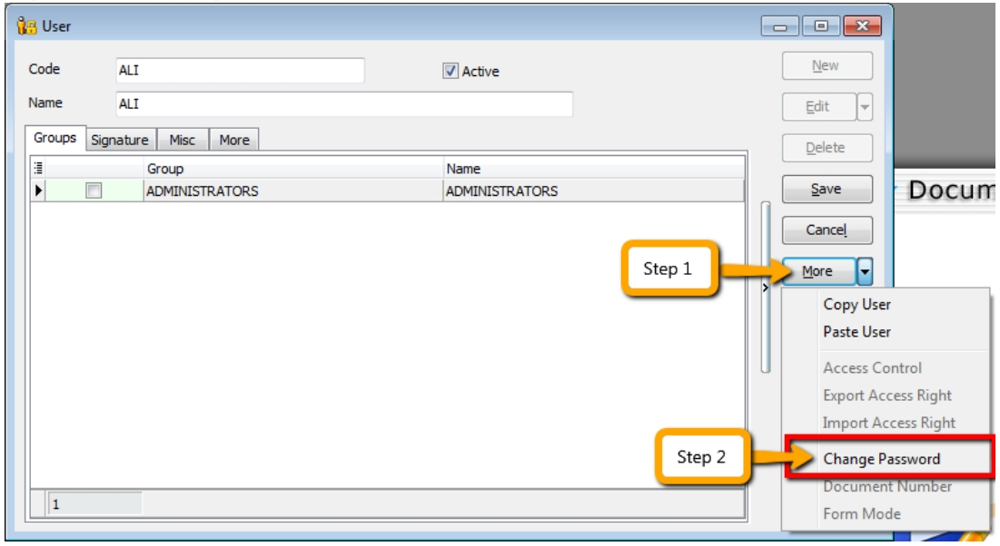

4. Click Save. Your new user account is now created.

    :::success info
    SQL User license is per concurrent basis (i.e. how many users can login to the system at the same time). This mean that if you have 5 staffs in the office who can access SQL but you only 3 license for 3 concurrent users, you can still maintain all 5 users in the system but only 3 users can login and access at the same time.
    :::

### User Access Right

:::info Video Guide
Watch tutorial video here: [Youtube](https://www.youtube.com/watch?v=t_TJKdOihfw&feature=youtu.be)
:::

Not every user is going to have the same access rights as ADMIN, and ADMIN user might want to set security control settings in system.

1. Select **Tools** > **Maintain User** > **Edit for the user that you want to set the access right for**.

2. Click on **More** Options and look for **Access Right**.

3. You need to check the transactions / functions (row), compare with the user (column) and **tick = Allowed** or **untick = Disallowed**, the action for a particular user for particular transactions. For example, base on the setting in the following images, the user is not allowed to delete Customers or to view Customer Payments.

   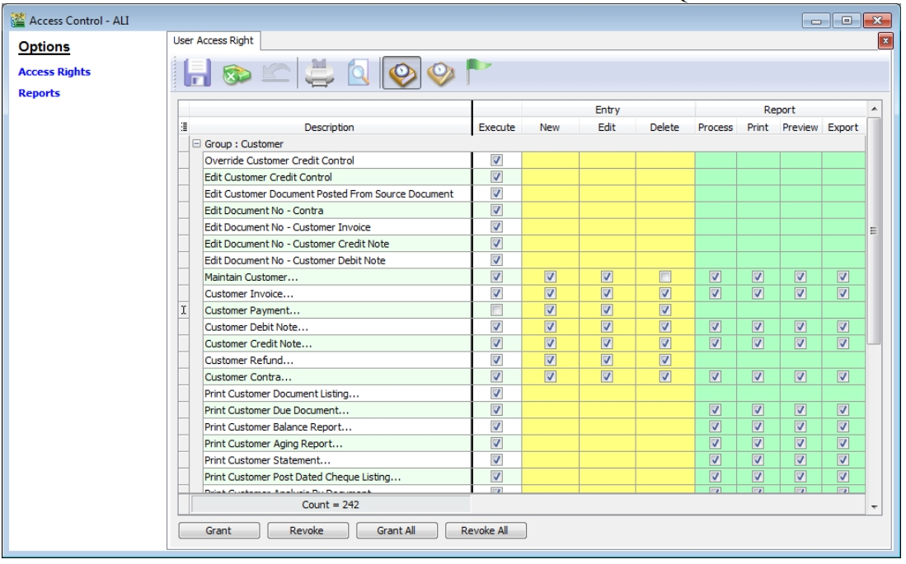

## Maintain Document Number

You can maintain document number format and next number.

:::info
Watch tutorial video here: [Youtube](https://www.youtube.com/watch?v=hFR6TfqxnRU&feature=youtu.be)
:::

1. **Tools** > **Maintain Document Number**.

2. Insert **description** for the particular set of document and select a **document type** (e.g. Payment Voucher)

3. The system’s defaults is the **Format** %.5d, where “%” is the formula which allows the function to auto-run for the document number while 5d stands for 5 digits.

   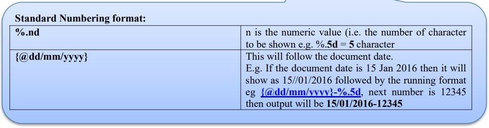

4. You can select the **Frequency** option as Never Reset or others.

5. Set the **Next Number** for this document.

   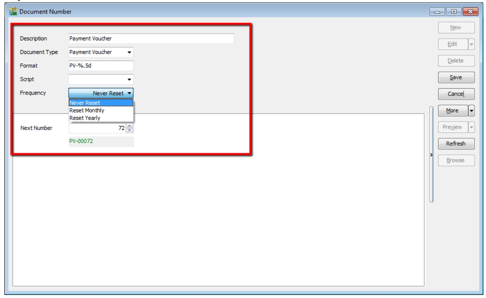

## Maintain Acceptable Transaction Date

:::info
SQL do not need to perform year end, it will cut off automatically. Once account closed, if you wish to block the period to avoid your users changed the account figure, you may apply this setting.
:::

Maintain Acceptable Transaction Date allows you to control which documents you are allowed to maintain (New, Edit) based on their dates.

- Any document which date falls **within** the allowed transaction dates **can** be edited.

- Any document which date falls **outside** the allowed transaction dated **cannot** be edited/created.

### New Acceptable Transaction Date

1. **Tools** > **Maintain Acceptable Transaction Date**

    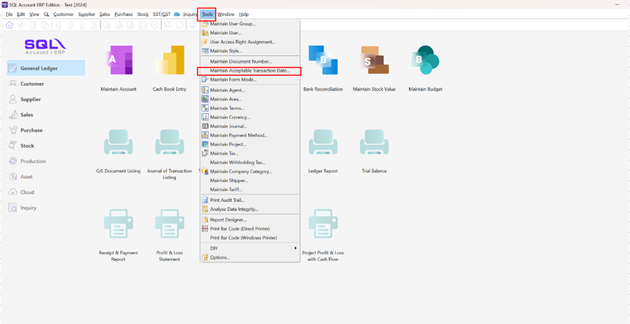

2. Click on **Append** (Icon with + symbol)

    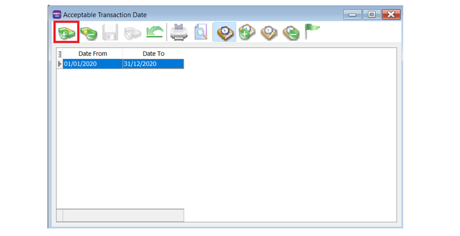

3. Choose the period which you want to **allow transactions**

4. **Save**.

    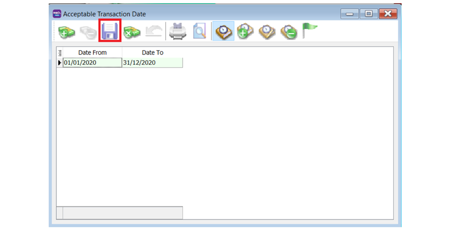

5. Result:

    It will show the message if users try to save a document that are not in acceptable transaction period

    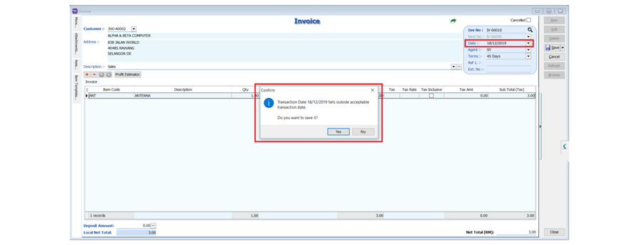

    If the user click "**Yes**" a dialogue box will request override permission by ID/PW with rights to override it.

    :::info
    The default setting grants users override permission. Refer to the following section for instructions on revoking this privilege from a specific user.
    :::

### Override Acceptable Transaction Date

   To override i.e. save a document that falls outside the acceptable transaction dates, you will need to be logged-in as a user with the right to override acceptable transactions dates.

   1. **Tool** > **Maintain User**. Double click on the user that you want to **edit**.

        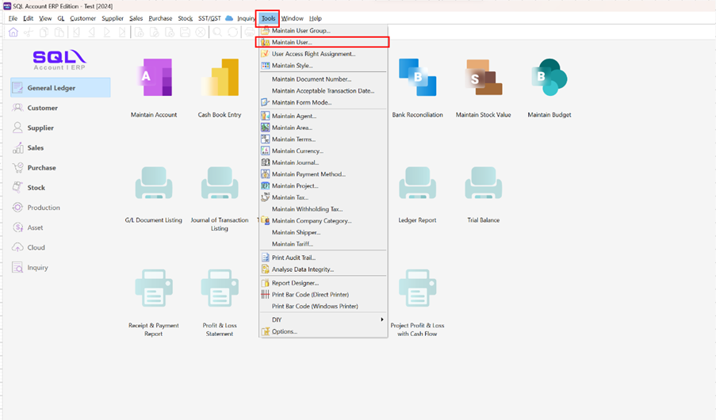

   2. Click on **More** > **Access Control**
        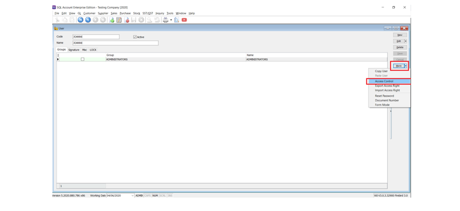

   3. Under **Group Tools**, tick or untick the option of **Override Acceptable Transaction Date** to allow or deny the user from having the overriding right to save a document out of the acceptable transaction period.

   4. **Save** the access right.

      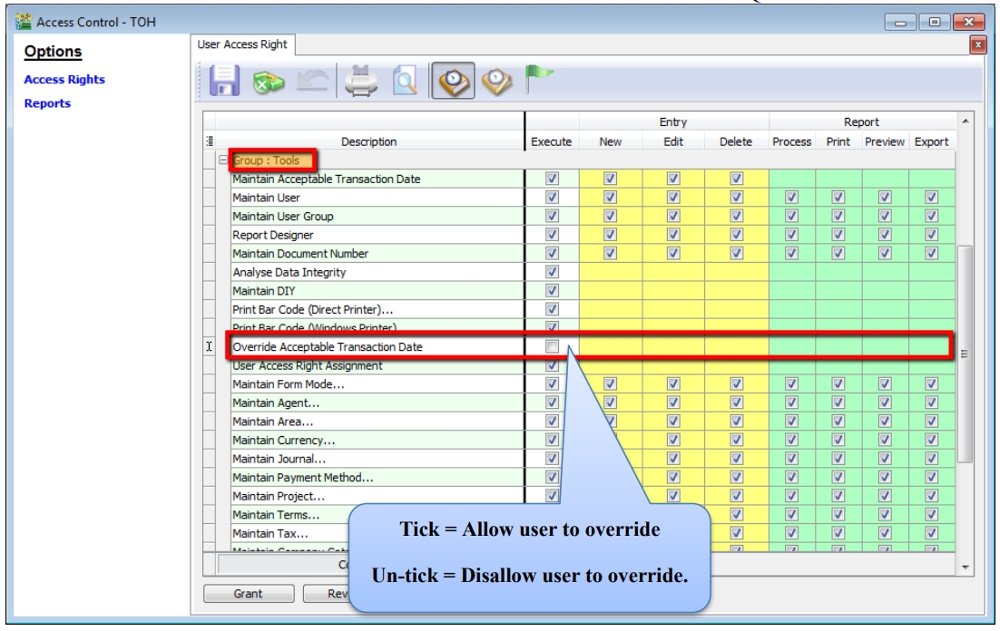

    5. Result:

        If the user Is not permitted to override, the system will prompt the following dialog and you can choose either

        - **OK = cancel saving**
        - **Override = Enter user the ID and password of a user who can override then save the transaction.**

        

        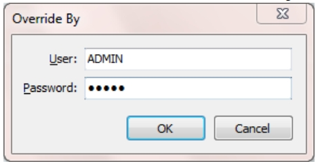

## Maintain Form Mode

Form Mode helps to filter data based on defined criteria. It is used to restrict users to view only specific sets of data for a certain document. For example, agent **Lip Fong can view and access the sales invoices belonging to his agent code** LF ONLY.

### New Form Mode

:::info
Watch tutorial video here: [Youtube](https://www.youtube.com/watch?v=bqSDZlAhM5I&feature=youtu.be)
:::

1. **Tools** > **Maintain Form Mode** > **New**.

2. **Enter Code & Select the document** form that you want to filter, e.g. Invoice

   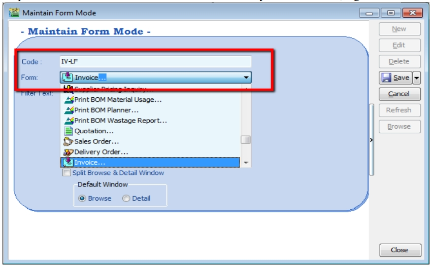

3. Click on the **Customize Filter** and then click on the **press the button to add a new condition**.

   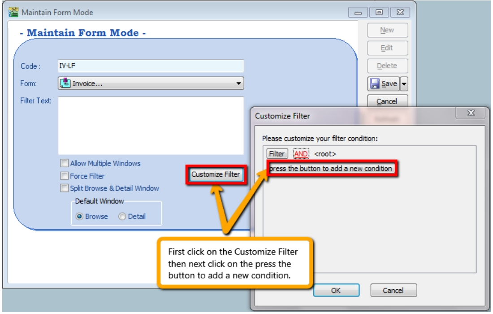

4. Change the **“SL_IV.DOCKEY” to “SL_IV.Agent”** because right now I need to filter based on sales invoice agent field, then change **the “= equals” to “like”** after that **enter the agent code** that you want to filter and click on **OK**.

   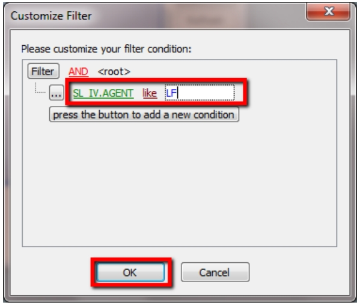

5. Make sure the info is updated correctly then you can **Save**.

   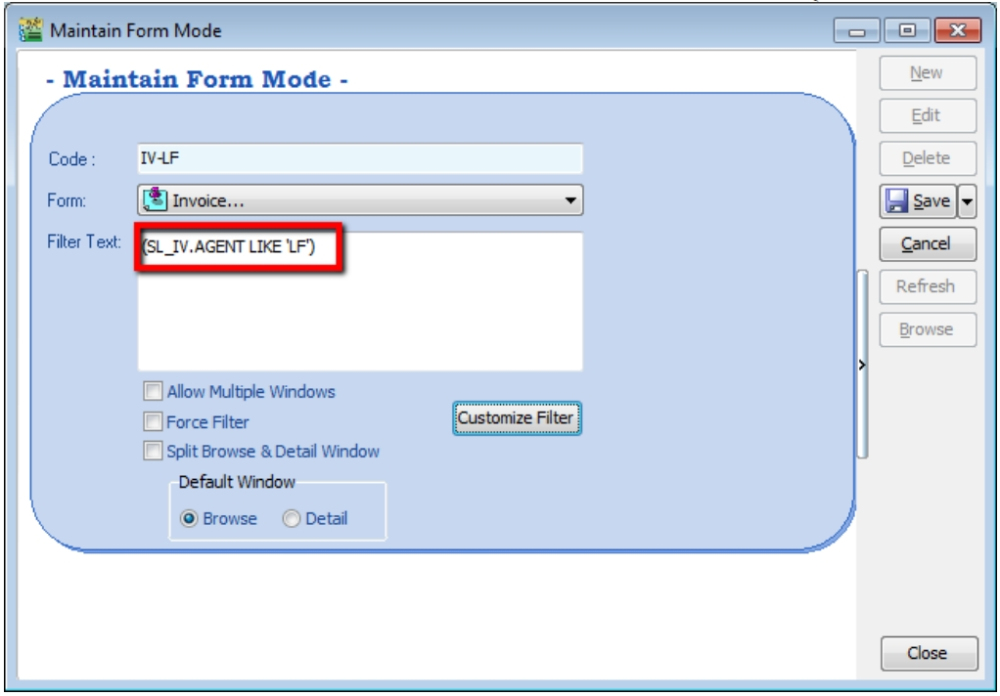

6. Other optional setting:

   

   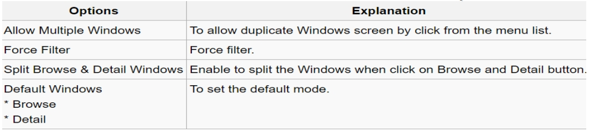

7. If you have set **more than 1 form mode**, once you click **Sales** > **Invoice** > you will get the prompt browse mode to choose which form mode that you want to apply.

   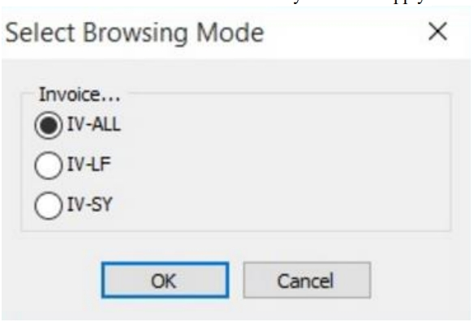

### Form Mode VS User

   How do I apply the format mode on a specific user?

   1. **Tools** > **User Access Right Assignment…**

   2. Under the list of security, click on **form mode**

   3. Select the user, eg: user code: LF (Lip Fong)

   4. Tick to apply the **form mode**, e.g. tick **form mode: IV-LF** and click Save

      

## Maintain Terms

Maintain Terms allows the user to maintain their Customer and Supplier terms. In SQL there are 3 types of different terms for you to assign.

1. **Tools** > **Maintain Terms** > **New**

2. **Insert Code, Description and allocated Term Type.**
   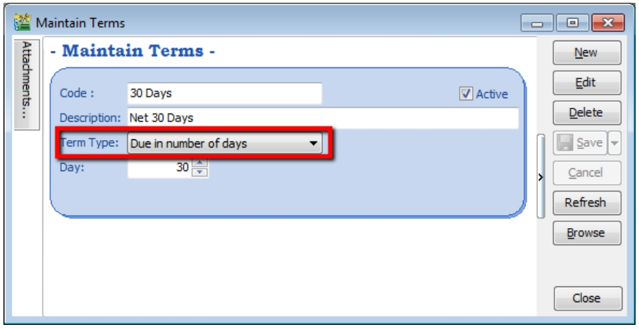

   - **Due in number of days** – Means how many days until document is due, e.g. if you set 30 days then the document will be due on the 30th day from the document date.

   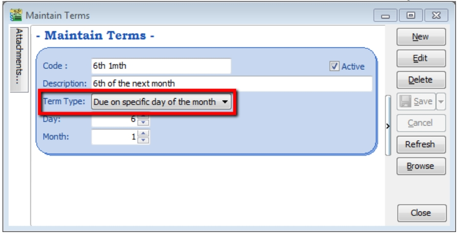

   - **Due on specific day of the month** – Means how many months and which day the document is due, e.g. if you set it as 1 Month 6 Days the document will be due on the 6th of the next month.

   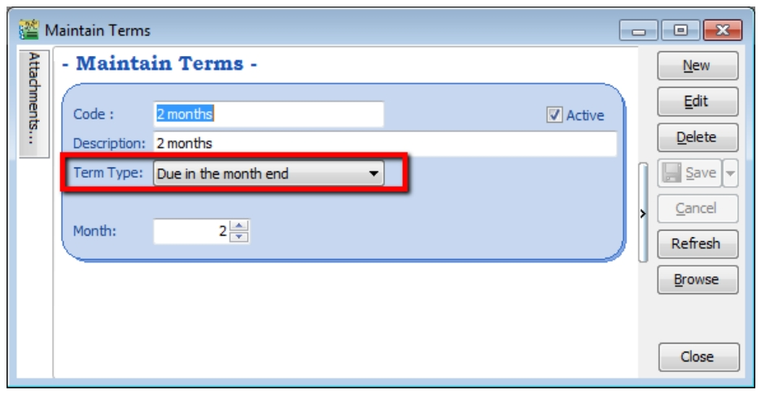

   - **Due in the month end** – Means how many months until the document is due at the end of the final month, e.g. if you set it as 2 months, the document will be due at the end of 2nd month.

## Maintain Currency

### New Foreign Currency

:::info
Watch tutorial video here: [Youtube](https://www.youtube.com/watch?v=qfhtlAjW4As&feature=youtu.be)
:::

You can bill overseas customers & suppliers in foreign currencies e.g. USD, SGD, Euro & etc. **(Prof Package Inclusive)**

1. **Tools** > **Maintain Currency** > **New**

   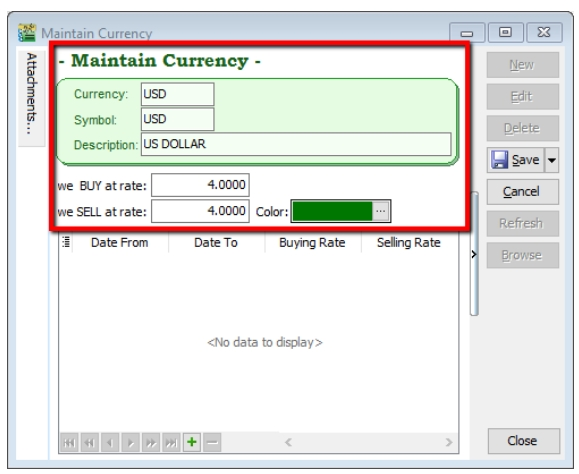

2. **Maintain Customer / Supplier to assign the currency**

   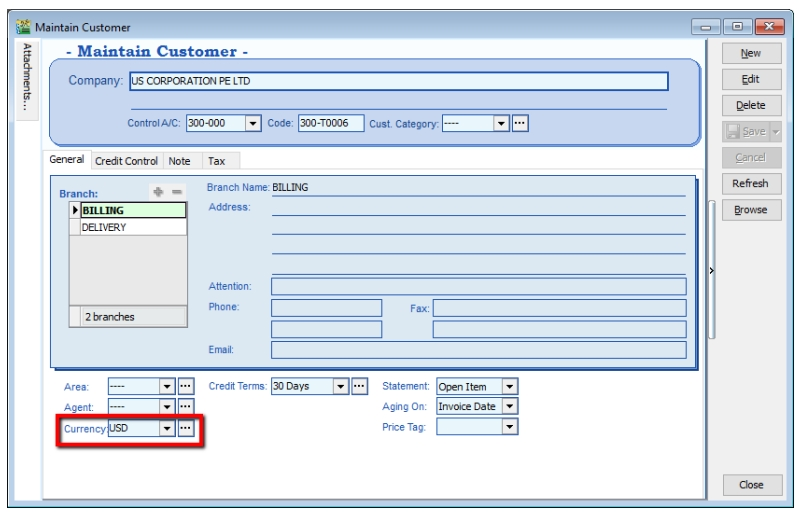

3. Sales document, select the customer, sample as below:

   1. Currency Rate will follow your setting from Tools > Maintain Currency, but it is still changeable in this invoice.

   2. Unit Price entered is in based on Customer’s currency eg this customer is in USD.

   3. system will auto converted into default currency RM on right bottom Local Net Total column.

      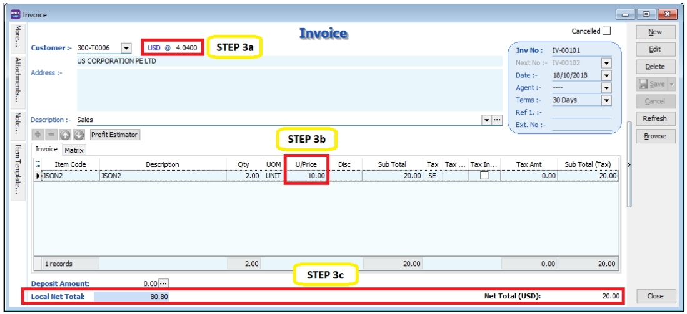

### Payment from Foreign Customer

#### Scenario 1

:::note
Customer Invoice **invoice billing in USD**, but **payment paid in your local RM bank**
:::

   1. **Customer** > **Customer Payment** > **New**

   2. Select your Customer

   3. Choose your RM Bank

   4. Enter your RM Amount

   5. Knock off the invoice and the rate will be update automatically by system. Foreign gain loss will be auto calculated and post to account accordingly. (you can call out Rate & Gain Loss column from the hidden field).

      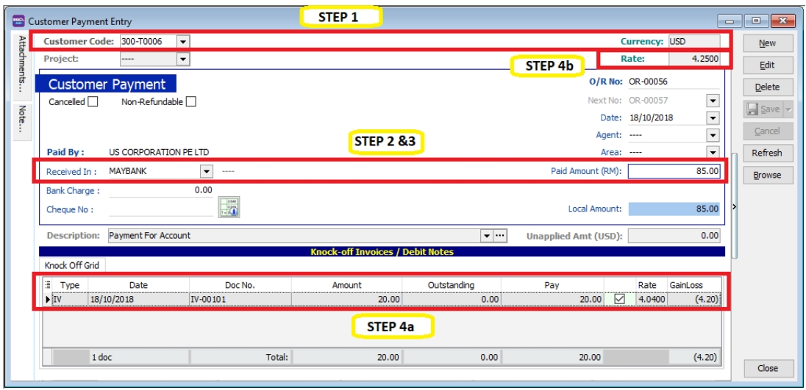

#### Scenario 2

:::note
Customer Invoice **billing in USD, Payment paid in your Foreign USD Bank**

*([Advance Currency](../faq/tools/advance-currency.md) modules required)*
:::

   1. Go to Tools > Maintain Payment > edit your USD Bank

   2. **Currency**: You can assign the currency for the particular payment method, so that the payment method will be in foreign currency payment.

   3. **Bank Charge Acc**: You can pre-set bank charges account to the payment method accordingly.

   4. **OR & PV Number Set**: Set default running document number for the particular payment method (optional)

   5. **Bank Info**: able to set Giro info & make payment thru Giro (refer [Interbank Giro](../additional-module/interbank-giro.md) Topic for more detail)

      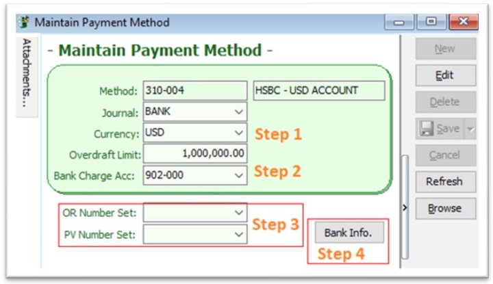

      Select your payment received in your **Foreign USD Bank**, enter your **paid Amount in USD, Enter your USD Rate** & Knock off the invoice, foreign gain loss will be auto calculated by system.

      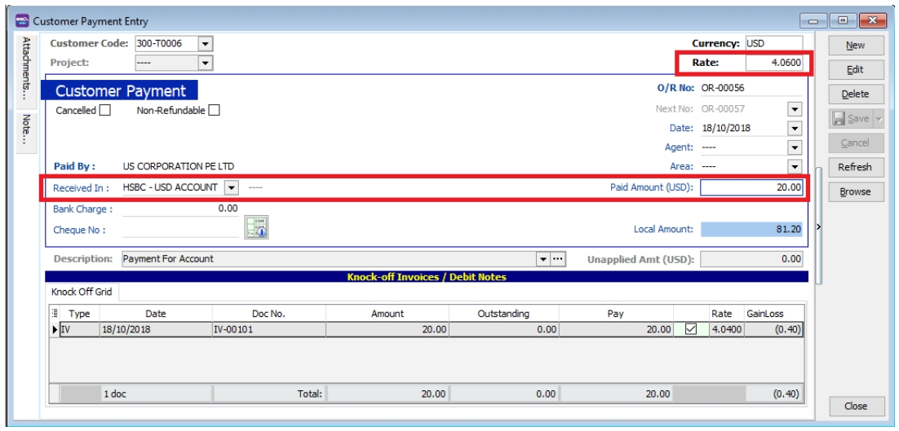

#### Scenario 3

:::note
Customer Invoice **billing in USD**, but **payment in others currency** eg SGD / RMB / EURO
:::

   1. Select your Bank eg you received in SGD Bank, enter your SGD Amount & SGD Rate.

   2. Knock off your USD Invoice.

   3. USD rate will be auto calculated & foreign gain loss will auto calculated and posting to account accordingly

      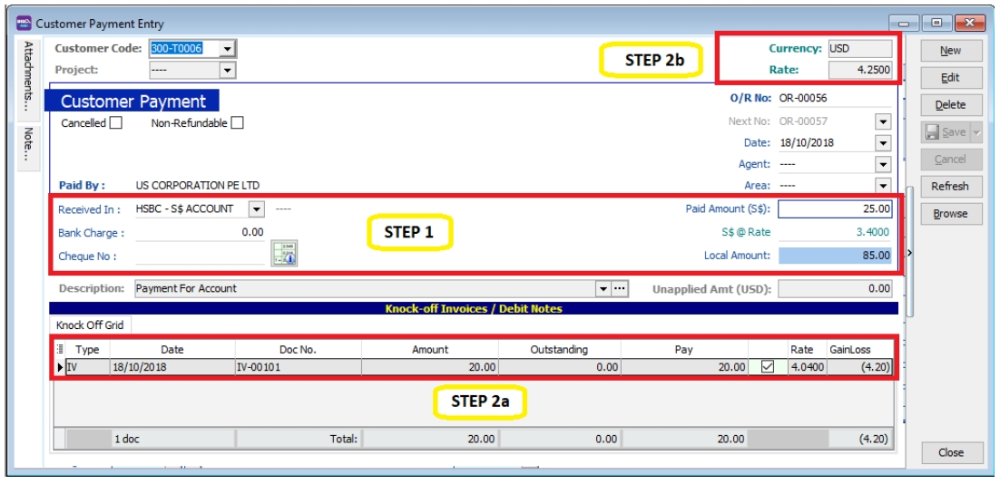

## Maintain Project (Required Project Module)

This module allows the user to maintain the project accounting on a branch or departmental basis, the user can use this module for simple construction business as they get to view Profit and Loss / Balance Sheet by Project.

1. Click on **Tools** > **Maintain Project**.

   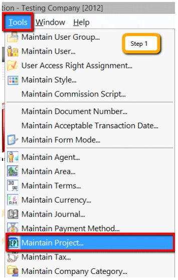

2. Insert **Project Code & Description**. Project Value and Project Cost is not compulsory fields to fill in, if you have filled in then it is for remark purpose.

   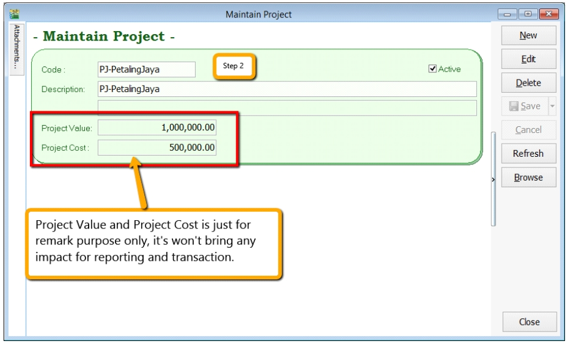

3. Click on **Tools** > **Options**.

   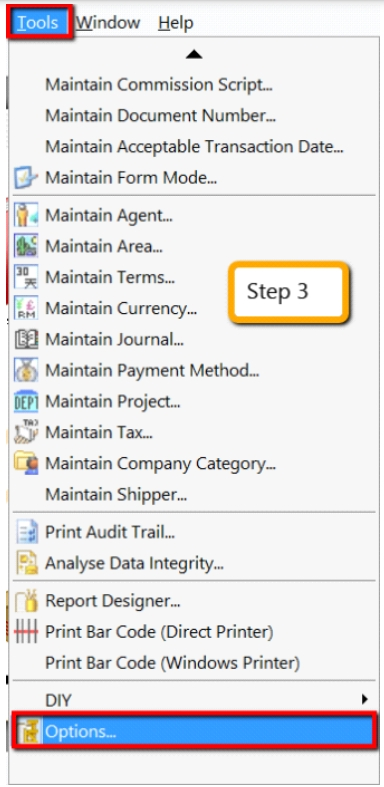

4. Then look for **Miscellaneous** > Make sure the option **“Show Document Project”** is ticked.

   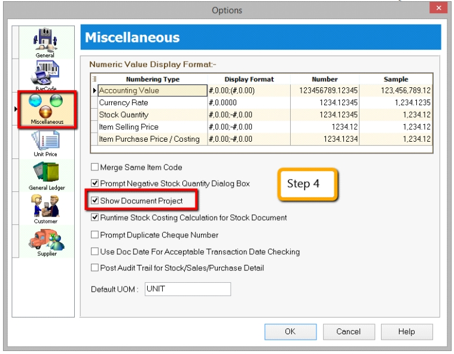

5. During **sales and purchase** transactions, make sure you can **the project column**, then **update** accordingly.

   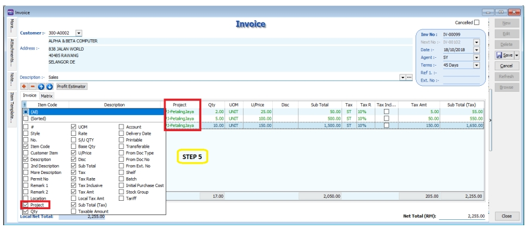

   When keying-in a transaction, some users will ask why is there a project at item detail and another beside the Customer. Duplicate tab?

   **What is the difference between More > Project >(Document Project) and Item Detail > Project (Item Project )?**

   

   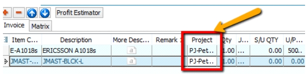

   

   **The project feature is also available for GL > Cash Book Entry.**

   After updating the document with project, how to view report with project and compare by project? For example: **GL > Print Profit & Loss Statement**.

6. Filter by the date that you want to view for the P&L report, then if you want to perform a project-to-project comparison then choose **“Comparison – Project (6 columns)”**

   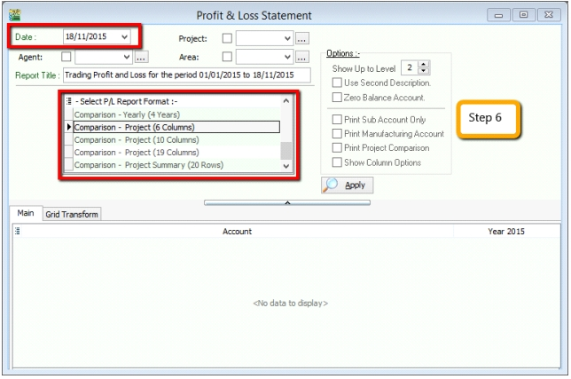

   :::note

   6 Columns = up to 6 projects

   10 Columns = up to 10 projects

   19 Columns = up to 19 projects.

   :::

7. Criteria

   1. After selecting the report that you need, make sure to tick the **“Show Column Options”**, then the top of the report will show column options.

   2. You may change the period that you want to view, e.g. by default it will be **“Current Month”**.

      If you want to view the whole year figures, then you have to **change to “Current Year”**.

      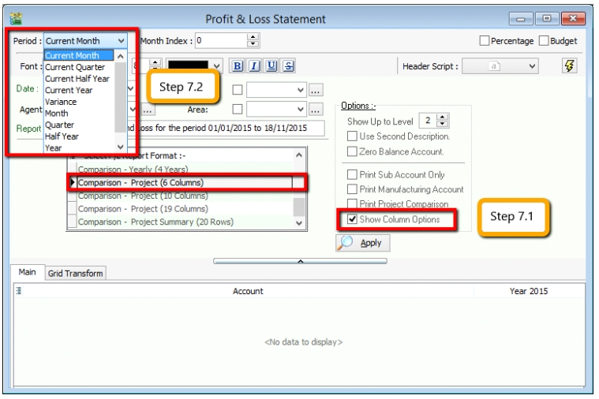

8. After changing the column options, you have to **tick the “Print Project Comparison”**, then the project tab will appear on the **right hand site**, you can select which project that you want to view then click on **Add**.

   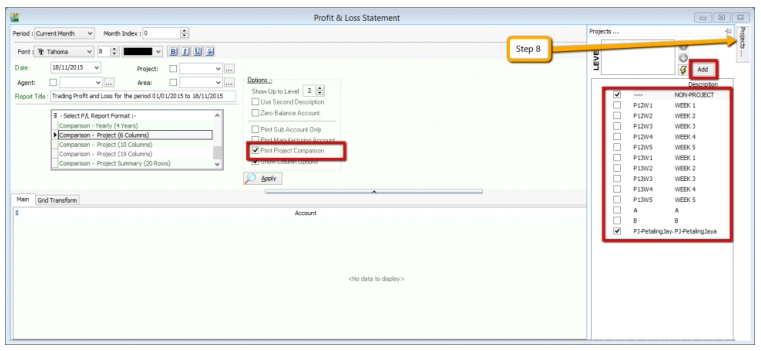

9. Click on **Apply** and you will see the result. The P&L report will compare each project that you select.

   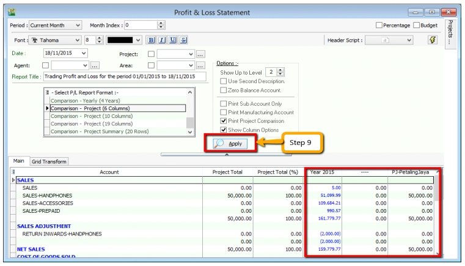

## 5 Cents Rounding

We can pre-set the system to automatically round your invoice or cash sales amounts to the nearest 5 cents.

:::info

Watch tutorial video here: [Youtube](https://www.youtube.com/watch?v=VSnX55l_3xw&feature=youtu.be)

:::

1. **Tools** > **Options** > **Customer**

2. **Tick 5 Cents Rounding** for Sales Invoice/ Cash Sales

   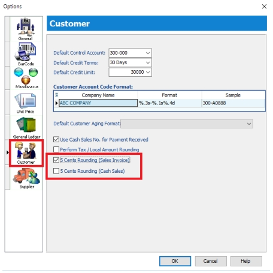

   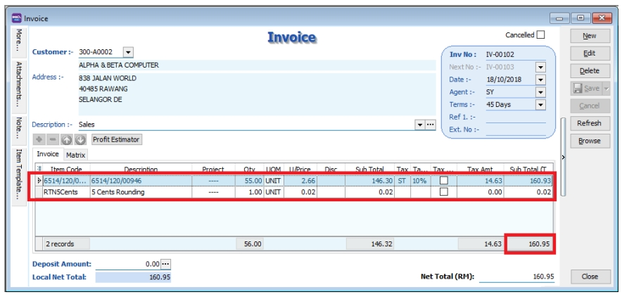

## Online Mobile Approval

### How it works?

For example : If we set Credit Limit over RM30,000 will required override

1. A Dialog box will be prompted after *Save Invoice*, ***‘Do You want to override?’*** > Click ***Yes***

    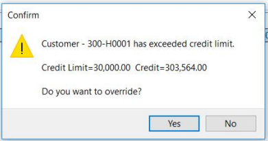

2. Click on ***Online Approval***

    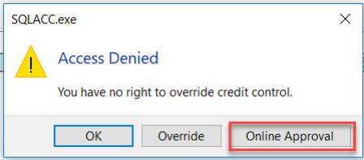

   1. Tick the ID that you choose to get approval

   2. You can choose to send by **Whatsapp**, **Send by Email** or **Send by Whatsapp & Email**

       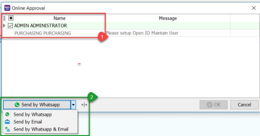

3. You will receive a message at **Whatsapp** message or **email sent by system**

   - **Senario 1 : Send By Whatsapp**

        You will receive a message > Click the link

        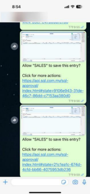

   - **Senario 2 : Send By Email**

        You will receive an email > Click **'CLICK HERE FOR MORE ACTIONS'**

        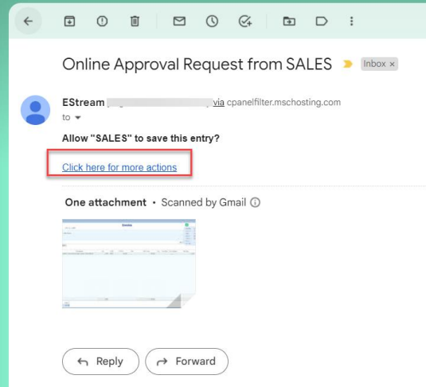

4. Login **Gmail Address** that you set in maintain user **Open ID (Google)**

    :::info[note]

    - This step is for those send by **whatsapp** and **not use Gmail** to receive notification
    - Those use **Gmail Address** to receive notification and approve can jump to **Step 6**

    :::

    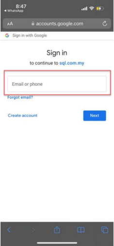

5. Enter your Gmail Password

    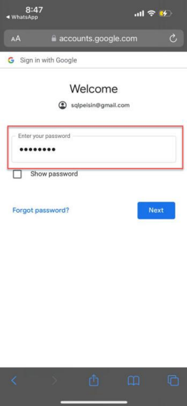

6. After Login Gmail you will see this window

    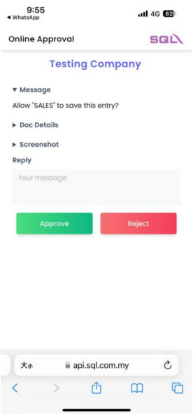

7. You can click on **Doc Detail** and **ScreenShot** to see the detail

   1. **Doc Detail** : To show Customer Code, the reason why need override

   2. **ScreenShot** : To see the transaction screen

   3. **Reply** : You can left a message and click Approve or Reject

        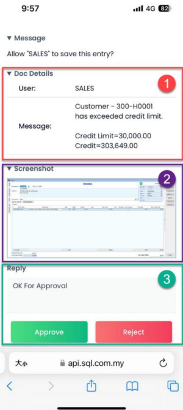

    :::info[note]
    After Approve or Reject you can go back SQL Accounting, you will see below possible scenario
    :::

     - **Scenario 1 : Approve Override**

         >a. Message : Approve Message
         >
         >b. The green tick will appear after approve
         >
         >c. Click **OK** to save that transaction

         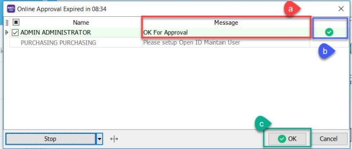

     - **Scenario 2 : Reject Override**

         >a. Message : Reject Message
         >
         >b. The cross will appear after reject
         >
         >c. **OK** button is disabled after reject, click **Cancel**

         

         After Click Cancel System will Prompt back to this dialog box :

         

### When to use?

These **ALL** can use Online Approval for user :

| Module          | Action                                                                                     |
|---------------|-----------------|
| Logon Screen    | - No access right to change password                                                      |
| All Module      | - All Document entry without Execute / Print / Preview / Export access rights               |
|                 | - Unable to Save and Manage Grid Layout                                                    |
|                 | - Unable to Grid Export                                                                    |
|                 | - Save Document Fall Outside Acceptable Trans Date                                         |
| Customer Inovice| - Fast entry save Invoice                                                                  |
| SL&PH           | - Prompt Stock Qty Control Dialog                                                          |
|                 | - Prompt change unit price                                                                 |
|                 | - Save price below cost (fmSLPriceControl)                                                  |
|                 | - Override Credit Control                                                                  |
| GL              | - Bank Recon Entry form to Check Bank Recon Listing                                         |
| Stock           | - Update GL stock value from other stock month end report                                   |
|                 | - Stock Report with Execute access right but without Process right                          |
| Inquiry         | - Hide Dashboard                                                                           |

### 1. Maintain User

1. Tools > Maintain User

    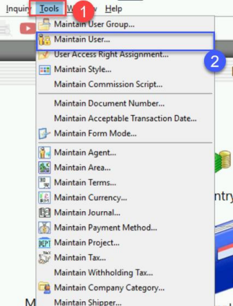

### 2. Edit User

1. Double click the user that you want to setting > Edit

    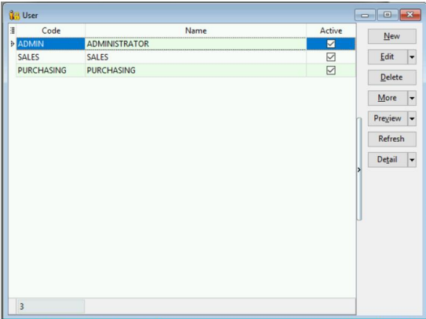

    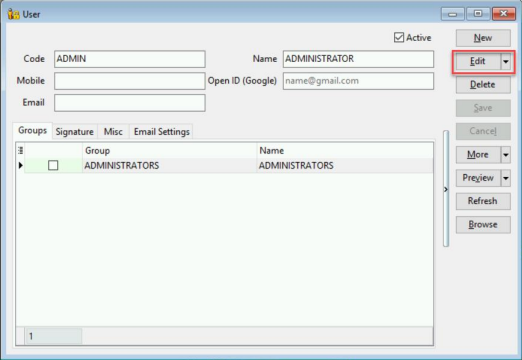

### 3. Set Approval Person

- Setting The Detail For Approval Person (ONLY GMAIL CAN LOGIN TO APPROVE OR REJECT)

  1. Mobile number - To which whatsapp number to get notification for approval only

  2. Email - To which email address to get notification for approval only

  3. Open ID (Google) - Gmail for approve or reject

    :::info[note]
    If receive notification email and approve email is Gmail, do setting only at **3.OPEN ID (Google)** and leave **2.Email** column blank
    :::

    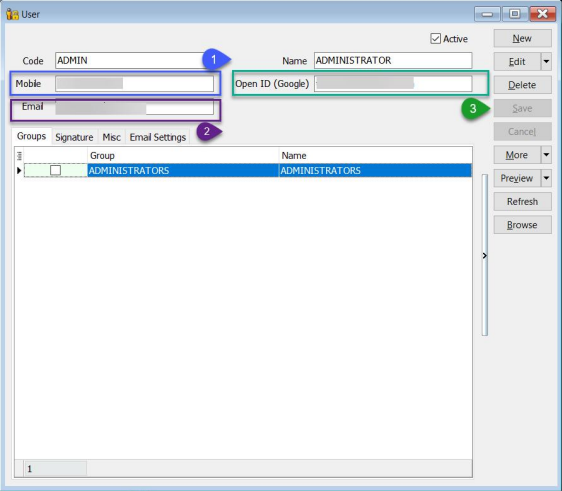

    For Example :

       - **Senario 1 : Use Same Gmail to Receive Notification and Give Approval**

            ```
            Your Gmail address is : `XXXXXX@gmail.com`

            1. Open ID (Google) : `XXXXXX@gmail.com`
            2. Email : **Left as blank**
            ```

            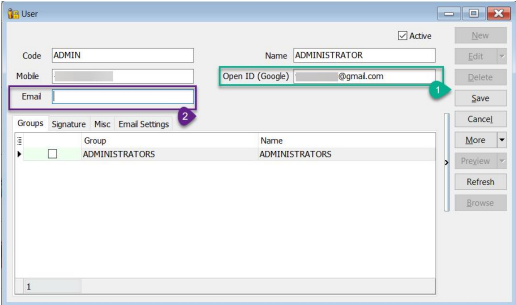

        - **Senario 2 : Use Different email to received notification and give approval**

            ```
            - To Give Approval Gmail Address is : `XXXXXX@gmail.com`
            - To Received notification Address is : `XXXXXX@estream.com`
            ```

            1. Open ID (Google) : Put your gmail address XXXXXX@gmail.com
            2. Email : XXXXXX@estream.com

            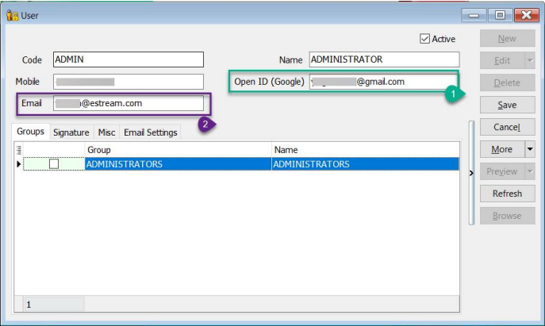

### 4. Setting SMTP

:::info[note]

- This Setting is for user who want to **use Email to send Notification**
- If use whatsapp to send approval can skip this step

:::

1. Make Sure you had create App Password
   - If you are using Gmail , you can [CLICK HERE](https://support.google.com/accounts/answer/185833?hl=en) to follow the steps to create your App Password
   - After getting your App Password, return to your SQL Accounting

2. Click on Email Setting
3. Your Email SMTP Host
4. Your Email SMTP Port
5. Your Email SMTP Connection Security
6. Your Email Address
7. Your Apps Password
8. Your Email Sender Name
9. Afte done setting click Save

    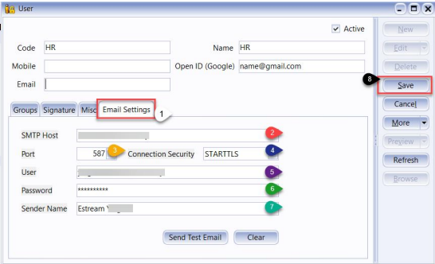
